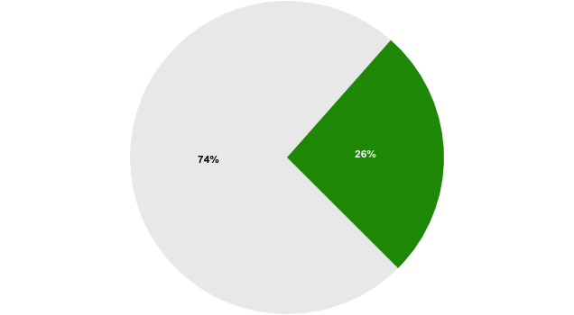
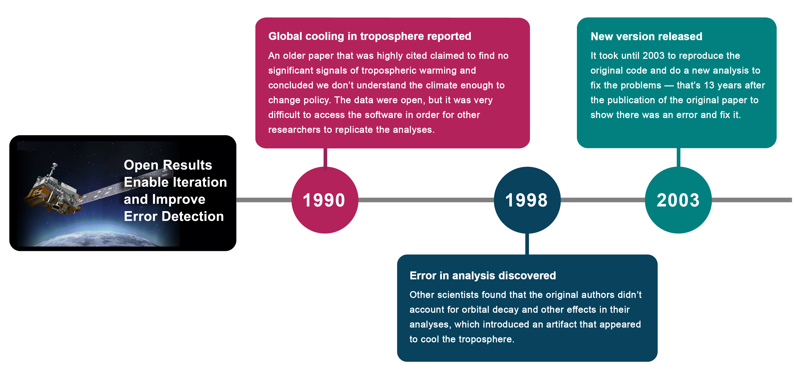
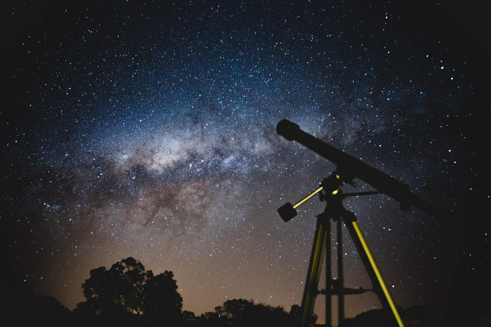
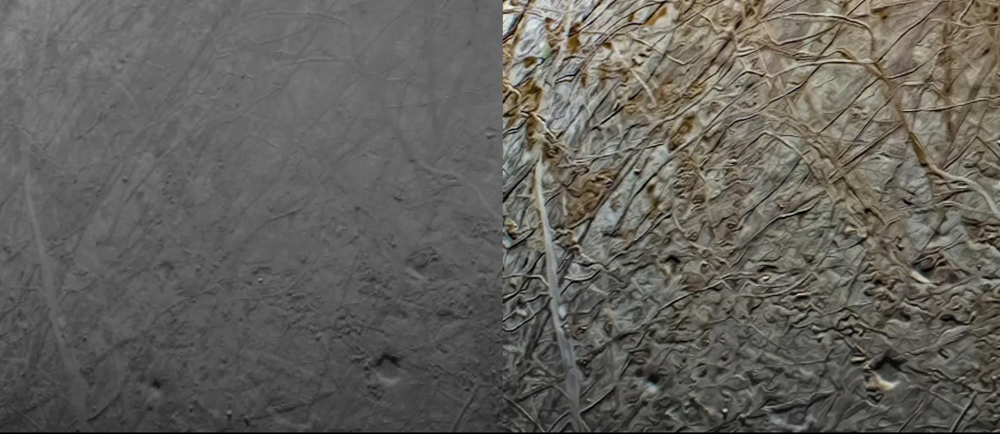

# Lesson 1: What is Open Science?

## Navigation
* [Motivation for Open Science](#motivation-for-open-science)
* [What is Open Science?](#what-is-open-science)
* [Who Does Open Science?](#who-does-open-science)
* [Lesson 1: Summary](#lesson-1-summary)
* [Lesson 1: Knowledge Check](#lesson-1-knowledge-check)

## Overview

In this lesson, you take a closer look at what open science means, including the intended goals and outcomes of adopting open science as an individual and as part of a larger community. You then review examples of open science in action. Finally, you wrap up the lesson by taking a closer look at why adopting open science is needed.

## Learning Objectives

After completing this lesson, you should be able to:

- Explain the motivation to do open science and the goals of open science.
- Define open science.
- List different groups that practice open science.

## Motivation for Open Science

Welcome to the first module of the TOPS Open Science 101 curriculum! Module 1 has five lessons that present information about the Ethos of Open Science. This incorporates the motivations and best practices for making science more open. This course was made possible thanks to the work of our NASA Transform to Open Science (TOPS) team, open science Subject Matter Experts (SMEs), and the entire TOPS community (3100+)! Please note that all image attributions are given at the end of each module.

We are really glad you are here!

This is the first lesson in the module on the Ethos of Open Science. Let's begin by explaining the word "ethos".

"Ethos is the distinguishing character, sentiment, moral nature, or guiding beliefs of a person, group,"

**Merriam Webster**

---

This lesson describes and showcases what makes Open Science, as an approach to knowledge production, unique or distinguishable from other scientific approaches.

Note that "ethos" is not exactly "ethics", but offers a broad enough term to include the moral attitudes held by the individuals or institutions who practice open science. To clarify the moral element to this discussion, we speak of "responsible open science" going forward.

The lesson introduces the concept of open science as a whole by explaining its motivation, definition, and operation. The lesson then reviews different components of science and the pillars that make them up. Throughout this module, we have integrated ethics around open science that dictate how you share, give due credit, and work together. "Practice the Golden Rule" - treat others the way you would like to be treated in their situation.

The curriculum of this course builds upon the work of others from across the globe and fields of research who paved the way to open science. Their recognition of open science as a necessary step to equalize knowledge access and catalyze research inspired NASA’s own pursuit to contribute. Best practices, performance indicators, and core principles established by the global open science community inform our current approach.

### Open Science at NASA

NASA funds some of the most diverse research of any federal agency and has a history of sharing research and results going back to the Apollo Program in the 1960s. NASA's Transform to Open Science program shares guidelines and best practices for open science that are applicable and beneficial across its entire range of research efforts.

NASA funds research in fields from Astrobiology to Physics, and basic science to applied engineering. NASA datasets include biology, chemistry, environmental science, geology, and other fields related to robotic and human planetary exploration, stellar evolution, and the search for extraterrestrial life.

The open science practices and principles that play a critical role supporting NASA mission success are equally relevant to other government agencies and institutions. Similar considerations, approaches, and behaviors are needed in a variety of scientific contexts. Tools for open science frameworks and workflows follow generally similar models.

Open science practices and principles can be applied to all stages of the research process. One early example of NASA’s efforts to involve more people in science is the [<u>exoplanet citizen science projects</u>](https://exoplanets.nasa.gov/citizen-science/). The [Exoplanet Explorers](https://www.zooniverse.org/projects/ianc2/exoplanet-explorers) project posed the questions:

- Are small planets (like Venus) more common than big ones (like Saturn)?
- Are short-period planets (like Mercury) more common than those on long orbits (like Mars)?
- Do planets more commonly occur around stars like the Sun, or around the more numerous, cooler, smaller red dwarfs?

"Stargazing Live", a live television program, took place across three consecutive nights in 2017. The hosts invited viewers to contribute to their research question by classifying solar systems from an open access dataset. Within 48 hours of the program's
debut, more than 10,000 people had participated in [Exoplanet Explorers](https://www.zooniverse.org/projects/ianc2/exoplanet-explorers) and classified over 2 million systems.

Following the first night of the program, the researchers watched the results roll in, as citizen scientists helped sift through the data. On the second night, enough people had participated that the researchers were able to share the demographics of the planet candidates that had already been flagged and were undergoing additional analysis: 44 Jupiter-size planets, 72 Neptune-size planets, 44 Earth-size planets and 53 sub-Neptunes (larger than Earth but smaller than Neptune).

Communities, working together on a problem, can rapidly find new results! Open science enables this and more.

### The Internet Facilitates Sharing of Information

Historically, factors like time, access to sufficient tools and data, and physical proximity limited who could be involved in science, as well as how easily collaboration could take place within the scientific community. More recently, digital resources like the Internet have increased participation by eliminating barriers to entry and presenting a platform for digital collaboration on a global scale. The internet offered people access to the appropriate infrastructure to conduct open science, while the practices of open science enabled more people to engage with research products. Unfortunately, challenges remain for people who don't have the right computational tools and/or speak the relevant languages.

The Internet creates many outlets for public hosting and free access to research and data. These outlets combined with advances in computational power enable nearly anyone to perform complex data analysis. It is now possible to connect participants, stakeholders, and outputs of open science on the Internet to make scientific processes and products easier to discover and access.

### Why Should We Do Open Science Now?

Science and science communication increasingly face severe pushback from the public because of inadequacies in the reproducibility of results and the spread of misinformation, respectively, that foster mistrust. The practice of open science counteracts this by involving community feedback to validate results in a more robust manner and combats misinformation by making results available to the public.

**Reproduce Results**

Science becomes more robust and accurate when scientists validate their colleagues' results. However, the rapidly-growing pool of published research presents an overwhelming challenge to reproduce:

Source: [https://www.pnas.org/doi/full/10.1073/pnas.1708290115](https://www.pnas.org/doi/full/10.1073/pnas.1708290115)

- In 2011, the AAAS, publisher of Science, began requiring the authors of computational research reports to share data and software upon request
- In 2018, a [research study](https://www.pnas.org/doi/full/10.1073/pnas.1708290115) was carried out that investigated 204 articles for reproducibility and that were published in the journal Science after 2011. It was found that only 26% of papers were able to be reproduced, with the two primary reasons being the inability to get access to the data and software and the fact that the methods were not described in sufficient detail.

**How many studies were reproduced?**

 **No  Yes**

**Open Results Enable Iteration and Improve Error-Detection**

In this section, we will look at an example of how closed science can restrict research impact by [following the outcome](https://digitalcommons.unl.edu/cgi/viewcontent.cgi?article=1318&context=usdeptcommercepub) of a highly cited journal article to understand how science functions to inform a field’s state of research, the decisions of policy makers, and the actions of society.

A 1990 analysis of satellite data on climate temperature concluded that the upper atmosphere experienced no warming, a finding that contradicted early climate models predictions. Policymakers concluded from this result that researchers don't understand climate models enough to warrant changes in environmental policy. The processed data from this study were made open-access but, as was typical for the time, neither the original data nor the code used for processing and analyzing the data were shared by the original research team. Eight years after the article was published, other scientists noticed that the original authors didn't account for several important effects. This oversight introduced errors into the dataset and falsely produced artificial cooling to the temperature measurements. It took another five years and additional funding to reproduce the code and conduct a new analysis. Thirteen years after the original paper, it was confirmed that the upper atmosphere was warming and agreed with climate model predictions.

The inability for the scientific community to access an article’s original data and code slows the pace of discovery, thirteen years in this case, and forces other research teams to repeat the work (code) instead of moving on to new projects. This isn't the pace that we want to advance science, with one step forward and two steps back to iterate and resolve problems.

The intentions of the original research group were not to conceal or prevent access to their data and methods; the community norms at the time simply did not include the sharing of data and software openly. This is, in part, because it allows researchers to keep a competitive advantage when seeking funding opportunities. In this case, the research group simply followed this common practice. This culture of closed science needs to be changed because the practice of withholding code (or data or other research artifacts) can stifle scientific progress. In the climate change example, a flawed study could have swiftly been corrected by open peer feedback but it instead undermined the credibility of climate scientists. The cost to progress on climate change research and the prevented benefit to society was enormous. It is imperative to shift the entire science ecosystem, policies, and rewards towards the prioritization of openness if the full and immediate benefits of research are to be realized.

**Traditional Publishing Limits Participation**

Historically, scientific publishers have charged subscription fees to access journals and, often, article processing charges (APCs) to cover the costs of preparing a manuscript for press (even when the peer reviewers were volunteering their time). These practices limit both who could read papers and who could publish results.

Open access publishing has significantly increased the number of articles that are available as electronic copies online. A growing number of governments and funding agencies are starting to mandate that research funded by taxpayers must be accessible to the public after publication. However, the current hybrid system still does a poor job of allocating costs fairly across the research publication process (more on this in Module 5).

The issue of who has access to published papers also motivates open science. [For example](https://www.unesco.org/en/articles/can-science-be-more-equitable-so-everyone-enjoys-benefits-open-science-answer), even though more climate research is made available as open access than that from other scientific fields, the majority of climate research articles, including many important ones, remain behind paywalls. Climate misinformation is freely available to anyone online but scientific climate results are mostly hidden from the public behind paywalls. This practice does not increase trust in science.

Source: [https://www.unesco.org/en/articles/can-science-be-more-equitable-so-everyone-enjoys-benefits-open-science-answer](https://www.unesco.org/en/articles/can-science-be-more-equitable-so-everyone-enjoys-benefits-open-science-answer)

## What is Open Science?

But what is open science exactly? To illustrate, first we’ll present a definition for open science that was developed in 2023 by the U.S. [federal government](https://open.science.gov/).

"Open Science is the principle and practice of making research products and processes available to all, while respecting diverse cultures, maintaining security and privacy, and fostering collaborations, reproducibility, and equity."

**The White House Office of Science and Technology Policy Memo, 2022 (adapted)**

---

This definition was developed by a team of U.S. federal agencies. They reviewed many different definitions of open science from both within the U.S. and around the world. These definitions have changed over time as the understanding of open science has matured and become more nuanced. Let’s break down the definition a bit more:

- Research products and processes should be available to all, not just a small subset of experts, particularly if funded with public funds.
- Research products and processes should be 'respecting diverse cultures' – fostering an open dialogue between researchers, indigenous people, and local communities. This also means that research must respect the diversity of laws and customs in different countries and/or as they apply to different kinds of research.
- While open science is our aim, security and privacy remain important concerns. Therefore, select sensitive information should be protected.
- Of the stated principles, "Fostering collaborations, reproducibility, and equity", the first two are research standards, while the latter refers to the inclusion of people who might otherwise get left out.

Open science is a culture intended to promote science and its social impact. Open science creates new opportunities for different stakeholders including researchers, political decision makers, and public participants. Open science increases study transparency, repeatability, reproducibility, and confirmation. We expand what these terms mean and why they matter throughout this module and later in Open Science 101 modules.

### How Do You Do Open Science?

The Ethos of Open Science is a broad term that encompasses the moral and ethical attitudes held by individuals and institutions about practicing ‘open’ science. There is an ethical element to sharing both new knowledge and the processes used to obtain said knowledge. It is important to note that there is no one be-all way of practicing or conducting open science.

Diverse practices, assumptions, and goals are just part of the complexity of open science. There are also divergent moral principles that guide open science communities. Such principles are captured in "codes of conduct". A code of conduct is a community governance mechanism that outlines the principles and practices expected of a given research community’s members, as well as the process for investigating and reprimanding those in violation of the code.

In a sense, a code of conduct constitutes the moral backbone of a research community. However, as with the numerous schools of thought, there are similarly many codes of conduct. In other words, there is no one set of universal principles that all open science
practitioners abide by. For example, consider how [OLS](https://openlifesci.org/code-of-conduct),  [INOSC](https://osf.io/6gsye), [allea](https://allea.org/portfolio-item/the-european-code-of-conduct-for-research-integrity-2/), [AGU](https://www.agu.org/Plan-for-a-Meeting/AGUMeetings/Meetings-Resources/Meetings-code-of-conduct) and [Ethical Source](https://ethicalsource.dev/community-code-of-conduct/) all have different codes of conducts and guiding principles.

This great diversity responds to the growing proliferation of open science initiatives and the great use we can make of open science approaches to knowledge.

The goal of TOPS is to push the community as a whole towards open science as an ethical responsibility to share knowledge.

| Ethics | Morals |
|---|---|
| Community consensus about "proper" behavior. | Personal set of standards for "good" behavior. |

You may or may not have heard the term "Open Science" used before this course. If you have, you likely have some preconception of open science and what it looks like in practice. Let’s collectively look at those various conceptions.

### Activity 1.1: Think About the What and How of Open Science

In this activity, reflect on your answers to the questions and then compare your thoughts to the key takeaways.

- What does the act of open science look like? Does a scientist use or create something specific that would characterize their research as open? What comes to your mind?
- Describe how you currently share your materials (data, code, results)?
- How might you share materials in the future more openly?
- What stands in the way?

**Key Takeaways:**

There are many ways to do open science. One of the best ways to start your open science journey is to think about how you do your science and how you might be able to make your science more open.

**Goals of Open Science**

The nuances of implementing open science take time and experience to develop. This curriculum provides practical steps and insightful examples to make open science happen.

Goals of open science include: 
- Facilitating collective benefit.
- Achieving inclusive development and innovation.
- Realizing equitable outcomes.
- Ensuring appropriate control over the data you use, make, or share throughout your research process, and comply with policy, regulatory, and legal guidance on release.
- Nurturing respectful relationships with the culturally- diverse communities who might provide or interact with your data, software, and results.
- Actively engaging with interested communities to increase representation and consultation throughout your research efforts. Members of any communities that provide data must be allowed to determine the benefits, harms, and potential future uses based on their community values and priorities.

### Fostering Collaborations, Reproducibility, and Equity

The IDEA of Open Science: Inclusive, Diverse, Equitable, and Accessible.

Openly using, making, and sharing research analyses, software, or datasets gives everyone credit for their work.

Sharing is grounded in the belief that access to information and the ability to collaborate is essential for advancing scientific understanding and solving complex problems.

Open sharing enables greater transparency in the scientific process and facilitates reproducibility; it enables collaboration and inclusion of more diverse perspectives and expertise; and it makes scientific knowledge more accessible to the public.

Not only does open sharing help society, but it also can benefit each of us as individual researchers. It can lead to greater visibility, impact, and credit of your results, data, and software; it can provide access to new collaborations and ideas, and it can fulfill ethical and social responsibilities.

### Activity 1.2: Definition of Open Science

#### Match the parts of the OSTP definition with the relevant IDEA/Respecting cultural diversity concepts.

<table>
  <tr>
    <td>Engage with interested communities to increase research efforts</td>
    <td>Respecting cultural diversity representation throughout</td>
  </tr>
  <tr>
    <td>Fosters inclusivity, diversity, equity and accessibility</td>
    <td>IDEA</td>
  </tr>
</table>

#### Fill in the missing word in the definition of open science.

"Open Science is the principle and practice of making research products and processes _____ to all, while respecting diverse cultures, maintaining security and privacy, and fostering collaborations, reproducibility, and equity."

\- The White House Office of Science and
Technology Policy (OSTP) Policy Memo, 2022

#### According to the White House Office of Science and Technology Policy, open science fosters...

Select all that apply.

- Collaboration
- Competition
- Equity
- Limited accessibility
- Reproducibility

### Examples of Open Science in Action

<table>
  <thead>
    <tr>
        <th>EXAMPLE 1 : CITIZEN SCIENTISTS DRIVE NEW RESEARCH METHODS &#9745;</th>
        <th>EXAMPLE 2 : RADAR DATA TO KEEP AN EYE ON CLIMATE CHANGE</th>
    </tr>
  </thead>
  <tbody>
    <tr>
        <td colspan="2">
            
JunoCam is a camera/telescope aboard the Juno spacecraft that orbits Jupiter. It was added to Juno specifically for citizen scientists and public outreach purposes.

            
The camera’s original purpose wasn’t to perform science, only observe. However, access was given to citizen scientists who processed pictures by stitching JunoCam image bands together. Participation among the citizen science community helped expand the utility of the camera and <a href="https://www.nasa.gov/missions/europa-clipper/citizen-scientists-enhance-new-europa-images-from-nasas-juno/">led to an unforeseen success</a>. Iconic images created by these citizen scientists of Jupiter and Europa have intrigued and inspired people from across the globe.

            
Collected data also benefited traditional science:

            
"Pretty much all of what we are learning about the structures and dynamics of Jupiter's clouds is coming from publicly-edited images," says planetary scientist and JunoCam wrangler Candice Hansen. Hansen explains, "The team is processing a few images itself but with no image processing staff, the researchers are relying on the work of citizen scientists."

            
The Juno spacecraft team made new and unexpected science possible through open and easily accessible data. Public participation brought new perspectives and expanded the team’s capacity to conduct valuable research.

            
Credits:

            
Image data: NASA/JPL-Caltech/SwRI/MSSS

            
Image processing: Navaneeth Krishnan S © CC BY

            

        </td>
    </tr>
  </tbody>
</table>

<table>
  <thead>
    <tr>
        <th>EXAMPLE 1 : CITIZEN SCIENTISTS DRIVE NEW RESEARCH METHODS</th>
        <th>EXAMPLE 2 : RADAR DATA TO KEEP AN EYE ON CLIMATE CHANGE &#9745;</th>
    </tr>
  </thead>
  <tbody>
    <tr>
        <td colspan="2">
            
Have you ever seen weather forecast images for your location? That data comes from NEXRAD radar stations, many of which have been operating for over 30 years. The data has always been made publicly available, but can be difficult to use. It was mostly used for rain information, so stations didn’t see a need to make it readily accessible after 24 hours. Users who wanted the historical data from NEXRAD had to work through the following arduous steps:

            <ul>
            <li>Go to a website.</li>
            <li>Make a request (but not one too large).</li>
            <li>Wait for a robot to read the data off tape storage and copy it online.</li>
            <li>Receive an email with instructions on where to download a user's data.</li>
            <li>Download the data.</li>
            </ul>
            
The massive size of the dataset, more than 250TB, made it essentially impossible to do large-scale analysis. Nobody had the time to make these requests and download the data bit by bit.

            
<strong>However, in 2015, all NEXRAD data were moved to and made freely available in the cloud. Usage of the dataset increased almost immediately!</strong>

            
Researchers started using the NEXRAD data for other types of science. For example, they used <a href="https://aws.amazon.com/blogs/publicsector/the-birds-in-the-cloud-how-the-university-of-oklahoma-uses-nexrad-data-to-study-birds/">NEXRAD radar readings of birds to monitor flight patterns.</a> In particular, purple martins! Purple martins form huge roosts of up to 50,000 birds that can be tracked using radar. The purple martins perform stunning aerial performances that can now be tracked with the same technology previously reserved for rain measurements.

            
In another example of new NEXRAD uses, a NASA-led study linked variability in <a href=https://climate.nasa.gov/news/3201/climate-patterns-thousands-of-miles-away-affect-us-bird-migration/?s2=P1382021636_1683417608248277265>bird migration to large-scale climate patterns that originate thousands of miles away</a>. The better land managers understand current migration patterns and foresee behavioral changes in these birds due to climate change, the better they can direct their conservation and habitat restoration efforts. The newly- accessible radar data provides valuable insight needed to achieve their goals. This study was funded by NASA, uses NOAA NEXRAD data, and made fully available for the first time by the AWS Public data program.

            
The science of the future makes data so easy to use that it allows new questions to be asked, and answered, quickly to benefit society and policy.

        </td>
    </tr>
  </tbody>
</table>

### Key Takeaways: Definition of Open Science

Open science is multi-faceted and can mean different things to different people. Some scientists may think of open science as open access publications or as citizen science. In this module and more broadly in this curriculum, we make it clear that open science encompasses all of these various aspects. Right now, you may be more comfortable with some aspects of open science than others - and that’s ok! We hope that you will better understand the scope and nuances of open science by the end of this curriculum, and also understand the benefits of doing open science, as we have begun to discuss in this section. Specifically, the increasing amount of information about scientific processes and products available online enables access for a much wider array of individuals and communities to use, make, and share scientific research and results.

## Who Does Open Science?

As briefly discussed in previous lessons, open science doesn’t only involve researchers; many other stakeholders are affected by the outcomes of open science. Stakeholders include any individuals who can affect or be affected by open science projects.

Scientific research should benefit humanity. Although open science has many stakeholders, the advantageous interaction between science and society takes place among three core groups: scientific researchers, policymakers, and the public. Researchers do science and share their results with policy makers and the general public to inform their decisions and improve their lives. The public helps to fund research through taxes and can provide input to future areas of study. Policymakers help to implement measures that are informed by scientific results to improve the health, environment, and livability of society.

These three stakeholder groups remain central to the world of open science. However, the inclusive nature of open science demands participation from the broader public. Growth in public participation in science can occur by removing barriers to those historically excluded and by expanding the community of people who support the scientific research itself.

Here we list some core groups who we envision as taking part in and/or benefitting from open science, while being fully aware that this list is not exhaustive and the categories we choose here have very blurred boundaries.

*Select each tab to get more information.*

<table>
  <thead>
    <tr>
        <th>RESEARCHERS &#9745;</th>
        <th>POLICY-MAKERS</th>
        <th>GENERAL PUBLIC</th>
    </tr>
  </thead>
  <tbody>
    <tr>
        <td colspan="3">
            
Researchers are often thought of as the ones who do open science to benefit others. However, researchers themselves can also greatly benefit from open science. Their work can achieve higher visibility among colleagues and the public, they receive credit for a full range of activities related to their science (including time spent sharing data and code, for instance), and they have more access to datasets.

            
A team of supporters and collaborators enables this research to take place. Open science aims to include these supporting members of the scientific process and ensure they receive credit for their contribution to improve science.

        </td>
    </tr>
  </tbody>
</table>

<table>
  <thead>
    <tr>
        <th>RESEARCHERS</th>
        <th>POLICY-MAKERS &#9745;</th>
        <th>GENERAL PUBLIC</th>
    </tr>
  </thead>
  <tbody>
    <tr>
        <td colspan="3">
            
Policymakers represent another key community in the science environment. Policy makers can reference scientific findings to inform their decisions for the betterment of society. Those who help in the understanding and dissemination of these policies (including educators and science journalists) are crucial to this process. Policy makers can also play important roles in ensuring and facilitating open science by setting data management processes, encouraging open access legislation, and developing ethical guidelines for experiments. Policy makers can benefit from open science by gaining better access to scientific output via the open sharing of research results.

        </td>
    </tr>
  </tbody>
</table>

<table>
  <thead>
    <tr>
        <th>RESEARCHERS</th>
        <th>POLICY-MAKERS</th>
        <th>GENERAL PUBLIC &#9745;</th>
    </tr>
  </thead>
  <tbody>
    <tr>
        <td colspan="3">
            
The public plays a crucial role in science today as consumers of scientific results who make decisions based on, and adhere to policies shaped by, scientific results. Open science can make scientific results, data, and workflows more accessible to the public by strengthening routes of access to trustworthy sources of information, which in turn increases trust in science. The public can also take part in open science through community science projects, for example as volunteers to collect or manage data. As a result, participants boost their understanding of science and feel empowered through opportunities to exert influence.

        </td>
    </tr>
  </tbody>
</table>

Open science can strengthen the connection between all of these groups. Communication between researchers and both the public and policymakers stands to drastically improve with more transparent and accessible scientific knowledge.

### Activity 1.2: Think about Open Science

In this activity reflect on your answers to the questions and then compare your thoughts to the key takeaways.

- In your field, what steps are being taken to increase openness, and what stands in the way?
- What could help to increase openness? 
- What stands in the way?

**Key Takeaways: How Closed Science Affects You**

Some observational reports are difficult to replicate because of the uniqueness of the observations or ethical considerations (for example, unique astronomical events and long-term ecological observations, or accidental experiments like crashes and inadvertent releases of contaminants).

Here, we would like you to consider limitations brought about by software, data, or methods that are not fully described or made accessible.

## Lesson 1: Summary

In this lesson, you learned:

- The motivation for open science as well as its goals and outcomes.
- Why we should be doing open science now and how technology has made it more achievable.
- The definition of open science.
- Different groups that do open science.

## Lesson 1: Knowledge Check

Answer the following questions to test what you have learned so far.

*Question*

**01/04**

What is open science?

- Sharing all information so anyone can access it.
- A legal definition of free science.
- A nuanced way of sharing the process and products of science.

*Question*

**02/04**

Why is open science happening now?

- Communicating research results is an integral aspect of science.
- The internet and increasing availability of computers enables access by a much wider segment of society.
- Researchers are mandated by law to share all their findings  and raw data immediately after conducting their experiments.
- Open Science is happening now because of a global  shortage in academic professionals, necessitating widespread public involvement.

*Question*

**03/04**

Select all open science actions that foster collaboration, reproducibility, and equity.

- Open sharing of data, software, and results.
- Prioritizing the fastest possible publication speed to ensure that results are disseminated quickly.
- Ensuring that the most resources are allocated to the most popular and widely reported fields of research.

*Question*

**04/04**

What societal problems can open science help to address? Select all that apply.

- Scientific reproducibility crisis.
- Spread of misinformation.
- The increase in paper usage due to the printing of scientific journals and articles.
- The overpopulation of certain animal species used in laboratory testing.
- The issue of decreasing interest in artistic and cultural studies due to the emphasis on scientific research.
- The rising costs of luxury consumer goods are influenced by technological advancements.