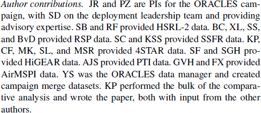
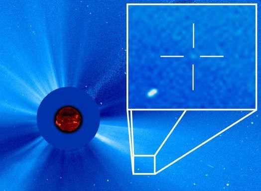
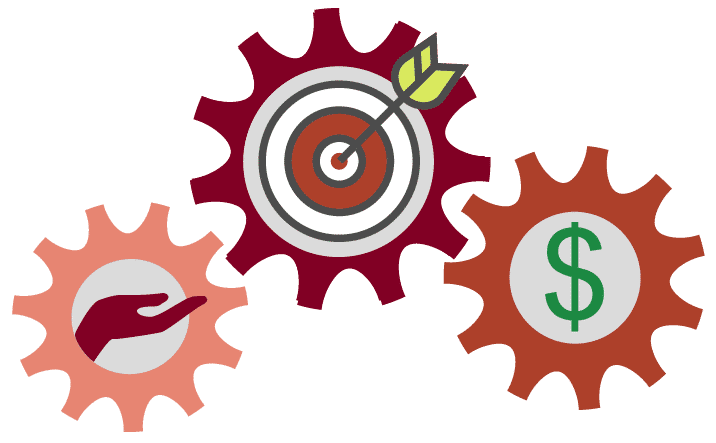

# Lesson 2: Why is Open Science Important?

## Navigation
* [Open Science Breaks Down Stovepipes and Increases Innovation](#open-science-breaks-down-stovepipes-and-increases-innovation)
* [Benefits to You](#benefits-to-you)
* [Benefits to Science](#benefits-to-science)
* [Benefits to Society](#benefits-to-society)
* [Lesson 2: Summary](#lesson-2-summary)
* [Lesson 2: Knowledge Check](#lesson-2-knowledge-check)

## Overview

In this lesson, you learn how adopting open science benefits you as a researcher and society. You also learn about some of the challenges and hurdles with using open science principles and how to navigate them.

## Learning Objectives

After completing this lesson, you should be able to:

- Describe the ways in which open science benefits your career with attribution, reach, and more collaborations.
- Describe the ways in which open science can advance science.
- List the benefits society receives when open science principles are adopted.

## Open Science Breaks Down Stovepipes and Increases Innovation

"We need more WE science rather than ME science."

**Harlan Krumholz,**

**Yale School of Medicine at 2022 CZI Meeting**

---

As NASA looks outward, we face both known and unforeseen challenges. These dynamic challenges will demand a new approach to science that achieves success through a responsive and inclusive scientific ecosystem. This requires more diverse teams - teams with more hands, eyes, and brains that have diverse experiences to participate.

In the previous lesson, we learned about foundational concepts that define open science – its importance, its purpose, and its proven successes. In this lesson, we address key benefits and challenges of implementing open science principles in research activities.

This lesson presents a perspective on the development of science that focuses on the intersection of scientific results, the process of creation, and the stakeholders that constitute the community.

This lesson highlights the benefits of open science to a wide range of stakeholder groups, along with examples that invite readers to investigate further. Additionally, this lesson explores common challenges to adopting open science practices.

Figure: There are many benefits of open science. [CC-BY Danny Kingsley & Sarah Brown](https://blogs.uef.fi/ueflibrary-bors/benefits-and-challenges-of-open-science/).

## Benefits to You

### You are Your Best Future Collaborator!

Doing open science not only lets other people understand and reproduce your results, but lets you do so as well! Implementing open science principles such as good documentation and version control helps you, potential collaborators, and anyone else to understand your results.

If your work is shared publicly, you will never lose access even if you move institutes or change jobs. Many researchers move around institutions and organizations. By having your data and software and results in repositories, you will always have access to them.

Implementing best practices for open science in your work not only helps you document, it could strengthen your funding proposals. Funding agencies have begun to realize that openly sharing research products can increase their citations received and uptake, resulting in a better return on investment.

Well-documented research products also demonstrate the quality of your work, which helps with public communication efforts and can also attract better collaborators. Reliability and a strong work ethic motivate others to want to work with you.

### Give and Get Credit When Using Results of Others

In addition to documenting your own research, the practice of giving credit to everyone who has contributed will strengthen your scientific community reputation and actualize the shared values of open science. As people gain confidence in the benefits of cooperative research, they will also start giving credit to more contributions that might previously have gone unacknowledged. Different work performed as part of a paper can be given in an author contribution statement like the example shared here.

The Turing Way project illustration by Scriberia. Used under a CC-BY 4.0 license. DOI: 10.5281/zenodo.3332807.

---

### More Visibility and Impact

In addition to improved scientific accuracy, adhering to open science practices potentially offers personal career benefits to researchers. Openly published research has significantly more visibility and impact potential with large audiences across the internet, which can lead to more citations, like-minded collaborators, and career/funding opportunities, according to a 2016 [study](https://pubmed.ncbi.nlm.nih.gov/27387362/).

#### Emerging evidence that some aspects of open science can increase your citations.

Publishing open access increases citation count by 18%, according to a 2018 [study](https://www.ncbi.nlm.nih.gov/pmc/articles/PMC7176083/).

Articles that make their data openly accessible via a direct link to a repository see ~25% higher citation impact, according to a 2020 study.

Publishing as open access may have prohibitive costs for some researchers depending on the venue. There are often other options that allow authors to share their work freely and openly. In Module 5 on Open Results, we discuss some of these other options including preprints and diamond open access.

There are many different research outputs that can be openly shared and made citable:

- Code
- Data
- Research talk slides
- Lectures
- Blog posts
- And more!

All of these are tangible, scientific outputs! Much of our time as researchers is spent writing code, collecting data, putting together lectures and not \*just\* publications. Publicly sharing materials publicly makes receiving a citation more likely.

### More Collaborations

Open science practices can also enable stronger collaborations, both within and between disciplines, as evidenced by a 2016 [<u>study</u>](https://liberquarterly.eu/article/view/10819). The ease of access to open data brings new agents to the landscape that allow for broader and more diverse participation. Through open science practices, such as pre-registration where researchers document their research plan at the start of a study, one allows for a stronger research design because feedback from various collaborators and stakeholders can be solicited before data collection begins. Similarly, preprints allow for swifter feedback on conclusions drawn from data once it is collected.

### Activity 2.1: Benefits to You

In this activity, reflect on your answers to the questions and then compare your thoughts to the key takeaways.

- Can you find your own previous work, post-publication and/or pre-publication? Can you bring your research materials (data, code, results) with you if you change institutions?
- Can you find the work of your collaborators? Of scientists in other fields that you find interesting? Have you reached out to others to collaborate with them after finding interesting results?
- Are people in your field giving and getting credit for work done?

**Key Takeaways: Benefits to You**

- Being more open encourages best research practices and makes it easier for you to build on your work.
- Open results have more visibility and impact.
- Open science encourages more collaborative science.

## Benefits to Science

### Transparent Science is Reproducible Science

When computers are used to produce scientific research, the code is considered a "method". Much like a lab research setting, a set of instructions for working with cells or agar plates can be considered a method. Peer-reviewed methods are an essential step in the scientific process. When these steps are not shared, no-one else can reproduce the work or build upon it for future scientific endeavors. Open methods allow people to judge whether or not the methods are trustworthy. In Lesson 1, the story of the Global Cooling Error presented a poignant example of science that was not reproducible because of a lack of data transparency.

### Open Science Can Improve Accuracy

A [study](https://www.nature.com/articles/s41562-021-01193-7) from 2022 found that researchers who practice transparency and promote verifiability benefit from readers and stakeholders who judge whether results presented are accurate and, according to a related [study](https://www.cmu.edu/dietrich/sds/docs/loewenstein/MeasPrevalQuestTruthTelling.pdf), that the results are not produced by questionable research practices that lead to misleading or unreliable results.

Open science also allows others to scrutinize the analytic decisions of researchers, such as whether the analysis was planned before or after observing the data, according to a 2018 [study](https://www.pnas.org/doi/full/10.1073/pnas.1708274114).

This allows others to check if they can arrive at the same conclusion as the original research team, and facilitates stronger public trust and support, according to a 2021 UNESCO [report](https://unesdoc.unesco.org/ark:/48223/pf0000379949).

Here is an example of open science that was able to correct errors in a healthcare study quickly, saving lives! In 2021, a [study](https://www.nature.com/articles/s41598-021-84092-1) was published that found that Covid stay-at-home policies did not stop transmission of the virus. The study was highlighted by prominent lockdown skeptics and news sites – swiftly gaining the attention of many people right at a critical time in the pandemic. Here was a scientific research article that said lockdowns don’t work! The authors of the study published source code and data with their paper. This allowed others to quickly look at how they arrived at their conclusion. Almost immediately, questions were raised about the paper and within nine months, two papers [here](https://www.nature.com/articles/s41598-021-02461-2) and [here](https://www.nature.com/articles/s41598-021-02096-3) pointed out major analysis method errors. The original paper was retracted. We all make mistakes. In this case, the paper had major policy implications and because the original authors had practiced open science, the error was rapidly corrected!

### Open Science Leads to More Discoveries

The Solar and Heliospheric Observatory (SOHO) has been sending home images of our dynamic sun, opening up a new era of solar observation. It was designed for heliophysics. However, planetary scientists found SOHO useful for its ability to spot comets that pass extremely close to the sun, known as sungrazers. To this day, SOHO is one of the best sources for views of the giant surface explosions regularly produced by the sun called coronal mass ejections, or CMEs, which can hurl a million tons of solar particles off into space. This field of view is large enough to see a sungrazing comet as it sling shots around the sun.

SOHO's great success as a comet finder is, of course, dependent on the people who sift through SOHO's data – a task made open to the world through real-time publicly available data.

A cadre of volunteer amateur astronomers dedicate themselves to searching this data via the NASA-funded Sungrazer Project. While scientists often search the imagery for very specific events, various members of the astronomy community choose to comb through all available imagery in fine detail. Over 2,300 comets have been found, 75% by citizen scientists. This created a great training dataset for algorithms. NASA scientists had algorithms to find comets that they felt that were sufficiently accurate.

In 2022 though, NASA decided to fund a challenge open to the public to develop new algorithms and guess what? New algorithms were discovered along with two new comets!

### Quality and Diversity of Scholarly Communications

Furthermore, open science improves the state of scientific literature. Scientific journals have traditionally faced the severe issue of publication bias, where journal articles overwhelmingly feature novel and positive results, according to a 2018 [study](https://pubmed.ncbi.nlm.nih.gov/30523135/). This results in a state where scientific results in certain disciplines published scientific results may have a number of exaggerated effects, or even be “false positives” (wrongly claiming that an effect exists), making it difficult to evaluate the trustworthiness of published results, according to a 2011 and 2016 study. Open science practices, such as registered reports, mitigate publication bias and improve the trustworthiness of the scientific literature. Registered reports are journal publication formats that peer-review and accept articles before data collection is undertaken, eliminating the pressure to distort results, according to a 2022 [study](https://www.nature.com/articles/s41562-021-01193-7). Other open science practices, such as pre-registration, also allows a partial look into projects that for various reasons (such as lack of funding, logistical issues or shifts in organizational priorities) have not been completed or disseminated, according to a 2023 [study](https://pubmed.ncbi.nlm.nih.gov/34396837/), giving these projects a publicly available output that can help inform about the current state research.

By using openly available tools and making our scientific process and products more openly available, we can ensure that all who wish to involve themselves can take part in the global scientific community.

### Key Takeaways: Benefits to Science

- Open science can accelerate scientific discovery. Collective knowledge is not only faster, but more effective than individual efforts.
- Open science allows for errors to be quickly corrected, making science more accurate.
- Open science practices, such as registered reports, mitigate publication bias and improve the trustworthiness of scientific literature.

## Benefits to Society

The mainstream adoption of open science began relatively recently. The potential benefits of open science extend beyond research through contributions to society and policy.

Collaboration, innovation, education, technology advancement, and science-based public policy are all improved by the open availability of research products. Sharing all research products (eg. data, code, results) makes the scientific process more transparent which may help increase public trust in science. Also, open science encourages IDEA (Inclusion, Diversity, Equity, Accessibility), and increases involvement of citizen-scientists and non-experts in the research process. The inclusion of diverse perspectives from an open community invites unique perspectives that contribute to a more robust and often more accurate scientific outcome.

Scientists study issues that affect every aspect of life. Yet, public interest in science remains low due to a lack of trust, understanding, and sociocultural factors. How can scientists expect the public to trust science about complex and often contentious issues, whether it is vaccine development or landing on the moon, if they don’t allow the public to see the process and results? Building trust in science is essential to a well-informed society. Open science provides a pathway to do this.

The public who funds government research through taxes should be entitled to its results and data, as long as safety and security are not an issue. Science should be more open to ensure its insights benefit the public who enables it.

Open science introduces more scrutiny into research that helps ensure accuracy and encourages efficiency through open discourse. This approach accelerates the pace of discovery and subsequently the dissemination of results to the public and policymakers.

### Open Science Can Accelerate the Pace of Science

Open science practices accelerate the pace of scientific discovery by involving ideas and labor from the broader community. The rapid response to the 
[Covid-19 Pandemic showed Open Science in action to accelerate discovery.](https://www.nejm.org/doi/full/10.1056/NEJMp2034518)

Researchers uploaded the initial genome sequence of SARS-CoV-2 into an open-access database in January 2020, creating a data-sharing precedent and metadata that would later enable insights about new Covid-19 variants. The NIH developed a dedicated platform for sharing research tools for Covid-19 and encouraged investigators to expedite reporting to ClinicalTrials.gov ahead of requirements. Open-science publishing agreements that support evidence dissemination have complemented these practices and policies. One day after the World Health Organization declared Covid-19 a public health emergency, more than 50 academic publishers issued a joint statement committing to open-access policies for Covid-19 research. Support for preprint servers has promoted awareness of research successes and failures, and journals have helped accelerate the distribution of actionable information, including by means of dedicated Covid-19 web pages, endorsement of preprints, and an emphasis on sharing data with public health authorities.

### Open Science is Efficient Science

Open science reciprocates the benefits it provides to researchers onto the communities that scientists hope to serve. Data from one observation or science experiment can have unanticipated uses. In Lesson 1, we discussed an example where the use of radar data for tracking the effect of climate change was used to track bird migration.

Through open science practices, research waste can be avoided, such as unintentional and costly repetition of previous studies, according to a 2020 European Commission [report](https://op.europa.eu/en/publication-detail/-/publication/6bc538ad-344f-11eb-b27b-01aa75ed71a1). In the human sciences, this also reduces participant fatigue in the long term. By maximizing what is learned from publicly available data, one does not need to test repeatedly, especially on already vulnerable communities. By “giving away” science, individuals, communities and organizations can more easily adopt research results to inform interventions for their own needs without the knowledge being gatekept by the original researchers and organizations involved. In this way, open science can strengthen the social and economic impacts of scientific results.

### Open Science Attracts a Diverse Set of Participant

Image credit: Andy Brunning/Compound Interest. **CC BY-NC-ND 4.0 DEED**

---

The open sharing of scientific products and processes makes science accessible to everyone. This allows full participation from everyone, and also maximizes the number of people who can benefit from the work.

The best ways to include a diverse group of open science practitioners and stakeholders are to remove existing barriers and design for inclusion. Beyond this, it is important to learn how to communicate effectively with diverse collaborators, people at different skill levels, career levels, backgrounds, and areas of expertise. The ability to build diverse teams is a skill that everyone can learn.

### Key Takeaways: Benefits to Society

- The public who funds government research through taxes should be entitled to its results and data, as long as safety and security are not an issue.
- Open science allows for errors to be quickly corrected and accurate results to be built upon by others, impacting policies.
- Open science decreases the unintentional and costly repetition of previous studies, accelerating science that benefits society.

## Lesson 2: Summary

The following are the key takeaways from this lesson:

- Citing the work of other scientists whose work you build upon or reuse supports the community-minded open science practice of using, making, and sharing.
- Doing science openly can boost the visibility of research and lead to more meaningful collaborations.
- Science quality and efficiency is improved when open science best practices are followed.
- Open science helps society by allowing more people to participate in science, which increases the accuracy and impact of results.

## Lesson 2: Knowledge Check

Answer the following questions to test what you have learned so far.

*Question*

**01/03**

What benefits do the individual researchers gain when practicing open science?

Select all that apply.

- Documenting work
- Receiving credit
- Finding collaborators
- Priority access to international scientific conferences
- Securing a higher position in the academic hierarchy irrespective of their publication record

*Question*

**02/03**

How does openness improve science? 

Select all that apply.

- Accelerated pace of science
- Improved accuracy
- Reduced publication bias
- Fewer discoveries

*Question*

**03/03**

What benefits to society does open science bring? 

Select all that apply.

- Wider use of results increases return on investments in science.
- Open distribution of accurate results reduces misinformation.
- Open Science facilitates a greater understanding and acceptance of pseudoscientific theories.
- It creates more job opportunities in science-related fields, irrespective of the relevance or quality of the research.
- Promotes the commercialization of academic research, leading to increased product advertisements in scientific literature.