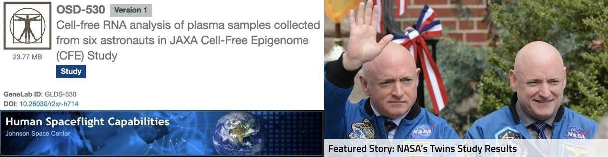
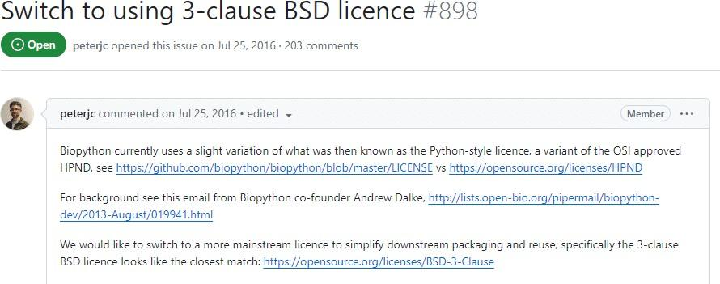
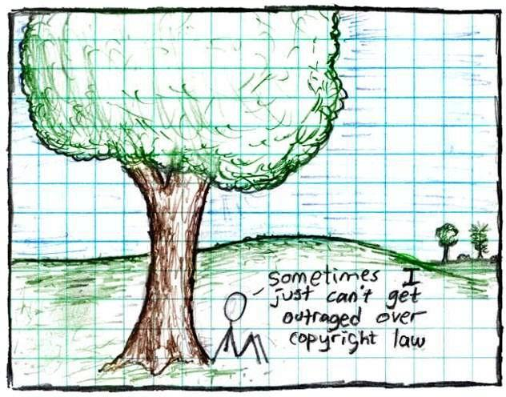

# Lesson 3: How to do Open Science

## Navigation
* [Maintaining Security and Protecting Privacy](#maintaining-security-and-protecting-privacy)
* [Intellectual Property](#intellectual-property)
* [Policies and Practices around Open Science](#policies-and-practices-around-open-science)
* [Lesson 3: Summary](#lesson-3-summary)
* [Lesson 3: Knowledge Check](#lesson-3-knowledge-check)

## Overview

The ability to discern when and how to share information in an appropriate manner is an essential skill of open science. Practitioners of open science must balance their pursuit to maximize openness while respecting diverse cultures, maintaining security and privacy, and following institutional policies and practices.

This lesson introduces important security and privacy considerations for scientists when sharing information. Next, the lesson discusses how sharing information may impact different communities. Following this, the lesson explains the topic of intellectual property, how it can be protected, and the different types of licenses available to facilitate sharing while ensuring the owner of the information receives credit for their work. Lastly, this covers the effect of rules and regulations set by an organization, grant, or publisher on a scientist's options to make their research open access.

## Learning Objectives

After completing this lesson, you should be able to:

- List reasons information should not be shared due to security or privacy issues.
- Define what intellectual property is and recall the different ways it can be shared openly through licenses or the public domain.
- Recognize sharing policies and procedures of your department, organization, funding agency, and publication in order to make the most responsible science sharing decisions.

The following paragraphs of this section outline key areas of consideration for determining whether or not to make your data openly available.

## Maintaining Security and Protecting Privacy

Previous lessons have showcased a broad range of open science success stories, but we recognize that there are still plenty of valid concerns and unexplored challenges to implementing open science. Open science demands the valuable but complex practices of respecting diverse cultures, maintaining security, and protecting privacy. This lesson presents a strategic approach to making decisions about doing open science in common scenarios. For those scenarios that we cannot foresee, this lesson offers mitigation strategies to help overcome unique challenges with mindful preparation and community support.

**Scenario: A Country’s Military Secrets or Violates National Interests** 

When the release of data or research can lead to national security concerns, there are added restrictions around sharing this information. In the U.S., sharing of this type of information often falls under International Traffic in Arms Regulations (ITAR) and Export Administration Regulations (EAR) export control regulations. Sharing ITAR/EAR-regulated data, equipment, resources, or research without clearance to do so can put the country's national security at risk and may bring about both severe criminal and administrative penalties.

**Human Patient Privacy**

*NASA has collected human spaceflight biomedical data since the start of Apollo...*

*... but the only human data in the Life Sciences Data Archive are from astronauts who signed releases for their data to be public.*

In the U.S., health data is protected under the Health Insurance Portability and Accountability Act of 1996 (US-HIPAA) and it is not allowed to be shared without expressed written consent by the patient. As such, health information about astronauts is something NASA protects carefully, working to balance the publicity of the job with regulations and best practices for medical privacy while also enabling peer-reviewed biomedical research.

See this example and more at NASA's [Open Science Data Repository](https://osdr.nasa.gov/bio/repo/data/studies/OSD-530/).

**Respecting Diverse Cultures** 

Open Science advocates for making research widely available, while also recognizing that there are many reasons why some information should not be released, and that these decisions need to involve the people who provided input and/or could be harmed by the consequences of release.

**Indigenous, Cultural, and Conservation Concerns**

When considering the impacts of data sharing, it is important to recognize if those affected are equally represented in the discussion. For example, historically excluded communities, the environment, and wildlife are too often not considered when deciding to make research open access.

[For example](https://www.nature.com/articles/s41576-019-0161-z), while genomic research often relies on individual- based consent, it is often used to make decisions that impact indigenous communities without their consent.

Another [example](https://www.theguardian.com/us-news/2023/feb/23/lidar-technology-archeology-radical-thinking) of how data can inadvertently impact vulnerable communities is the use of LiDAR by archaeologists to study remote areas. This type of data has the potential to reveal unprotected vulnerable indigenous sites in need of protection.

 

**CARE Principles**

The [CARE Principles of Indigenous Data Sovereignty](https://www.gida-global.org/care) are people- and purpose-oriented, and were originally set up to use data in a way that advances data governance and self-determination among Indigenous Peoples. CARE principles can be applied by involving communities or local stakeholders and should be covered at the start of a research project.

**Environmental Justice**

When sharing your results, are you sharing it with the groups that are most impacted in ways that are accessible to them? When studying the impact or effect on a specific community, it is important to include that community in the design of your work and ensure that the results of the work are accessible - both freely available and understandable – to the communities involved.

Environmental justice is the fair treatment and meaningful involvement of all people regardless of race, color, national origin, or income with respect to the development, implementation, and enforcement of environmental laws, regulations, and policies. Read more about how [NASA Earth data is being made more accessible to those communities most affected](https://www.earthdata.nasa.gov/learn/backgrounders/environmental-justice). 

**Protecting Endangered Species**

Humans aren’t the only group that can be negatively impacted by data sharing. Rare and endangered species can also be impacted. For [example](https://www.rspb.org.uk/birds-and-wildlife/crane), the sharing of breeding sites for declining wildlife populations can further exacerbate the population decline. For this reason, rare animals may have their breeding sites kept secret.

## Intellectual Property

### What is Intellectual Property?

Intellectual property is the recognition of rights associated with the content created by human intellect. There are several different types of intellectual property and how they are recognized varies by country, type, and timescales.

It's important to understand who has the rights to the content you create. It can depend on a number of different factors. Work that you create may belong to your employer, may be in the public domain, may depend on the license of underlying work, may belong to the publisher of your work, or may be your own intellectual property. Ownership may affect how your work can be shared.

This section provides an introduction to some of the common issues faced by researchers around intellectual property. For instructions specific to your institution, reach out to your intellectual property counsel at your institution for details of how these may affect sharing your scientific work.

### Most Common Types of Intellectual Property Protection

**Copyright**

A copyright protects original works of authorship. This could be artistic or literary works, and also applies to software. In general and if applicable, copyright is automatically applied at the moment of creation with no further registration needed.

Most open licenses depend on copyright. The person(s) who owns the copyright has the right to apply for a license.

Example: An image in a scientific journal or something from the web. Generally speaking, using copyrighted images for teaching and education is considered fair use. However, if that includes posting images to a website, that could be considered a publication and therefore copyright infringement.

**Trademark**

A trademark can be applied to any content including words, phrases, symbols, designs, or a combination of these things that identifies your product. Trademarks in general are not relevant for scientific purposes.

**Patents**

A patent is an exclusive right granted for an invention, which is a product or a process that provides, in general, a new way of doing something, or offers a new technical solution to a problem. Patents are another way to make your work open while protecting your intellectual property.

Many organizations have groups that will support the development and commercialization of inventions. [NASA's Tech Transfer](https://technology.nasa.gov/) office is an example of one of these making much of NASA's inventions available for licensing as part of the [NASA Patent Portfolio](https://technology.nasa.gov/patents).

**Public Domain**

In some cases, intellectual property is not protected at all. Public domain is when a creative work has no intellectual property rights associated with it. Some types of intellectual property expires after a certain time scale. Some types of work, such as those created by civil servants in the United States, is not covered by copyright and can appear immediately in the public domain. For others, the creator donates the work to the public domain or intellectual property rights are not applicable.

### Why Should You Care About Intellectual Property Policies?

Why should I, as a scientist, care about this? Well, consider what happens to the ownership of your research if you move institutions:

- Can you take your paper drafts, presentations, and copies of publications with you?
- Can you take your data?
- Can you take your software?

Understanding these questions is important to practicing open science and ensuring that your intellectual property is able to be shared widely. Review the image on the right as an example.

Worrying about intellectual property and copyright can seem like an unnecessary detail early on. However, anticipating changes to your situation by ensuring permanent ownership of your work in the planning phase of your research can help you avoid legal and institutional issues later on.

If you submit your manuscript to a publisher that requires that they own the copyright of the work, will you be able to access that paper when you change jobs and no longer have a subscription to that work? Are you able to meet the mandates of your funding agency to openly share your work? Can you reuse the figures that you made in derivative works? Will others be able to access your work? While these may seem like questions you shouldn't have to worry about, it can become very difficult to deal with after the fact.

Example: In scenarios where seeking consent before sharing (or changing sharing conditions), it can be complex to implement the changes. Biopython, an open source biology toolkit, started re- licensing their code in 2016, and [are still working on it in 2023, individual contributor by individual contributor.](https://github.com/biopython/biopython/issues/898)

### Licensing

Licensing is a way to help to allow others to reuse your work legally. It is a way to specify under what conditions, if any, others can use, build upon, or distribute your work. It is also a method to ensure that your work is appropriately credited. It is generally illegal and may be a form of academic misconduct to reuse content without a license, even if the content can be found on the internet. This law protects content creators, just as it protects your work from being used by others without clear permission. Thankfully, it’s easy to allow others to re-use your work.

"By applying a license to your work, you make clear what others can do with the things you're sharing, and also establish the conditions under which you're providing them (such as cite you)."

**Open Science Knowledge Base**

---

Image credit: XKCD: CC BY-NC 2.5 DEEX 

[https://xkcd.com/14/](https://xkcd.com/14/)

---

If you don't license your work, others can't/shouldn't re-use it – even if you want them to.

Licenses can be applied to data, code, and reports, or publications, and almost any other "creative" output. There are also several different types of licenses and also the case where no license need to apply:

<table>
  <thead>
    <tr>
        <th>PERMISSIVE LICENSES &#9745;</th>
        <th>PROTECTIVE LICENSES</th>
        <th>PUBLIC DOMAIN</th>
    </tr>
  </thead>
  <tbody>
    <tr>
        <td colspan="3">
            
Permissive Licenses allow users a wide range of rights including the ability to use, modify, and distribute the work with no restrictions or very few. Examples of permissive license would be open source software license such as Apache 2.0 or MIT license or the Creative Commons licenses such as <a href="https://creativecommons.org/licenses/by/4.0/">Creative Commons Attribution (CC-BY)</a>.

        </td>
    </tr>
  </tbody>
</table>

<table>
  <thead>
    <tr>
        <th>PERMISSIVE LICENSES</th>
        <th>PROTECTIVE LICENSES &#9745;</th>
        <th>PUBLIC DOMAIN</th>
    </tr>
  </thead>
  <tbody>
    <tr>
        <td colspan="3">
            
Protective Licenses are a legal technique of granting certain freedoms over copies of copyrighted works while including some limitations. This may include copyleft licenses, commercial licenses, or other restrictions.

        </td>
    </tr>
  </tbody>
</table>

<table>
  <thead>
    <tr>
        <th>PERMISSIVE LICENSES</th>
        <th>PROTECTIVE LICENSES</th>
        <th>PUBLIC DOMAIN &#9745;</th>
    </tr>
  </thead>
  <tbody>
    <tr>
        <td colspan="3">
            
Public Domain is not a license, but it is an indication that there are no reuse restrictions on the work. <a href="https://creativecommons.org/publicdomain/zero/1.0/">Creative Common Zero</a> is a worldwide public domain mark that indicates that the material is free to use without any restrictions.

        </td>
    </tr>
  </tbody>
</table>

 More detail about licensing for each of these types of products can be found in later modules including different types of licenses, when to apply a license, and tools for applying licenses. Creative Commons and the Open Source Initiative are two resources with more information on open licenses.

### Activity 3.1: To Share or Not to Share

Place the following activities into the Share or Not Share boxes:

<table style="width:100%">
  <tr>
    <th colspan="23">Share</th>
  </tr>
  <tr>
    <td>Plant genome data from experiments on the International Space Station.</td>
    <td>Software that identifies solar flares.</td>
    <td>Artificial Intelligence model trained on Mars observations.</td>
  </tr>
</table>

<table style="width:100%">
  <tr>
    <th colspan="23">Not Share</th>
  </tr>
  <tr>
    <td>Export controlled design documentation for a high resolution camera.</td>
    <td>Non-anonymized astronaut health data.</td>
    <td>Software containing login keys to high performance computers.</td>
  </tr>
</table>

## Policies and Practices around Open Science

So far we've discussed situations where sharing may not be appropriate or may need to be handled with care, as well covered intellectual property protections to consider prior to sharing your work. Next, we will explore the importance of policies and practices to practicing open science set by your organization, funding agency, and academic journal. The decision to not release certain scientific results can be a moral and/or legal choice. The next section of this lesson is an introduction on what to watch out for.

### Preparing to Use and Make Controlled Research

It is important to plan for the release of your data and results from the very beginning of your research project. Investigate and obtain all permits, approvals, and/or certifications needed to ensure you can share your research products.

**Remember:** Reputable journals and repositories will reject submissions if compliance can’t be documented!

<table>
  <thead>
    <tr>
        <th>MATERIALS - SHARING AND COMMERCIAL PRODUCT AGREEMENT &#9745;</th>
        <th>HUMAN OR ANIMAL SUBJECT INSTITUTIONAL REVIEW BOARDS</th>
        <th>COLLECTING PERMITS</th>
    </tr>
  </thead>
  <tbody>
    <tr>
        <td colspan="3">
            <ul>
            <li>Can be permissive or restrictive.</li>
            <li>Many versions available.</li>
            </ul>
        </td>
    </tr>
  </tbody>
</table>

<table>
  <thead>
    <tr>
        <th>MATERIALS - SHARING AND COMMERCIAL PRODUCT AGREEMENT</th>
        <th>HUMAN OR ANIMAL SUBJECT INSTITUTIONAL REVIEW BOARDS &#9745;</th>
        <th>COLLECTING PERMITS</th>
    </tr>
  </thead>
  <tbody>
    <tr>
        <td colspan="3">
            <ul>
            <li>Check experiment-specific requirements early.</li>
            <li>Be sure to comply with all aspects of ongoing review.</li>
            </ul>
        </td>
    </tr>
  </tbody>
</table>

<table>
  <thead>
    <tr>
        <th>MATERIALS - SHARING AND COMMERCIAL PRODUCT AGREEMENT</th>
        <th>HUMAN OR ANIMAL SUBJECT INSTITUTIONAL REVIEW BOARDS</th>
        <th>COLLECTING PERMITS &#9745;</th>
    </tr>
  </thead>
  <tbody>
    <tr>
        <td colspan="3">
            <ul>
            <li>Don't assume collection is allowed just because a sampling location seems unmanaged.</li>
            <li>Engage and consult with local communities to ensure their concerns are addressed.</li>
            </ul>
        </td>
    </tr>
  </tbody>
</table>

### Sharing Controlled Research

As we've previously shown, different kinds of intellectual property are released using different formal structures. For example, text and media products are released under copyright and software is released under a license.

It is important to check with specialist communities when preparing your research plan. Methods for sharing results may follow different standards of practice or may require a special data format for distribution or submission to common repositories.

<table>
  <thead>
    <tr>
        <th>CREATIVE COMMONS VS. OPEN SOURCE VS. PUBLIC DOMAIN LICENSES &#9745;</th>
        <th>REPOSITORIES</th>
        <th>GUID ELEMENTS FOR SELECTING BETWEEN OPTIONS</th>
    </tr>
  </thead>
  <tbody>
    <tr>
        <td colspan="3">
            <ul>
            <li>Can be permissive or restrictive.</li>
            <li>Many versions available.</li>
            </ul>
        </td>
    </tr>
  </tbody>
</table>

<table>
  <thead>
    <tr>
        <th>CREATIVE COMMONS VS. OPEN SOURCE VS. PUBLIC DOMAIN LICENSES</th>
        <th>REPOSITORIES &#9745;</th>
        <th>GUID ELEMENTS FOR SELECTING BETWEEN OPTIONS</th>
    </tr>
  </thead>
  <tbody>
    <tr>
        <td colspan="3">
            <ul>
            <li>General and discipline-specific options.</li>
            <li>Check submission requirements early.</li>
            <li>Often have user communities willing to help.</li>
            </ul>
        </td>
    </tr>
  </tbody>
</table>

<table>
  <thead>
    <tr>
        <th>CREATIVE COMMONS VS. OPEN SOURCE VS. PUBLIC DOMAIN LICENSES</th>
        <th>REPOSITORIES</th>
        <th>GUID ELEMENTS FOR SELECTING BETWEEN OPTIONS &#9745;</th>
    </tr>
  </thead>
  <tbody>
    <tr>
        <td colspan="3">
            <ul>
            <li>Choose 'supported' versions with active and friendly communities.</li>
            <li>Take precautions to reduce security risk.</li>
            </ul>
        </td>
    </tr>
  </tbody>
</table>

What are the rules for science? Before sharing, check you have the right to do so:

1. What does your supervisor or Principal Investigator say?
2. What does your grant/contract say?
3. What does your organization say?
4. What does your funding agency say?
5. If you are planning to publish, what does the publisher say?

Remember, sometimes what they say may conflict, for example:

- If your grant / funder says outputs should be open, usually your institute will permit you to share items even if they are normally more restrictive.
- Different types of outputs may have different types of restrictions. (e.g. software or hardware might have one expectation, whilst data might have others).

Universities and other institutions may have OSPOs (Open Source Policy Office) or commercialisation offices. Most institutes will have intellectual property counsel to help answer questions. Librarians are another good resource to consult when looking for advice on sharing. Considering these policies earlier in your research can save you time and energy down the road, which is why...

### Early is Better

It is important to think about what policies may affect your research outputs as early as possible so that when you want to share information, you have either already obtained approvals or know where to go to get approvals to share. This ensures that you don’t inadvertently share (or fail to share) something that could affect your career, negatively impact others, or pose legal issues.

**Remember:** You can't unshare something that is already shared! Equally, if your research requires ethical approval or consent to share, this may be harder to gain after you’ve done your study.

This also helps structure your research, data, and methods in a way that makes it easier for you to share when the time comes.

### Reusing Science Ethically - Give Credit!

As we stated previously, licensing helps make sharing your work easier, but it also ensures you retain credit. It’s always important to properly source any content you use and remember to only share properly licensed content. Even if a license does not require attribution, providing credit helps increase reproducibility by providing the provenance of your work. This is the norm in scientific communities.

Remember when reusing science:

- Open science is a partnership and giving credit is critical to make it work.
- Consider citing all resources used: datasets, software, infrastructure, etc.
- Hopefully, others will reciprocate when reusing your work. (Scientific ethics dictate they should).

Standing on the shoulders of giants (Public Domain) 

Image credit: [Library of Congress](https://commons.wikimedia.org/wiki/File:Library_of_Congress,_Rosenwald_4,_Bl._5r_cropped.jpg), Rosenwald. CC-BY

---

In addition to documenting your own research, giving credit to all contributors strengthens the practice and community of Open Science. As researchers gain confidence in the benefits of cooperative research, they will in turn give credit to contributors that might otherwise have gone unacknowledged.

### Other Reasons Not to Share

This lesson has only covered common scenarios of when and how to share science. Regardless of the situation, it’s important to consider the implications of sharing information and those who could be negatively impacted before deciding if or how the information should be shared.

In order to practice responsible open science, careful attention should be given to how data is anonymized and how sensitive information is removed from it in order to safeguard people’s identity and prevent breaches of privacy. The misuse of private data and illicit means of collection is an issue for every sector, not only science.

### Activity 3.2: Not all Science Can, or Should, be Open All the Time

In this activity reflect on your answers to the following questions:

- What are some reasons you would NOT want your research to be open?
- How would you balance openness with privacy/security/control?

## Lesson 3: Summary

In this lesson, you learned:

- Situations when it may be inappropriate or harmful to share your data or research. These include maintaining security, protecting privacy, and respecting diverse communities.
- What intellectual property is, who owns it, and how it is protected through licenses.
- Various organizations within science (e.g. universities, publications, funding agencies, etc.) may have their own individual sharing policies that are best to consider at the beginning of a research project to avoid any potential pitfalls along the way.

## Lesson 3: Knowledge Check

Answer the following questions to test what you have learned so far.

*Question*

**01/03**

What type of Intellectual Property protection would you need for an image you generated from your own data to display your results?

- Patent
- Trademark
- Copyright

*Question*

**02/03**

Which of the following is NOT a common type of license:

- Copyright
- Permissive
- Creative Commons

*Question*

**03/03**

Which of the following should be considered when sharing information?

- What does your funding agency say?
- What does your organization say?
- How are affected communities impacted by the release of the information?
- All of the above.