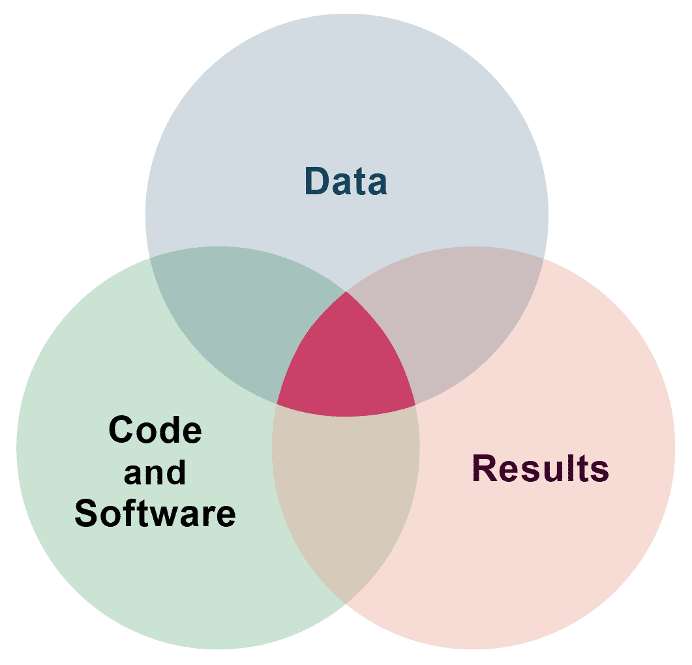
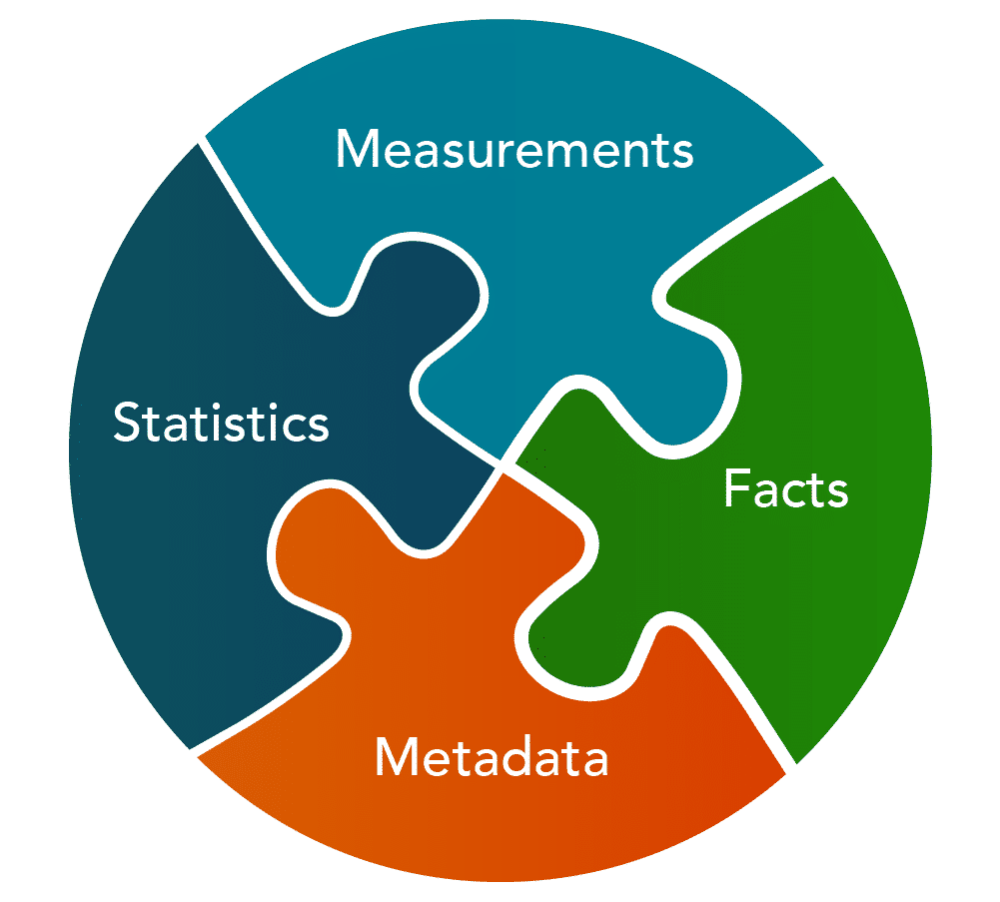
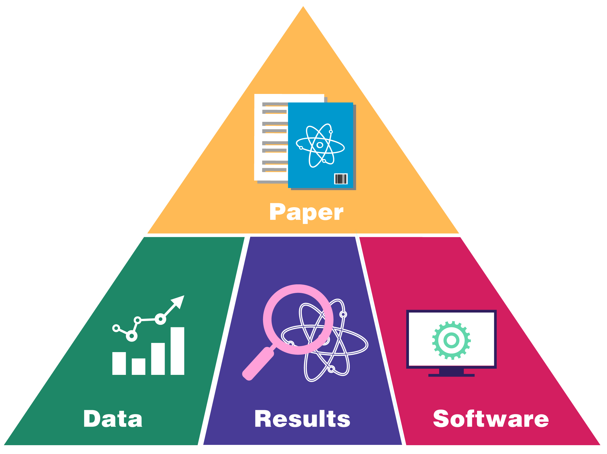
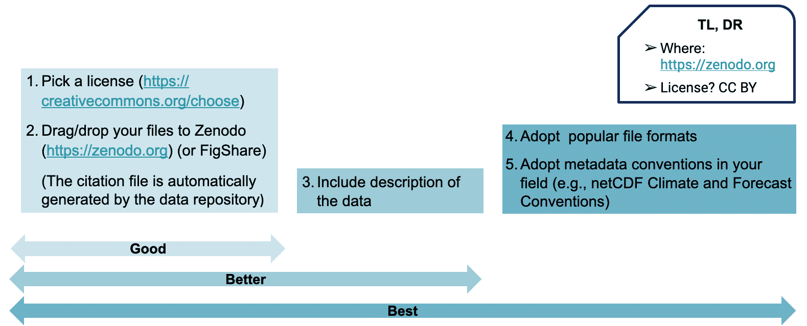
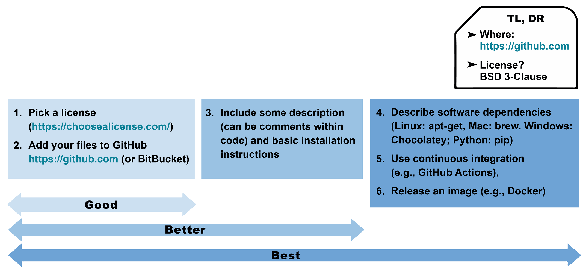
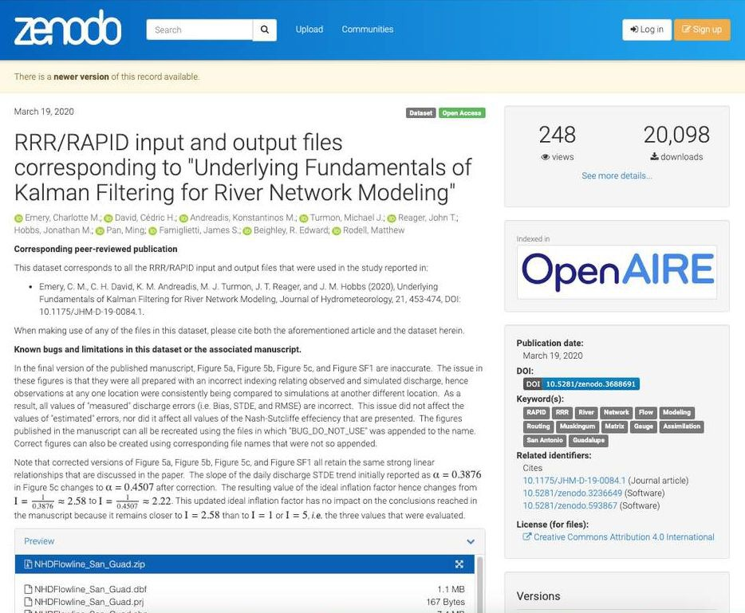
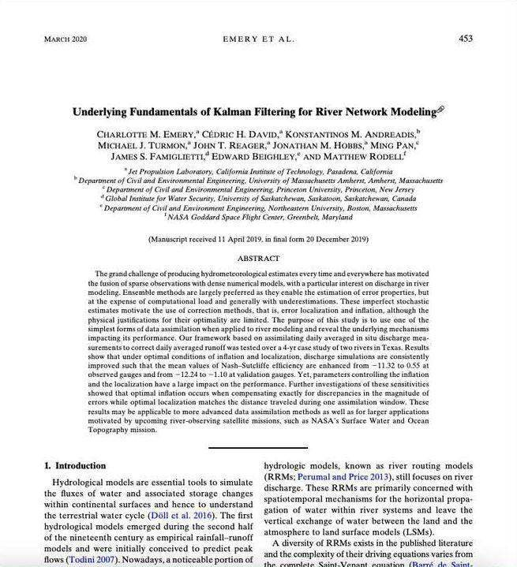

# Lesson 1: Introduction to the Process of Open Science

## Navigation
* [Definition of Open Science and Research Products](#definition-of-open-science-and-research-products)
* [Using Tools for Open Science in Practice](#using-tools-for-open-science-in-practice)
* [Lesson 1: Summary](#lesson-1-summary)
* [Lesson 1: Knowledge Check](#lesson-1-knowledge-check)

## Overview

In this lesson you review the definition of open science and several other common terms including research products, data, software, and results. In addition, you will read examples that demonstrate how these open science tools are used in practice. The lesson wraps up with an example of how one group openly shared their data, results, software, and paper.

## Learning Objectives

After completing this lesson, you should be able to:

- Define common types of research products including data, software, and results.
- List common ways to share data, code, and results while practicing open science.

## Definition of Open Science and Research Products

### What is Open Science?

"Open Science is the principle and practice of making research products and processes available to all, while respecting diverse cultures, maintaining security and privacy, and fostering collaborations, reproducibility, and equity."

**The White House Office of Science and Technology Policy (OSTP) and the National Science and Technology Council (NSTC)**

---

### Open Research Products

Scientific knowledge, or research products, take the form of:

 

### What is Data?

In general, data are pieces of information about a subject, including theoretical truths, raw measurements, or highly processed values.

There can even be data about data, called metadata. In our lessons, when we talk about data we are referring to scientifically or technically relevant information that can be stored digitally and accessed electronically such as:

- Information produced by missions and experiments, including calibrations, coefficients, and documentation
- Information needed to validate scientific conclusions of peer-reviewed publications

Open data can have many characteristics, including rich and robust metadata and be made available in a range of formats. These characteristics are detailed more later in this module, and even further in the module on Open Data.

### What is Code?

Many scientists write source code to produce software to analyze data or model observations. Code is a language that humans can type and understand. Software is often a collection of programs, data, and other information that a computer system uses to perform specific tasks. Scientists write and use many different types of software as part of their research.

**General Purpose Software** – Software produced for widespread use, not specialized scientific purposes. This encompasses both commercial software and open-source software.

**Operational and Infrastructure Software** – Software used by data centers and large information technology facilities to provide data services.

**Libraries** – No creative process is truly complete until it manifests a tangible reality. Whether your idea is an action or a physical creation, bringing it to life will likely involve the hard work of iteration, testing, and refinement.

Just be wary of perfectionism. Push yourself to share your creations with others. By maintaining an open stance, you’ll be able to learn from their feedback. Consider their responses new material that you can draw from the next time you’re embarking on a creative endeavor.

**Modeling and Simulation Software** – Software that either implements solutions to mathematical equations given input data and boundary conditions, or infers models from data.

**Analysis Software** – Software developed to manipulate measurements or model results to visualize or gain understanding.

**Single-use Software** – Software written for use in unique instances, such as making a plot for a paper, or manipulating data in a specific way.

Some of the tools that you can use to develop software are introduced in Lesson 4. Understanding how to find and use others' code, create your own, and share it are an important part of advancing science and covered in the module on Open Code.

### What are Results?

Results capture the different research outputs of the scientific process. Publications are the most common type of results, but this can include a number of other types of products. Both data and software can be considered a type of result, but when we discuss results, we will focus on other types of results. Results can include the following:

- Peer-reviewed publications
- Computational notebooks
- Blog posts
- Videos and podcasts
- Social media posts
- Conference abstracts and presentations
- Forum discussions

 You may already be familiar with the research life cycle, but still unfamiliar with the types of results that can be shared openly throughout this process. When sharing results, we strive to be as open as possible, with the goal of increasing reproducibility, accessibility, and inclusion of our science. Throughout the research lifecycle, there are multiple opportunities to openly share different results that can lead to new collaborations and lines of inquiry. Additional details on the scope of open results are shared in Module 5 – Open Results.

## Using Tools for Open Science in Practice

The following lessons in this module explore different tools and resources available to researchers for using, making, and sharing open science. As mentioned, it is important to think about how to integrate open science principles across all stages of the research process. Here is an overview of one way the various pieces might work together.

### The Components of Open Science

The four principal components of open science can be organized in a pyramid of openly-shared research products.

The research paper, closely tied to the results, sits at the top of the pyramid and summarizes how you’ve combined your software and your data to produce your results.

The practice of sharing these components can occur at varying degrees of completeness. For the following guidance on how to share components of open science, we simplify the range of completeness to "good", "better", and "best." This range reflects one’s commitment to sharing open science at all steps in the research process and to all of its products.

### Sharing Open Data

Data can be easily shared through many different services - the best way for scientific data to be shared is often through a long term data repository that will both preserve your data and make it discoverable. The image provides some of the considerations when sharing the data through [Zenodo](https://zenodo.org/), a generalist data repository. These considerations would be similar for other data repositories. See Module 3 - Open Data for more details on sharing open data.

### Sharing Open Code

When sharing open code, it is often through an online version controlled platform that allows others to contribute to the software and provides a history of changes to the software. For example, many researchers choose to post code files on  [GitHub](https://github.com/) with a BSD 3-Clause license. This permits others to contribute and reuse the software. Steps to preserve code and make it discoverable are discussed in Module 4 - Open Code.

 

### Sharing an Open Paper

Researchers can choose to publish in a journal with an open access license. Researchers can search for open access journals through the Directory of Open Access Journals (DOAJ). (See Module 5 - Open Results)

### Sharing Open Results

When sharing results, include your methodology that was used to produce results (i.e. the “provenance”) directly with your software. Software tends to evolve with time while the outputs of the software itself can retain some consistency. Therefore, sharing your methodology helps others to reproduce your aging results with newer software, even if the methodology to produce them can vary as the software evolves.

### An Open Science Project Example

Here is an example of how one group openly shared their data, results, software, and paper; all with their own unique identifiers. Note that data and software can each have multiple identifiers, enabling others to cite all versions or one unique version.

 Here, you can review the separate elements of the image above. Select "\<" and "\>" buttons to navigate.

 **Data**

 This version:  [https://doi.org/10.5281/zenodo.3688691](https://doi.org/10.5281/zenodo.3688691)

All versions:  [https://doi.org/10.5281/zenodo.3688690](https://doi.org/10.5281/zenodo.3688690)

**Results**

  [https://doi.org/10.1175/JHM-D-19-0084.1](https://doi.org/10.1175/JHM-D-19-0084.1)

 

Software

This version:  [https://github.com/c-h-david/rapid](https://github.com/c-h-david/rapid) 

All versions:  [https://doi.org/10.5281/zenod](https://doi.org/10.5281/zenod)

## Lesson 1: Summary

In this lesson, you learned:

- Scientific knowledge, or research products, take the form of: data, software, and results.
- In general, data are pieces of information about a subject, including theoretical truths, raw measurements, or highly processed values.

## Lesson 1: Knowledge Check

Answer the following questions to test what you have learned so far.

*Question*

**01/03** 

Read the statement below and decide whether it's true or false:

*Open Science is the principle and practice of making research products and processes available to all, while respecting diverse cultures, maintaining security and privacy, and fostering collaborations, reproducibility, and equity.*

- True
- False

*Question*

**02/03** 

What are the four principal outputs of open science? Select all that apply.

- Budgets
- Results
- Inclusion
- Data
- Code
- Paper

*Question*

**03/03** 

Which of the following is a type of software? Select all that apply.

- General purpose
- Operational and Infrastructure
- Modeling and Simulation
- Analysis
- Material