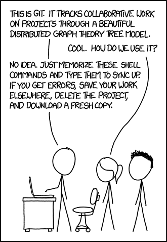
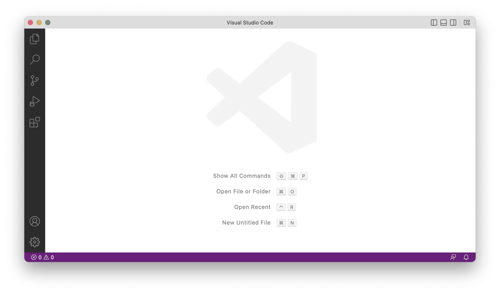
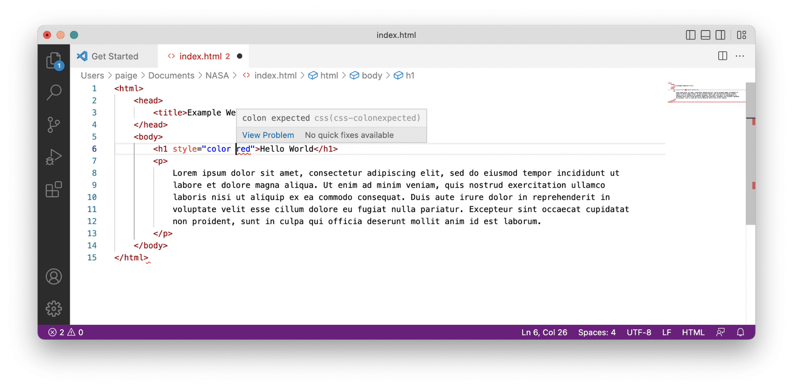
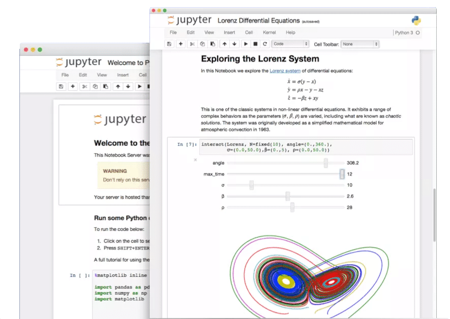
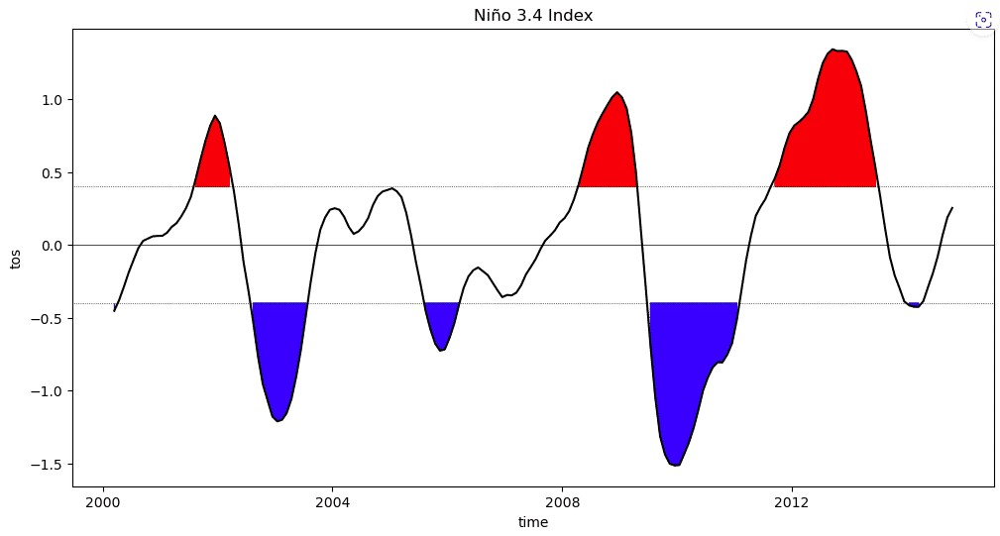

# Lesson 4: Tools for Open Code

## Navigation
* [Introduction to Open Code](#introduction-to-open-code)
* [Tools for Version Control](#tools-for-version-control)
* [Tools for Editing Code](#tools-for-editing-code)
* [Additional Tools](#additional-tools)
* [Lesson 4: Summary](#lesson-4-summary)
* [Lesson 4: Knowledge Check](#lesson-4-knowledge-check)

## Overview

This lesson introduces you to some useful tools for working with open code. You will learn the various tools available to develop, store, and share open code, from version control to code editing software to containers.

## Learning Objectives

After completing this lesson, you should be able to:

- Explain the benefits of using tools for open code development.
- Define version control and understand how it supports collaboration in the development and management of code.
- List a few tools for editing software and some of their features.
- Distinguish between software repositories and software archives.

## Introduction to Open Code

In Lesson 3, we learned about useful tools for working with scientific data. Now, we will provide an overview of commonly used tools that help us write and run computer code to explore, analyze, and visualize our scientific data. Later in Module 4 – Open Code, we will discuss in greater detail what it means to make our code open, and walk through the steps of how to find, create, and share open code.

Understanding how to work with scientific code is essential in the modern landscape of data-driven research. The tools presented in this lesson encompass a diverse array of resources designed to streamline, enhance, and optimize the process of developing, maintaining, and collaborating on code development for scientific research. They enable the creation of robust and efficient code, often leveraging the collective wisdom of the open-source community. In the pursuit of reproducibility and transparency, these tools can also facilitate the sharing and dissemination of scientific code, fostering collaboration and ensuring that the foundations of scientific research remain open and accessible to all.

### Historical Precedent for Making Code Open: Linux Operating System

Is the idea of writing code openly a new concept? No!

#### Context: Development of Linux OS

[CLICK TO LEARN](https://en.wikipedia.org/wiki/History_of_Linux)

- Started in 1991 by Linus Torvalds.
- Almost immediately released for scrutiny.
- Many eyes → Many bugs found → Many fixes. 

## Tools for Version Control

### Version Control

Version control is the practice of tracking and managing changes made to code or other types of files. You may be familiar with “Track changes” in software like Microsoft Word. This is a form of version control, though not one well-suited to working with code. Version control is considered standard practice in the software development community, and simplifies management of code through time.

The general way we use version control starts by initializing a folder on your computing platform with the version control system you are using. A version control system automatically tracks all changes made by contributors and allows you to work offline and return later with updates. You write code as you usually do in your code editor of choice. After you have written some code or made some updates to existing code, you then commit those changes to the version control system to create a sort of "checkpoint" that you can then revert back to later if necessary. Then you add or update more code, and commit changes again. Each commit requires you to add a short message which lets you briefly describe what changes were made. These messages serve as metadata that ensures collaborators, future users, and future you understand your development process at a point in time.

This may sound like a simple process, and in many ways it is! So why is it so important? Especially when it comes to coding, the ability to create a snapshot in time of a piece of code can be very helpful. For instance, you may have a piece of code that yields the intended result, but then you want to add a new function. You may choose to copy that code file so you don’t lose the current state, and then work in a new file. This can become cumbersome pretty quickly when you have multiple files that are different versions of the same piece of code. Or instead of creating a new file, you may write code for the new function directly in the original file, but now the code throws errors when you try to run it, and you can’t remember which lines you added since the last time the code ran without errors. By using version control, these problems are solved because we can revert back to the checkpoint when the code ran cleanly, and thereby avoid the need to create multiple copies to save the original piece of code.

There are many other features of version control systems, such as the concept of creating "branches" that allow you to work on new updates to a piece of code independently from and in parallel to the original piece of code. A branch is a deviation from the original code, but can be merged back into the original code when desired. All of these concepts are even more useful when collaborating with others using version control platforms, a collaborative practice that will be discussed later in this lesson.

### Types of Software Version Control

There are two main styles of software version control systems:

<table>
  <thead>
    <tr>
        <th>CENTRALIZED &#9745;</th>
        <th>DISTRIBUTED (MORE POPULAR)</th>
    </tr>
  </thead>
  <tbody>
    <tr>
        <td colspan="2">
            <ul>
              <li>Singular "main" copy of the codebase</li>
              <li>Must interact with specific server</li>
              <li>Example: Subversion (SVN)</li>
            </ul>
        </td>
    </tr>
  </tbody>
</table>

<table>
  <thead>
    <tr>
        <th>CENTRALIZED</th>
        <th>DISTRIBUTED (MORE POPULAR) &#9745;</th>
    </tr>
  </thead>
  <tbody>
    <tr>
        <td colspan="2">
            
Control:

            
Each developer’s system can retain a copy of the codebase 
            Examples:

            <ul>
              <li>Git</li>
              <li>Mercurial</li>
            </ul>
        </td>
    </tr>
  </tbody>
</table>

Using a distributed version control system like Git gives you more flexibility.

**Example: Git**

The most popular version control system for software development is Git. Git is open-source and is commonly used in conjunction with web-based software hosting sites like GitHub and GitLab (more on these in the next section), which allow for collaboration and sharing of code. You can also use it on your local computer when writing your own code. Git is often run at the command line, but there are other interfaces for using Git as well, including GitHub Desktop and some code editors that have Git integration included (more on this later).

[https://xkcd.com/1597/](https://xkcd.com/1597/)

---

Git is very powerful and widely used (according to a Stack Overflow [ developer survey](https://survey.stackoverflow.co/2022), over 87% of developers use Git), but that doesn’t mean it is straightforward to learn. There are many good resources for learning Git (see below). If you find Git confusing at first, know that you are not alone! (There’s even an XKCD comic about it!). For in-depth training on Git, please see the Software Carpentry lesson, listed below: [ Version Control with Git: Summary and Setup (swcarpentry.github.io)](https://swcarpentry.github.io/git-novice/)

### Version Control Platforms

Version control platforms, typically web-based software hosting platforms, expand the usefulness of version control by allowing for a centralized location to store and collaborate on code, along with many other helpful features for code development and sharing.

Some examples of version control platforms:

- GitHub: a Git-based platform that allows collaboration and code history tracking. Owned by Microsoft.
- GitLab: a Git-based platform that also offers DevOps and CI/CD functionalities.
- BitBucket: a platform that can host Git and Mercurial repositories. Owned by Atlassian.

GitHub is one of the most popular platforms, and so we will provide examples of how to use GitHub in the rest of this section. It is important to note that GitHub is where most open-source software packages are housed, and so if you are interested in getting more involved with the open source software community, GitHub is an essential tool to learn how to use!

**Example: GitHub**

GitHub is an online, cloud-based software repository hosting site that integrates with Git and offers many other features that help with code development, collaboration, testing, and releases. Before we dive into some of these features, it’s important to understand how GitHub acts as a remote repository when using version control systems like Git.

If we go back to the general idea of using version control systems, GitHub can be added into the picture as a remote repository that hosts code. After creating a “checkpoint” in Git, you can then upload a copy of the current snapshot of your code to GitHub. There are a few reasons you might want to do this, including:

- To serve as a backup for your work (it is now stored on a remote server that you can access even if your computer dies).
- To share your code with others (more on this later in this course).
- To collaborate with others on your code. By uploading to GitHub, your code can be made accessible to others who might want to add features.

Let’s expand on some of GitHub’s collaboration tools. Some of these features include:

<table>
  <colgroup>
    <col style="width: 49%" />
    <col style="width: 49%" />
  </colgroup>
  <thead>
    <tr class="header">
      <th>Term</th>
      <th>Description/Definition</th>
    </tr>
  </thead>
  <tbody>
    <tr class="odd">
      <td>Issue Tracking</td>
      <td>
        Keep track of feature requests, bugs, and other types of updates via GitHub Issues. GitHub also allows the use of labels and assigning people to tasks to help organize tasks.
      </td>
    </tr>
    <tr class="odd">
      <td>Project Discussion Forums</td>
      <td>
        GitHub allows for an online discussion forum where you can ask and answer questions, and hold community discussions.
      </td>
    </tr>
    <tr class="odd">
      <td>Contribution Tracking</td>
      <td>
        GitHub has a straightforward way to keep track of suggested code contributions (called “Pull Requests”) from different people.
      </td>
    </tr>
    <tr class="odd">
      <td>Code Review Tools</td>
      <td>
        GitHub has a rich set of tools for reviewing and accepting (or denying) contributions from others (or yourself), such as in-line comments and easily viewable tracked changes to individual files.
      </td>
    </tr>
    <tr class="odd">
      <td>Tailored Permissions</td>
      <td>
        Choose who has the ability to update the code. This helps you feel confident that only those with permission can update code that you shared in GitHub, and also others feel safe to suggest updates without worrying that they might accidentally overwrite existing code.
      </td>
    </tr>
  </tbody>
</table>

All of these features excel at enabling asynchronous collaboration across teams. Most scientific open- source packages use GitHub for their primary code development. Note that there are many more GitHub features that we don’t go into here that support collaboration, as well as automated workflows and so much more. To learn more about GitHub, take a look at these references:

-  [How to Use Git and GitHub – Introduction for Beginners (freecodecamp.org)](https://www.freecodecamp.org/news/introduction-to-git-and-github/)
-  [Getting Started with GitHub — Pythia Foundations (projectpythia.org)](https://foundations.projectpythia.org/foundations/getting-started-github.html)

[Cite Project Pythia: [https://foundations.projectpythia.org/preamble/how-to-cite.html](https://foundations.projectpythia.org/preamble/how-to-cite.html)]

### Summary of Benefits to Using Version Control and Version Control Platforms

- Features the ability to rewind changes back to any committed point
- Eases collaboration with others
- Keeps a directory clean from clutter, with no need for multiple copies of files
- Provides a targeted backup system for your work

## Tools for Editing Code

### Integrated Development Environment (IDEs)

An Integrated Development Environment (IDE) plays an important role in open code development by offering a comprehensive toolkit to researchers, scientists, and developers for editing code. It is a software application that streamlines the entire process of creating, testing, and managing code for scientific research and data analysis. By providing an all-in-one platform, an IDE allows researchers to write, debug, and optimize code more efficiently, fostering collaboration and reproducibility in open code science projects.

In open science, where transparency and accessibility are paramount, IDEs often incorporate version control systems like Git to facilitate collaboration and ensure that a research codebase is readily available for others to use and improve. Additionally, many IDEs integrate with data analysis and visualization tools. This makes it easier for scientists to analyze and interpret their data, ultimately contributing to the advancement of open code science practices.

If you were in a room with 10 developers and asked them each what their favorite code editor is, you would get many different responses. In this lesson, we will go over a few of the more popular varieties.

 **Source-Code Editing & Kernels – The Value of IDEs and Kernels**

IDEs can bring a lot of good tools to your efforts. It’s not just about editing code any more. Modern, robust IDEs can do most of the things listed here, if not more. One can use an IDE without executing in a kernel; one can use a kernel without having developed code in an IDE. However, they can work hand-in-hand.

<table>
  <thead>
    <tr>
        <th>Integrated Development Environment (IDE) &#9745;</th>
        <th>Kernel</th>
    </tr>
  </thead>
  <tbody>
    <tr>
        <td colspan="2">
            
Source code editing:

            <ul>
              <li>Syntax highlighting</li>
              <li>Error/bug warnings</li>
            </ul>
            
Plugins

            <ul>
              <li>Debuggers</li>
              <li>Memory management</li>
              <li>Version control</li>
              <li>Build automation</li>
            </ul>
        </td>
    </tr>
  </tbody>
</table>

<table>
  <thead>
    <tr>
        <th>Integrated Development Environment (IDE)</th>
        <th>Kernel &#9745;</th>
    </tr>
  </thead>
  <tbody>
    <tr>
        <td colspan="2">
            <ul>
              <li>Execution environment</li>
              <li>Like a virtual machine</li>
              <li>Isolates work area</li>
              <ul>
                  <li>Tailor settings</li>
                  <li>Easily replicable</li>
              </ul>
            </ul>
        </td>
    </tr>
  </tbody>
</table>

**IDE Example: Visual Studio Code**

The most popular IDE these days, Microsoft’s Visual Studio Code (or VS Code) is feature-rich without being clunky.

- It has a "dark mode" option which is easier on the eyes for long coding sessions.
- It provides the basics such as syntax highlighting and an integrated terminal window.
- It also has a wealth of plugins for connecting to servers, version control systems, and troubleshooting. It has several linter plugins, which can analyze your code for bugs, errors, and to help your team code in a consistent "style". This eases code maintenance down the road.
- If your line of code has an obvious error in it, the IDE will produce a red squiggle, just as if you’ve spelled something wrong in a Word Document.

Below is an example of a developer who accidentally typed an equal sign when they should have typed a colon. VS Code caught the error, and when the developer hovered over the red squiggle, VS Code explained what the error was and offered to take them to further documentation.

 

Another useful feature in VS Code (as well as many other code editors) is Git Integration. Instead of using a Terminal window, you can just make a few clicks and easily integrate Git into your workflow!

From VS Code you can:

- Easily see modifications to your code. 
- Create a branch.
- Upload your changes directly to GitHub.
- Download changes from other team members to your local system.

 **IDE Example: Rstudio – IDE**

While Visual Studio Code is a more generic IDE where you can use plugins to specialize it, there are also IDEs, such as RStudio, that have specialized features for specific languages right out of the gate.

Researchers conducting statistical analysis tend to use the coding languages of R and Python. RStudio has built-in tools for that very purpose, including data visualization.

 

Source:  https://en.wikipedia.org/wiki/File:RStudio_IDE_screenshot.png

### Plain Text Editors for Coding

Most laptop or desktop computers that run standard operating systems (Windows, MacOS, Linux) have multiple pre-installed plain-text editors that can be used for coding. It is beneficial to know how to use at least one, because it makes editing scripts and files a quick process.

<table>
  <colgroup>
    <col style="width: 49%" />
    <col style="width: 50%" />
  </colgroup>
  <thead>
    <tr class="header">
      <th><strong>PROS</strong></th>
      <th><strong>CONS</strong></th>
    </tr>
  </thead>
  <tbody>
    <tr class="odd">
      <td>
        <ul>
        <li>Lightweight</li>
        <li>Many distributed natively with OS</li>
        </ul>
      </td>
      <td>
        <ul>
        <li>No plugins to help find bugs, errors, etc.</li>
        <li>May not have syntax-highlighting</li>
        </ul>
      </td>
    </tr>
  </tbody>
</table>

### Computational Notebooks

A computational notebook refers to a virtual, interactive computing environment that combines code execution, documentation, and data visualization in a single interface. These notebooks are widely used in data science and coding fields. Popular examples include Jupyter Notebooks and R Notebooks. They allow users to write and run code in a step-by-step manner, providing an efficient platform for data analysis, research, and collaborative coding, with the added benefit of integrating rich text (including equations), images, and charts for clear documentation and communication.

**Example: Jupyter Notebook and JupyterLab**

Jupyter notebooks are open-source web applications that are widely used for creating computational documents. But before we dive into Jupyter Notebooks, we want to make it clear that Jupyter Notebooks are one of many platforms in the Jupyter ecosystem:

- Jupyter Notebook – contained language shell for interactive programming, displaying output inline with inputs
- JupyterLab – an in-browser user interface showing multiple windows for notebooks, terminals, and code editing
- JupyterHub – middleware for running shared interactive computing environments, including JupyterLab and Jupyter Notebook, on shared computing infrastructure (such as the Cloud)

We will use Jupyter Notebook as an example of a computational notebook and discuss how JupyterLab is related to Jupyter Notebook. The following section on computing platforms will discuss JupyterHub.

This screenshot shows an example of a Jupyter Notebook that integrates rich text (with headers and links), equations, code, and the interactive output from those lines of code, including a plot. This screenshot makes it clear why this is called a computational notebook - it resembles a lab notebook that you may have written out by hand in school.

[Project Jupyter \| Home](https://jupyter.org/)

---

Many programming languages are supported by Jupyter. Fun fact: the name "Jupyter" refers to the three core languages supported by Jupyter: Julia, Python, and R.

 JupyterLab is a browser-based interactive development environment that supports Jupyter Notebooks, and is designed in a more flexible environment that allows for many useful features. One of these features is Git integration, as we saw for other IDEs like Visual Studio Code.

Since Jupyter Notebooks allow for integration of code with visualizations and text, they can serve as a tool to carry out research projects and create easily shareable computational documents for education, collaboration, or science communication. With rich text capabilities, such as the use of headers, italics, links, and many more, you can create a readable document that contains runnable code. These are just some of the reasons why JupyterLab and Jupyter Notebooks are widely used across many disciplines, including computational research and data science.

#### For more information on Jupyter products and its community, check out their website.

[CLICK TO LEARN](https://jupyter.org/)

If you want to dive in, check out Project Pythia's "Getting Started with Jupyter" lesson, geared toward scientists without assumption of programming background.

### Activity 4.1: Run a Jupyter Notebook Yourself from the Browser

Let's use an example from Project Pythia to showcase how computational notebooks can be used in science. Project Pythia is an education Hub for the geoscientific community. They have some great learning resources and example research notebooks that are developed and maintained by the community, and are freely available.

In this activity, you will run pre-written Python code in a Jupyter Notebook from your browser to make plots related to the El-Niño Southern Oscillation (or ENSO). You will use the open-source software package called Xarray to read in sea surface temperature data from a global climate model (the Community Earth System Model - CESM), and create some visualizations of ENSO events across the last 20 or so years. The goal is to recreate the plot below for the last ~20 years. This figure shows the years and magnitude of the El Niño events in red and of the La Niña events in blue.

Source:  [https://climatedataguide.ucar.edu/climate-data/nino-sst-indices-nino-12-3-34-4-oni-and-tni](https://climatedataguide.ucar.edu/climate-data/nino-sst-indices-nino-12-3-34-4-oni-and-tni)

---

Follow These Steps:

1.  Navigate to the “[Calculating ENSO with Xarray](https://foundations.projectpythia.org/core/xarray/enso-xarray.html)” lesson
2.  In the top right corner, hover your mouse over the rocket icon, and click on "Binder". This will open the lesson as an executable Jupyter Notebook that runs on the Cloud. Note that it may take several minutes for the Notebook to get set up.

3.  After the Notebook loads, you should see something like the following. Note – this actually uses the JupyterLab view!

4.  You can take a little time to breeze through the text and code in the Notebook, but keep in mind that this lesson assumes a lot of prior knowledge, so it’s ok if you don’t understand everything. You can still appreciate the nice plots you’re about to make!
5.  You are now ready to run the notebook yourself! To do that, you can go to the "Run" menu in the upper left of the JupyterLab window and choose "Run All Cells":

6.  This should only take a few seconds, and if you scroll down, you can view a couple nice visualizations that you just created: *Use the "\<" and "\>" buttons to navigate between the images.*

7. Take some time to look through the Notebook a bit more closely. You will see that there is text (including headers, links, and even a table right at the start!), code, and figures integrated together. This is just one example of how scientists use computational notebooks for their research.

You can peruse more of the Project Pythia Python learning resources via their [Foundations Book](https://foundations.projectpythia.org/landing-page.html), and you can view more advanced example research workflows in the geosciences that use computational notebooks (which they call "[Cookbooks](https://cookbooks.projectpythia.org/)") to see more examples of how notebooks are used in science. If you are interested in the geosciences, you can even contribute your own notebook if you have a notebook you'd like to share!

### Computing Platforms

 We use the term "computing platform" to refer to the computational machine used to run code. There are many different computing platforms that you can choose, each having their own pros and cons. Here is an overview of three computing options:

#### Personal Computer (e.g. a laptop)

Pros:
- Convenient - Can run computations when and where you choose 
- Can tailor the software environment to be exactly what you need 
- Don't have to share your computing resources

Cons:
- Has limited computational power 
- Requires downloading data and software

#### High Performance Computing (HPC)

Pros: 
- High computational power

Cons:
- Typically owned and run by a particular institution - may need to be affiliated with that institution to gain access to their HPC
- May have to wait significant amounts of time to run your code, since they are typically shared across many people and groups
- Need significant funds to build an HPC

#### Cloud Computing

Pros:
- Extremely high computational power 
- Minimal wait times to run code
- Typically accessible to anyone with an internet connection
- On-demand pricing options - You only have to pay for what you use

Cons:
- High cost per computation
- Lack of transparency in costs - E.g. it can cost significant amounts to read in data from different Cloud regions, but may not always be clear which region your data and compute are in
- May require some extra knowledge in how Cloud computing works

 Examples of Cloud providers: 
 - Amazon Web Services (AWS)
 - Google Cloud
 - Microsoft Azure

Many data providers, especially of large datasets, are migrating their data to the Cloud to increase accessibility and to make use of the large storage capacity that the Cloud provides. For instance, NASA Earthdata (which houses all NASA Earth science data) is now using AWS to store the majority of its data. Many Cloud providers also have a number of publicly available datasets, including  [Google Cloud](https://cloud.google.com/storage/docs/public-datasets/#%3A~%3Atext%3DAvailable%20public%20datasets%20on%20Cloud%20Storage%201%20ERA5%3A%2Cfrom%202015%20through%20the%20present.%20...%20More%20items) and [AWS](https://registry.opendata.aws/)[.](https://cloud.google.com/storage/docs/public-datasets/#%3A~%3Atext%3DAvailable%20public%20datasets%20on%20Cloud%20Storage%201%20ERA5%3A%2Cfrom%202015%20through%20the%20present.%20...%20More%20items)

 When choosing a computing platform, it is important to consider where your datasets are saved and how big the datasets are. For instance, when working with small datasets, it is often preferable to use a personal computer since data download will take minimal time and large computing resources likely aren’t needed. When working with large datasets, however, it is best to minimize the amount of downloading and uploading data that is needed, as this can take significant amounts of time and internet bandwidth. If your large datasets are stored on the Cloud already, it is typically best to use Cloud resources for the computation as well, and likewise for HPC use.

## Additional Tools

### Software Repository vs Archive

Software repositories and archives provide centralized locations to store and share software, but there are some important key differences between them that we will discuss in this section.

A software repository is a dynamic and collaborative space where developers work on the latest code, making it the heart of ongoing software development and version control. It houses actively maintained codebases, which encourages collaboration and continuous, often community-driven, improvement.

Conversely, a software archive is static storage where stable and thoroughly tested software releases are kept. Users access these archives to obtain reliable versions of software, ensuring stability and reliability in their applications. Understanding the difference between these two is crucial for effective software development and distribution.

Git/GitHub and Bitbucket are popular choices for software repositories.

<table>
  <thead>
    <tr>
        <th>Repository &#9745;</th>
        <th>Archive</th>
    </tr>
  </thead>
  <tbody>
    <tr>
        <td colspan="2">
            <ul>
              <li>Is a location for sharing code.</li>
              <li>Often use version control systems like Git, Mercurial, and Subversion to track changes</li>
              <li>Typically contains the latest development version (sometimes called the "master" or "trunk") of a software project, which can be actively worked on by developers.</li>
              <li>Used for collaborative software development and code sharing among a team or a community of developers.</li>
            </ul>
            
<strong>Important note:</strong> A repository is nothing more than a place for hosting code. These days, a version control system and a repository are often one and the same thing. It is important to understand the distinction. However, some websites are purely dropboxes for code executables or zip files of source code.

        </td>
    </tr>
  </tbody>
</table>

<table>
  <thead>
    <tr>
        <th>Repository</th>
        <th>Archive &#9745;</th>
    </tr>
  </thead>
  <tbody>
    <tr>
        <td colspan="2">
            <ul>
              <li>Often used for distribution and long-term preservation of software.</li>
              <li>A storage system that contains specific, stable releases or versions of software, compiled binary packages, or source code releases.</li>
              <li>Users typically download software from an archive to install and use it on their systems.</li>
            </ul>
        </td>
    </tr>
  </tbody>
</table>

**Containers**

A software container is a standalone, and executable package that includes everything needed to run a piece of software, including the code, runtime, system tools, environment settings, and libraries. Containers are isolated environments that hold the application as well as anything needed to run the application, ensuring consistency and portability across different computing environments. A container is a helpful tool that can provide efficiency, scalability, and ease of deployment. Some examples of widely utilized container tools are Kubernetes, Docker, and Apache Mesos.

### Activity 4.2: Match Tools

Match each item to their description:

<table>
  <colgroup>
    <col style="width: 50%" />
    <col style="width: 50%" />
  </colgroup>
  <tbody>
    <tr>
      <td>
        Integrated development environment (IDE)
      </td>
      <td>
        Enhanced text editor for code. Assists with identifying syntax and constructs of code
      </td>
    </tr>
    <tr>
      <td>
        Software archive
      </td>
      <td>
        Static storage where stable and thoroughly test software releases are kept.
      </td>
    </tr>
    <tr>
      <td>
        Version control platform
      </td>
      <td>
        Tool that helps software developers manage and track changes in
      </td>
    </tr>
  </tbody>
</table>

## Lesson 4: Summary

In this lesson, you learned:
- The usefulness of digital tools that manage, foster collaboration, and house open code.
- How version control systems like Git and platforms like GitHub can increase collaboration and management of code.
- Some common tools for editing open code, including integrated development environments (IDEs) like Visual Studio Code and Jupyter Notebooks.
- The difference between software repositories and archives, and also how software containers can help with the sharing and reproducibility of code.

## Lesson 4: Knowledge Check

Answer the following questions to test what you have learned so far.

*Question*

**01/03** 

Which is NOT a benefit to using version control and version control platforms?

- Ability to track changes that have been made
- You cannot go back to make changes
- Ease of code collaboration with others
- Directory clean from clutter - no need for multiple copies of files
- A very targeted backup system for your work

*Question*

**02/03** 

An interactive computing environment that combines code execution, documentation, and data visualization in a single interface is known as a:

- Version Control Platform
- Software Repository
- Computational Notebook
- Container

*Question*

**03/03** 

A software repository and a software archive are the same thing.

- True
- False
