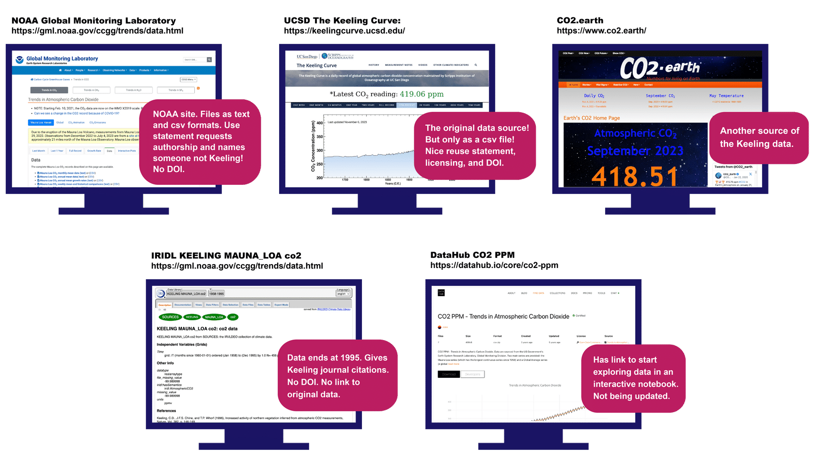
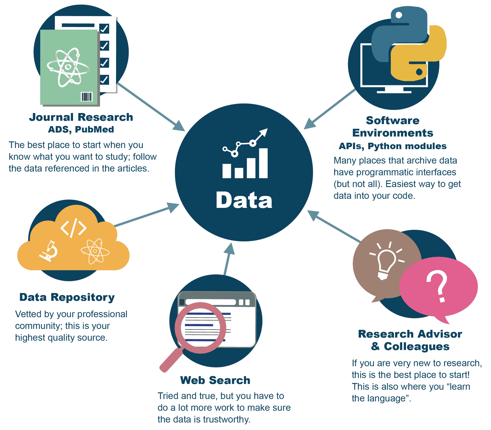
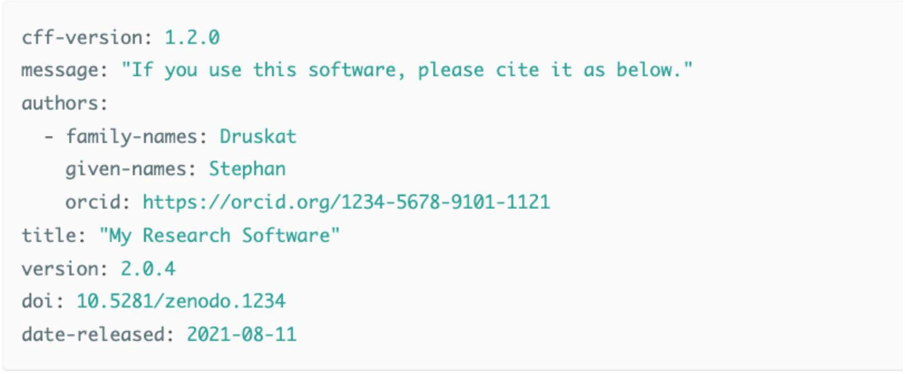

# Lesson 2: Using Open Data

## Navigation
* [Overview](#overview)
* [Learning Objectives](#learning-objectives)
* [Introduction](#introduction)
* [Discovering Open Data](#discovering-open-data)
* [Assessing Open Data](#assessing-open-data)
* [Using Open Data](#using-open-data)
* [Lesson 2: Summary](#lesson-2-summary)
* [Lesson 2: Knowledge Check](#lesson-2-knowledge-check)

## Overview

In this lesson you learn how to discover, assess, and cite an open data set. You start by exploring repositories and learning about the issues and considerations for searching datasets. You then learn how to determine if the dataset is suitable for your use by learning what to review in documentation, licenses, and file formats. The lesson wraps up with a discussion about the importance of citing the datasets and how to read and follow citation instructions.

## Learning Objectives

After completing this lesson, you should be able to:

- Select data sources and use search techniques to discover open data.
- Assess if a dataset incorporates open access elements that ensure easy reusability.
- Explain the importance of citing open data, and find and follow citation instructions.

## Introduction

Open data isn't always simple to use in your research. Sometimes there are multiple versions of the same dataset, so learning how to discover and assess and then use open data will help you save time.

As an example, look at the monthly average carbon dioxide data from Mauna Loa Observatory in Hawaii. This is a foundational dataset for climate change. Not only is it one of the first observational datasets that clearly showed anthropogenic impacts on the Earth's atmosphere, it constitutes the longest record of direct measurements of carbon dioxide in the atmosphere. These observations were started by C. David Keeling of the Scripps Institution of Oceanography in March of 1958 at a facility of the National Oceanic and Atmospheric Administration \[Keeling, 1976\].

If you want to make this figure yourself, or use the data for some other purpose, first you will want to find the data. If you search for this dataset, or any data, chances are that you will find a number of different sources. How do you decide which data to use?

If you start with Google and search for "Mauna Loa carbon dioxide data" you will find a lot of results. Here are just some of them:

How do you decide which one to use? In this lesson we will cover how to find, assess relevance, and use open data.

---

## Discovering Open Data

Open data can be discovered by accessing data repositories, search portals, and publications. A wide variety of these resources are available. A key step is identifying the appropriate search terms for your application. Learning community-specific nomenclature and standards can accelerate your search.

### Where to Start Your Search

There are multiple pathways to find research data, and you should be practiced in all of them.

### People You Know (Online or In-person!)

When we show up to the present moment with all of our senses, we invite the world to fill us with joy. The pains of the past are behind us. The future has yet to unfold. But the now is full of beauty simply waiting for our attention.

What is the first and best way to find research data? Ask your community, including your research advisor, colleagues, team members, and people online. Knowing where to find reliable, good data is as much a skill and art as any lab technique. You learn this skill set by working with professionals in your field. There is no one source, no one method.

Image source: NASA, Dominic Hart 2023

---

### Publications

Datasets are often attached to scholarly publications in the form of supplementary material. Publication search engines can enable the discovery of relevant publications that you can then use to find data from a particular publication.

### Data Search Portals

Data can also be found utilizing a wide variety of search portals including:

*Select each tab to find out more information.*

<table>
  <thead>
    <tr>
        <th>GENERIC DATA SEARCH PORTALS &#9745;</th>
        <th>DISCIPLINE-SPECIFIC DATA SEARCH PORTALS</th>
        <th>NATIONAL AND INTERNATIONAL DATA SEARCH PORTALS</th>
    </tr>
  </thead>
  <tbody>
    <tr>
        <td colspan="3">
            
Generic data search portals enable discovery of a wide variety of data. Not built for specific disciplines, they serve a broader audience. This type of search portal collects and makes data findable. They are not sources of scientific data. These are aggregation services that emphasize quantity, not necessarily quality. This is where citizen scientists often go to find data, and it’s a great way for non-professionals to get involved in science.

            
Examples include:

            <ul>
                <li><a href="https://datasetsearch.research.google.com/">Google</a></li>
                <li><a href="https://www.kaggle.com/datasets">Kaggle</a></li>
                <li><a href="https://www.wikidata.org/wiki/Wikidata:Main_Page">Wikidata</a></li>
                <li><a href="https://www.opendatanetwork.com/">Open Data Network</a></li>
                <li><a href="https://github.com/awesomedata/awesome-public-datasets#readme">Awesome Public Datasets</a></li>
            </ul>
        </td>
    </tr>
  </tbody>
</table>

<table>
  <thead>
    <tr>
        <th>GENERIC DATA SEARCH PORTALS</th>
        <th>DISCIPLINE-SPECIFIC DATA SEARCH PORTALS &#9745;</th>
        <th>NATIONAL AND INTERNATIONAL DATA SEARCH PORTALS</th>
    </tr>
  </thead>
  <tbody>
    <tr>
        <td colspan="3">
            
Discipline-specific data search portals enable the discovery of specific types of data. They generally are tailored to meet their community’s needs.

            
Examples include:

            <ul>
                <li><a href="https://www.earthdata.nasa.gov/">NASA Earthdata</a></li>
                <li><a href="https://opendata.cern.ch/">CERN</a></li>
                <li><a href="https://www.ncbi.nlm.nih.gov/">NCBI National Center for Biotechnology Information</a></li>
                <li><a href="https://www.ebi.ac.uk/">EMBL's European Bioinformatics Institute</a></li>
                <li><a href="https://www.icpsr.umich.edu/web/pages">ISPCR</a></li>
                <li><a href="https://www.ncdc.noaa.gov/cdo-web/datasets">NOAA Climate Data Online</a></li>
                <li><a href="https://earthexplorer.usgs.gov/">USGS EarthExplorer</a></li>
                <li><a href="https://www.opensciencedatacloud.org/">Open Science Data Cloud (OSDC)</a></li>
                <li><a href="https://pds.nasa.gov/">NASA Planetary Data System</a></li>
            </ul>
        </td>
    </tr>
  </tbody>
</table>

<table>
  <thead>
    <tr>
        <th>GENERIC DATA SEARCH PORTALS</th>
        <th>DISCIPLINE-SPECIFIC DATA SEARCH PORTALS</th>
        <th>NATIONAL AND INTERNATIONAL DATA SEARCH PORTALS &#9745;</th>
    </tr>
  </thead>
  <tbody>
    <tr>
        <td colspan="3">
            
National and international data search portals enable discovery of data produced by or funded by national and international organizations.

            
Examples include:

            <ul>
            <li><a href="https://data.gov/">US Federal data</a></li>
            <li><a href="https://data.europa.eu/en">EU Data Portal</a></li>
            <li><a href="https://apps.who.int/gho/data/node.home">WHO</a></li>
            <li><a href="https://data.worldbank.org/">The World Bank</a></li>
            <li><a href="https://www.data.gov.uk/">data.gov.uk</a></li>
            <li><a href="https://data.unicef.org/">UNICEF</a></li>
            <li><a href="https://www.data.gouv.fr/en/">data.gouv.fr</a> - Open Platform for French Public Data</li>
            </ul>
        </td>
    </tr>
  </tbody>
</table>

### Repositories

A common way to share and find open data is through data repositories. Many repositories host open data with persistent identifiers, clear licenses and citation guidelines, and standard metadata.

Note that some of our example search portals are also repositories, but not always. Some of the search portals are simply catalogs of information about the data, rather than storage locations for the data themselves.

*Select each tab to find out more information.*

<table>
  <thead>
    <tr>
        <th>GENERAL REPOSITORIES &#9745;</th>
        <th>DOMAIN-SPECIFIC REPOSITORIES</th>
        <th>INSTITUTIONAL REPOSITORIES</th>
        <th>NATIONAL REPOSITORIES</th>
    </tr>
  </thead>
  <tbody>
    <tr>
        <td colspan="4">
            
General repositories are not designed for a specific community and are accessible to everyone.

            
Examples include:

            <ul>
            <li><a href="https://zenodo.org/">Zenodo</a></li>
            <li><a href="https://data.mendeley.com/">Mendeley Data</a></li>
            <li><a href="https://figshare.com/">Figshare</a></li>
            <li><a href="https://datadryad.org/stash">Dryad</a></li>
            </ul>
            
See the <a href="https://fairsharing.org/collection/GeneralRepositoryComparison">Generalist Repository Comparison Chart</a> – a tool for additional repositories and guidance. Dataverse has also published a <a href="https://dataverse.org/blog/comparative-review-various-data-repositories">comparative review</a> of eight data repositories.

        </td>
    </tr>
  </tbody>
</table>

<table>
  <thead>
    <tr>
        <th>GENERAL REPOSITORIES</th>
        <th>DOMAIN-SPECIFIC REPOSITORIES &#9745;</th>
        <th>INSTITUTIONAL REPOSITORIES</th>
        <th>NATIONAL REPOSITORIES</th>
    </tr>
  </thead>
  <tbody>
    <tr>
        <td colspan="4">
            
Specialized repositories (typically for specific data subject matter) provide support and information on required standards for metadata and more.

            
Some examples are:

            <ul>
                <li>Astronomy: <a href="https://archive.stsci.edu/">Hubble data</a></li>
                <li>Space Biology: <a href="https://genelab.nasa.gov/">NASA GeneLab: Open Science for Life in Space</a></li>
                <li><a href="https://heliophysicsdata.gsfc.nasa.gov/websearch/dispatcher">Space Physics: Heliophysics Data Portal- Solar Space Physics Product Finder (nasa.gov)</a></li>
            </ul>
        </td>
    </tr>
  </tbody>
</table>

<table>
  <thead>
    <tr>
        <th>GENERAL REPOSITORIES</th>
        <th>DOMAIN-SPECIFIC REPOSITORIES</th>
        <th>INSTITUTIONAL REPOSITORIES &#9745;</th>
        <th>NATIONAL REPOSITORIES</th>
    </tr>
  </thead>
  <tbody>
    <tr>
        <td colspan="4">
            
Many universities and organizations support research data and software management with repositories, known as institutional repositories, to aid their researchers with compliance requirements.

        </td>
    </tr>
  </tbody>
</table>

<table>
  <thead>
    <tr>
        <th>GENERAL REPOSITORIES</th>
        <th>DOMAIN-SPECIFIC REPOSITORIES</th>
        <th>INSTITUTIONAL REPOSITORIES</th>
        <th>NATIONAL REPOSITORIES &#9745;</th>
    </tr>
  </thead>
  <tbody>
    <tr>
        <td colspan="4">
            
National repositories aggregate data and make it available to the public.

            
Data stored in these repositories are often produced by the government.

            
Examples include:

            <ul>
                <li><a href="https://data.gov/">https://data.gov/</a></li>
                <li><a href="https://data.europa.eu/en">https://data.europa.eu/en</a></li>
            </ul>
        </td>
    </tr>
  </tbody>
</table>

### Challenges with Data Repositories

- Any single repository, search engine or publication search will not have access to all available open data.
- Search terms may not be consistent across sources or fields of science.
- It is essential to become familiar with the standard nomenclatures and appropriate metadata terms for your application.
- There is no sure-fire recipe. You may have to try numerous terms and data sources before finding relevant data.

### Activity 2.1: Discovering Open Data</strong>

Match the repository type to the correct definition.

|  |  |
|---|---|
| General repositories | Designed for all communities and are accessible to everyone |
| Domain-specific repositories | Repositories that are typically for specific data subject matters |
| Institutional repositories | Repositories supported by universities and organizations |
| National repositories | Repositories funded by the government |

## Assessing Open Data

Using open data for your project is contingent on a number of factors including quality of data, access and reuse conditions, data findability, and more. A few essential elements that enable you to assess the relevance and usability of datasets include (adapted from the [GODAN Action Open Data course](https://aims.gitbook.io/open-data-mooc/unit-3-using-open-data/lesson-2.2-quality-and-provenance)):

**Practical Questions**

- Is the data well described?
- Is the reason the data is collected clear? Is the publisher’s use for the data clear?
- Are any other existing uses of the data outlined? 
- Is the data accessible?
- Is the data timestamped or up to date?
- Will the data be available for at least a year? 
- Will the data be updated regularly?
- Is there a quality control process?

**Technical Questions**

- Is the data available in a format appropriate for the content? 
- Is the data available from a consistent location?
- Is the data well-structured and machine readable?
- Are complex terms and acronyms in the data defined? 
- Does the data use a schema or data standard?
- Is there an API available for accessing the data? 
- What tools or software are needed to use this data?

**Social Questions**

- Is there an existing community of users of the data?
- Is the data already relied upon by large numbers of people? 
- Is the data officially supported?
- Are service level agreements available for the data?
- It is clear who maintains and can be contacted about the data?

[[cite: https://aims.gitbook.io/open-data-mooc/unit-3-using-open-data/lesson-2.2-quality-and-provenance](https://aims.gitbook.io/open-data-mooc/unit-3-using-open-data/lesson-2.2-quality-and-provenance)]

Many of these questions may be answered by viewing a dataset’s documentation and metadata, as well as a data’s format and license, all of which will be discussed further in the next lesson "Making Data Open".

## Using Open Data

### The Importance of Citation

Acknowledgements and citations contribute towards fostering a culture of sharing data without fear of ideas or recognition being stolen. If a researcher can trust that their work will be cited, and used to further the development of science, the idea of making data open is more appealing and mutually beneficial. Use of standard citation practices are recommended to ensure due credit is given.

Data citations also aid in the transparency of how data is being used. By citing data, original authors and new researchers can easily track how the data are being used to answer different questions.

### Review Citing Guidelines

Many datasets and repositories explain how they’d prefer to be cited. The citation information often includes:

- Authors and their institutions
- Title
- ORCiD
- DOI
- Version
- URL
- Creation date
- Additional fields may also be specified

This is an example of a simple CITATION.cff file. Source: [GitHub](https://github.com/)

---

Most datasets require (at a minimum) that you list the data’s producers, name of the archive hosting the data, dataset name, dataset date, and DOI when citing data.

### Citing Open Data: Examples

**Example from a NASA Distributed Active Archive Center (DAAC)**

Matthew Rodell and Hiroko Kato Beaudoing, NASA/GSFC/HSL (08.16.2007), GLDAS CLM Land Surface Model L4 3 Hourly 1.0 x 1.0 degree Subsetted,version 001, Greenbelt, Maryland, USA:Goddard Earth Sciences Data and Information Services Center (GES DISC), Accessed on July 12th, 2018 at doi:10.5067/83NO2QDLG6M0

**Example from NASA Planetary Data System (PDS)**

Justin N. Maki. (2004). MER 1 MARS MICROSCOPIC IMAGER RADIOMETRIC

RDR OPS V1.0 [Data set]. NASA Planetary Data System. [https://doi.org/10.17189/1520416](https://doi.org/10.17189/1520416)

## Lesson 2: Summary

The following are the key takeaways from this lesson:

- Relevant data may be found in a variety of locations and may require some trial and error to find.
- Carefully assess data before using it for your project.
- Data citation is important when using data.

## Lesson 2: Knowledge Check

Answer the following questions to test what you have learned so far.

*Question*

**01/03**

Which of the following methods can be used for data discovery?

- Using appropriate search terms
- Investigating data identified by DOIs in publications
- Identifying relevant data repositories
- All of the above

*Question*

**02/03**

Which of the following is/are questions to consider when assessing if a dataset can be used?

- Is the data well described?
- Is the data well-structured and machine readable?
- Is there an existing community of users of the data?
- What tools or software are needed to use this data?
- Will the data be updated regularly?
- Is the publisher's use for the data clear?
- All of the above

*Question*

**03/03**

What information is commonly found in a citation file?

- Authors and their institutions
- Title
- ORCiD
- DOI
- Version
- URL
- Creation date
- All of the above
