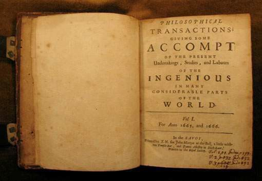
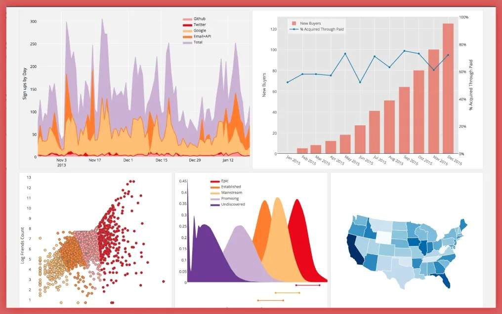
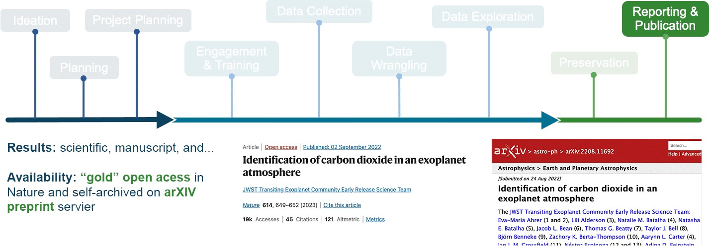
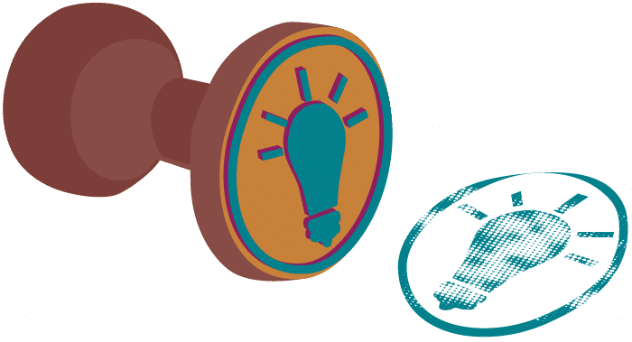

# Lesson 1: Introduction to Open Results

## Navigation

* [What Research Objects are Created Throughout the Research Cycle?](#what-research-objects-are-created-throughout-the-research-cycle)
* [Examples of Open Results](#examples-of-open-results)
* [What is the Reproducibility Crisis?](#what-is-the-reproducibility-crisis)
* [Lesson 1: Summary](#lesson-1-summary)
* [Lesson 1: Knowledge Check](#lesson-1-knowledge-check)

## Overview

This lesson aims to broaden your perspective regarding what shareable research outputs are produced throughout the research lifecycle. We will first consider what constitutes an open result. To do so, we will read an example of a forward-thinking research project that utilizes open result best practices. The perspectives gained from this example will ultimately get us thinking about how we can work towards creating reproducible research.

## Learning Objectives

After completing this lesson, you should be able to:

- Describe what constitutes open results and list the research objects that can be created throughout a research cycle.
- Describe how sharing open results can advance science and your career.
- Explain what the reproducibility crisis is and how open science can help combat it.

## What Research Objects are Created Throughout the Research Cycle?

### The Traditional Depiction of a "Scientific Result" Has Changed Over Time

When we think of results, most people think of just the final publication.

**1665**

This publication dates back to 1665 when the first scientific journal Philosophical Transactions was established to publish letters about scientific observations and experimentations.

**1940s**

Later in the 1940s, publishing became commercialized and took over as the mechanism for releasing journals, conference proceedings, and books. This new business model normalized publication paywalls.

**21st century**

Only by the 21st century did the scientific community expand the meaning of open results. The evolution of this definition was driven by technological advances, such as the internet, and advances in modes to share information. The open access movement was established by the [Budapest Open Access Initiative](https://www.budapestopenaccessinitiative.org/) in 2002 and the [Berlin Declaration on Open Access](https://openaccess.mpg.de/Berlin-Declaration) in 2003, both of which formalized the idea that, with regards to new knowledge, there should be "free availability on the public internet, permitting any users to read, download, copy, distribute, print, search, or link to the full texts of these articles" (Budapest Open Access Initiative).

### But Results Have Always Been Far More Than Just the Publication

You might be familiar with the research life cycle, but may not have considered what results could be shared openly throughout its process. This lesson adopts a definition of the research life cycle based on [The Turing Way](https://the-turing-way.netlify.app/index.html) and breaks it down into nine phases based, pictured in the figure below.

Although the phases are presented in a linear fashion, we acknowledge that the research lifecycle is rarely ever linear! Products are created throughout the scientific process that are needed to enable others to reproduce the findings. The products of research include data, code, analysis pipelines, papers, and more!

Following [Garcia-Silva et al. 2019](https://www.sciencedirect.com/science/article/abs/pii/S0167739X18314638), we define a Research object (RO) as a method for the identification, aggregation and exchange of scholarly information on the Web. Research objects can be composed of both research data and digital research objects that are defined as follows by the Organization for Economic Co-Operation and Development ([OECD Legal Instruments](https://legalinstruments.oecd.org/en/instruments/OECD-LEGAL-0347)).

The term 'Open Results' comprehensively includes all these research products and more.

Open results can include both data and code. Since data and code were covered in previous modules, in this lesson, we focus on sharing science outcomes as open results. Examples of open results can include:

- Open access peer-reviewed articles
- Technical reports
- Computational notebooks
- Code of conduct, contributor guidelines, publication policies
- Blog posts
- Short form videos and podcasts
- Social media posts
- Conference abstracts and presentations
- Forum discussions

Open access peer-reviewed articles are archived for long-term preservation and represent a more formal discussion of scientific ideas, interpretations, and conclusions. These discussions inform the method that researchers share results. In the following lesson section, we will discuss different types of sharing and methods to build and adapt them for use in your research.

Scientists can share their incremental progress throughout the research process and invite community feedback. Sharing more parts of the research process creates more interactions between researchers and can improve the end result (which may be a peer-reviewed article).

Throughout this module we will show you how to use, make, and share open results.

### The Practice of 'Open'

Specifically, the "Use, Make, Share" format has been naturally embedded throughout the curriculum and should be a familiar format by now. Lesson 2 will cover "Using". Lesson 3 will cover "Making". Lesson 4 will cover "Sharing". Throughout this module, we will pay particular attention to manuscripts and other research products as examples because the previous modules covered "Use, Make, Share" in the context of components with data and software.

## Examples of Open Results

Let's broaden our perspectives on the types of **research objects** that are produced throughout the research process. Let’s take a look at some examples from different projects.

### Reaching New Audiences

Qiusheng Wu is an associate professor at University of Tennessee. He has published 500+ video tutorials on [YouTube](https://www.youtube.com/%40giswqs), which have gained 25K+ subscribers, and 1.1M+ views (as of 8/2023).

Professor Qiusheng Wu created a [YouTube channel](https://youtube.com/%40giswqs) in April 2020 for the purpose of sharing video tutorials on the [geemap Python package](https://geemap.org/) that he was developing. Since then, Wu has published over 500 video tutorials on open-source geospatial topics. The channel has gained over 25K subscribers, with more than 1 million views and 60K watch hours in total. On average, it receives 70 watch hours per day.

The YouTube channel has allowed Wu to reach a much larger audience beyond the confines of a traditional classroom. It has made cutting-edge geospatial research more accessible to the general public and has led to collaborations with individuals from around the world. This has been particularly beneficial for Wu’s tenure promotion as it has resulted in increased funding opportunities, publications, and public engagement through the YouTube channel, social media, and GitHub.

Overall, the YouTube channel serves as an important tool for Wu to disseminate research, inspire others, and contribute to the advancement of science. It has also played a significant role in advancing Wu’s professional career.

### New Media for Science Products

"A new method reduced the compute time for this image from ~30 minutes to \<1 minute". In 2021, Lucas Sterzinger spent one summer of his PhD on an internship. During that summer, he wrote a blog post to explain and demonstrate a game-changing technology called Kerchunk – a software package that makes accessing scientific data in the cloud much faster.

Source: [https://medium.com/pangeo/fake-it-until-you-make-it-reading-goes-netcdf4-data-on-aws-s3-as-zarr-for-rapid-data-access-61e33f8fe685](https://medium.com/pangeo/fake-it-until-you-make-it-reading-goes-netcdf4-data-on-aws-s3-as-zarr-for-rapid-data-access-61e33f8fe685)

---

Alongside the blog post, he also created a tutorial as a Jupyter Notebook – both of these resources and associated code are freely accessible to the public, allowing for rapid adoption and iteration by other developers and scientists. He posted the blog on Medium and posted about it to Twitter. The blog got a lot of attention on a newly developed technology as it was being developed! This is starkly different from the slow and complicated world of academic publishing where this result would not have been shared for about a year (writing it up, the review process, publication process). He said, "Working on Kerchunk and sharing it widely using open science principles greatly expanded my professional connections and introduced me to the field of research software engineering. The connections I made from this led me directly to my current role as a Scientific Software Developer at NASA."

### New Products for Increasing Impact

Image credit: OpenStreetMap 2011, Ken Vermette. CC BY-SA 3.0

---

From '2003: let's map the UK to 2023:\>1.5M contributors, 100M+ edits, using the data to map the world with applications ranging from Uber to mapping UN Sustainable Development Goals." [OpenStreetMaps is being used for GIS analysis](https://welcome.openstreetmap.org/about-osm-community/consumers/), such as planning or logistics for humanitarian groups, utilities, governments and more. This was only possible because it was set up and shared openly and built by a community devoted to improving it. You never know where your personal project might go or who might be interested in collaborating!

### New Visualizations to Share Results

Matplotlib was developed around 2002 by post-doc John Hunter to visualize some neurobiology data he was working on. He wasn't a software developer, he was a neurobiologist! He could have just published the paper in a peer-reviewed journal, and maybe shared his code to create the figures, but instead he started an open project on GitHub and thought, 'well if this is useful to me, maybe it will be useful to others...'.

Source: [https://medium.com/dataseries/mastering-matplotlib-part-1-a480109171e3](https://medium.com/dataseries/mastering-matplotlib-part-1-a480109171e3)

---

Matplotlib is now the most widely used plotting library for the Python programming language and a core component of the scientific Python stack, along with NumPy, SciPy and IPython. Matplotlib was used for data visualization during the 2008 landing of the Phoenix spacecraft on Mars and for the creation of the first image of a black hole.

### JWST Case Study: Reporting and Publication

And last but not least, we have the example for the JWST Early Release Science team from Module 1 on how they reported their results. This came in various forms from publishing a peer review paper, preprints, blog posts, and social media. Their peer-reviewed publication was published open access in Nature along with a preprint through arXiv.

Open communication platforms furthered the reach and audience of results.

Figure Credit: https://arxiv.org/abs/2208.11692

---

The public is interested in what you are doing, and reaching them can involve communication through traditional and new platforms. Publishing results on platforms such as Twitter/X, Youtube, TikTok, blogs, websites, and other social media platforms is becoming more common. Awareness through social media drastically increases the reach and audience of your work. There have been studies on how this impacts citation rates. For example, The Journal of Medical Internet Research (JMIR) conducted a three-year [study](https://www.jmir.org/) of the relative success of JMIR articles in both Twitter and academic worlds. They found that highly tweeted articles were 11 times more likely to be highly cited than less tweeted articles.

Open communication platforms noticeably furthered the reach and audience of results.

Twitter \#1: https://twitter.com/cornerof_thesky/status/1595086671275589632?s=20  

Twitter \#2: https://twitter.com/V_Parmentier/status/1595127493199302656?s=20 

TikTok: https://www.tiktok.com/@astrojaket/video/7168878696906886405

YouTube: https://www.youtube.com/watch?v=cI-kM_wPbbQ 

---

## What is the Reproducibility Crisis?

A 2016 [Nature survey](https://www.nature.com/articles/533452a) on reproducibility found that of 1,576 researchers, "More than 70% of researchers have tried and failed to reproduce another scientist's experiments, and more than half have failed to reproduce their own experiments. "The 'reproducibility crisis' in science is a growing concern over several reproducibility studies where previous positive results were not reproduced.

We must consider the full research workflow if we are to solve the reproducibility crisis. The fact that 70% of researchers could not reproduce other scientists' results is shocking, especially considering that the reproducibility of science is the cornerstone of the scientific method.

By now, it should be obvious that there are many personal incentives to implement open science principles throughout all stages of the research process. By making results open throughout, you increase your ability to reproduce your own results.

Although reproducibility of one's own results might sound like a trivial achievement, a [2016 Nature study](https://www.nature.com/articles/533452a) found that 50% of researchers are unable to reproduce their own experiments. This highlights the critical nature of the reproducibility crisis. This also has implications for research beyond the ability to improve your research.

### What is the Cause of This Reproducibility Crisis?

The three main causes of the reproducibility crisis are:

1. Intermediate methods of research are often described informally or not at all.
2. Intermediate data are often omitted entirely.
3. We often only think about results at the time of publication.

We need to think of the entire research process as a result. As an example, scientific articles describe computational methods informally which demands significant effort from others to understand and to reuse.

Articles often lack sufficient information needed for other researchers to reproduce results, even when data sets are published, according to two studies in [Nature Genetics](https://www.nature.com/articles/ng.295) and [Nature Methods](https://www.nature.com/articles/nmeth.1333). Raw and/or intermediate data products and relevant software are often not provided alongside the final manuscript, limiting the reader's ability to attempt replication.

Without access to the source codes for the papers, reproducibility has been shown to be elusive, according to two other studies in [Briefings in Bioinformatics](https://academic.oup.com/bib/article/12/3/288/258098) and [Nature Physics](https://www.nature.com/articles/nphys3313).

### Combating the Reproducibility Crisis

If your research workflow uses principles of open results, as showcased in the example, this will help you to combat the reproducibility crisis.

We can create reproducible workflows and combat this crisis by considering open results at each stage of the research lifecycle. An Open Science and Data Management Plan (OSDMP) helps researchers think and plan for all aspects of sharing by determining how they will make software and data available. This plan can be shared publicly early on through a practice called pre-registering, where researchers determine their analysis plan and data collection procedure before a study begins (discussed previously in Lesson 2 of Module 2).

### Activity 1.1: What Could You Do?

Let's rethink your research workflow. Identify the research objects that could be (or could have been) shared as open results of a project you are/were involved in. What are high priority items for combatting the reproducibility crisis in each area of the research workflow?

- Ideation
- Planning
- Project Design
- Engagement & Training
- Data Collection
- Data Wrangling
- Data Exploration
- Preservation
- Reporting & Publication

**There are many personal advantages of implementing open science principles across all stages of a research process**

#### Key Takeaways: What Could You Do?

The OpenSciency team created a large table that describes all the different kinds of shareable research objects that are possible to create throughout the research lifecycle.

**A full table is available here**

[CLICK TO LEARN](https://opensciency.github.io/sprint-content/open-results/lesson1-research-process-and-results.html#research-stages-and-open-result-table)

Thinking about sharing everything all at once can be overwhelming when you are getting started. To move forward, just focus on how you might pick the most important item. Here we have pared down the list to only a couple items per category. Furthermore, you could think about shortening the list even further when you are getting started. For example, maybe it is the case that, for your work, sharing the code used to wrangle the data is the most critical element to reproducibility. Therefore, code-sharing would be a good place to start your open science journey. The small steps we make are what move us towards sustainable open science.

- **Ideation:** Proposals can be shared on Zenodo and open grant platforms such as [ogrants.org](https://www.ogrants.org/).
- **Planning:** Projects can be pre-registered before they begin.
- **Project Design:** Contributor guidelines or a code of conduct can be posted on Zenodo, GitHub, or team Web Pages.
- **Engagement & Training:** Workflow computational notebooks can be shared with the team via GitHub and released on Zenodo.
- **Data Collection:** Raw data can be shared through data repositories.
- **Data Wrangling:** Code can be shared through software repositories.
- **Data Exploration:** Computational notebooks can be shared via GitHub and released on Zenodo.
- **Preservation:** Data management plans for archiving can be posted on Zenodo.
- **Reporting & Publication:**
  - Open access peer-reviewed articles 
  - Computational notebooks
  - Code of conduct, contributor guidelines, publication policies 
  - Blog posts
  - Short form videos and podcasts 
  - Social media posts
  - Conference abstracts, posters, and presentations (when made openly available) 
  - Forum discussions

## Lesson 1: Summary

In this lesson, you learned that:

- The contemporary scientific workflow involves being open about processes and products. Research products (results) include far more than just the final manuscript, which is a drastic change from the historical notion of a scientific result.
- At every stage of the research lifecycle, there are research objects produced that we can consider results.
- We can combat the reproducibility crisis by sharing these research objects at each stage of our research workflow.
- There are amazing examples of research groups sharing different types of open results!

Let's start thinking about what we can do immediately to work towards an open research workflow.

## Lesson 1: Knowledge Check

Answer the following questions to test what you have learned so far.

*Question*

**01/02**

Which of the following may fit the definition of a "research object"?

- Raw data
- Blog
- Proposal
- Code of Conduct
- All of the above

*Question*

**02/02**

What are some of the key causes of the reproducibility crisis?

- Intermediate methods of research are often described informally or not at all.
- Intermediate data are often omitted entirely.
- We often only think about results at the time of publication.
- All of the above