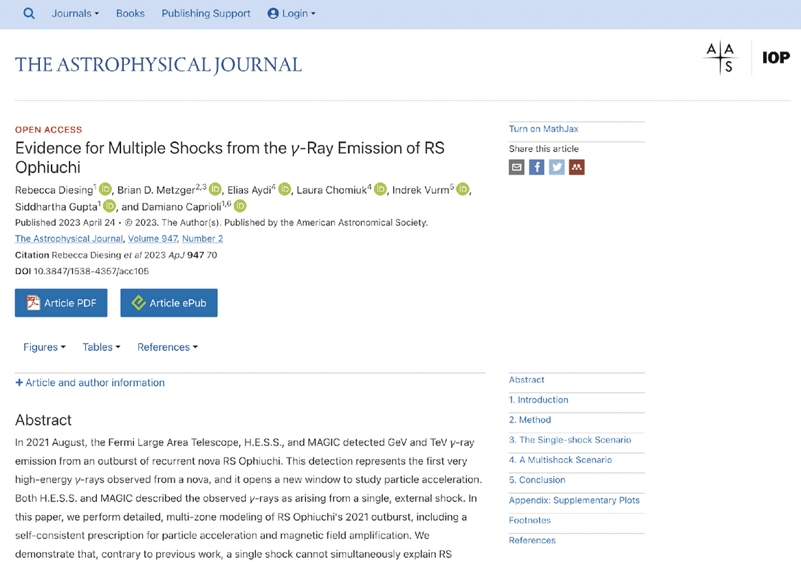
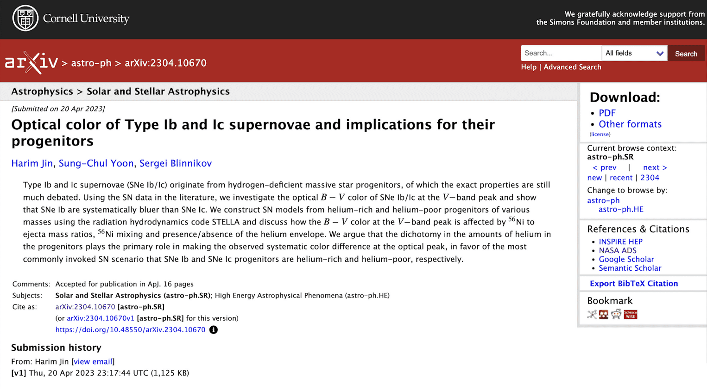

# Lesson 2: Using Open Results

## Navigation

* [How to Discover Open Results](#how-to-discover-open-results)
* [How to Assess Open Results](#how-to-assess-open-results)
* [How to Use Open Results](#how-to-use-open-results)
* [How to Cite Open Results](#how-to-cite-open-results)
* [Lesson 2: Summary](#lesson-2-summary)
* [Lesson 2: Knowledge Check](#lesson-2-knowledge-check)

## Overview

By the end of this lesson, you will be familiar with resources for open results utilization, how and when to cite the sources of the open results that you use, how to provide feedback to open results providers, and how to determine when it is appropriate to invite authors of the open results materials to be formal collaborators versus simply citing those resources in your work.

Published articles, blog posts, and forums can lead to new ideas for your own research. A technique learned from social media can be applied to a use-case that you are trying to solve. There are many different ways to discover results.

## Learning Objectives

After completing this lesson, you should be able to:

- Identify a variety of open results sources including both published science research and non-traditional sources.
- Evaluate the reliability and quality of open results sources based on key characteristics.
- List the responsibilities of an open results user, including providing feedback to open results developers.
- List the ways to cite open results into your own research process.

## How to Discover Open Results

How do I learn about the state of research for a particular field? How do you engage in the current conversation? Researchers often begin with a search of peer-reviewed articles. This review tells you how much research has been done in a field and what conclusions have recently been reached. In most fields, going through the peer-review process can take up to a year. The ability to find pre-prints can help reduce this delay because they offer the latest findings before a publication date. However, researchers who choose to share their results before publication typically do so in the ways listed as best practices above. As you start research on a topic, how do you find all these different types of results and engage in the most relevant research?

### Example: Exoplanets

The various stages of research, from conceptualization to dissemination of results, produce products that can be put into the public domain as "Open Results". Where these results are archived, and to what degree, depends on the discipline author. However, some general guidelines on where to start a search on open results include:

1. Scholarly Search Portals
2. Web Searches

**Scholarly Search Portals**

Search engines like Google and Bing have radically changed how we look up information. For research results, specialized academic search engines and portals curate scientific results from researchers based on topic and field. These engines are useful for finding peer-reviewed articles.

<table>
  <thead>
    <tr>
        <th>GENERIC &#9745;</th>
        <th>DISCIPLINE-SPECIFIC</th>
    </tr>
  </thead>
  <tbody>
    <tr>
        <td colspan="2">
            <ul>
                <li><a href="https://scholar.google.com/">Google Scholar</a></li>
                <li><a href="https://ui.adsabs.harvard.edu/">ADS</a></li>
                <li><a href="https://www.scopus.com/">Scopus</a></li>
                <li>Web of Knowledge</li>
                <li><a href="https://openknowledgemaps.org/">Open knowledge map</a> - facilitates exploration of interconnected topics</li>
                <li><a href="https://www.jstor.org/">JSTOR</a> - a wide range of scholarly content</li>
                <li><a href="https://www.researchgate.net/search">ResearchGate</a></li>
                <li><a href="https://sciencecast.org/">ScienceCast</a></li>
            </ul>
        </td>
    </tr>
  </tbody>
</table>

<table>
  <thead>
    <tr>
        <th>GENERIC</th>
        <th>DISCIPLINE-SPECIFIC &#9745;</th>
    </tr>
  </thead>
  <tbody>
    <tr>
        <td colspan="2">
            <ul>
                <li><a href="https://europepmc.org/">EuropePMC Life sciences</a></li>
                <li><a href="https://pubmed.ncbi.nlm.nih.gov/">Pubmed biomedical literature</a></li>
                <li><a href="https://arxiv.org/">arXiv</a> - for scholarly pre-prints in STEM, economics and computer science fields</li> 
                <li><a href="https://www.biorxiv.org/">Biorxiv Preprint</a> - server for biology</li>
                <li><a href="https://eartharxiv.org/">EarthArXiv</a> and <a href="https://essoar.org/">Earth and Space Science Open Archive</a></li>
                <li><a href="https://asapbio.org/preprint-servers">ASAPbio</a> - catalogs of preprint servers</li>
                <li>and others...</li>
            </ul>
        </td>
    </tr>
  </tbody>
</table>

Publications that provide some levels of open access are tracked in the [Directory of Open Access Journals (DOAJ).](https://doaj.org/)

**Web Searches**

Open results include much more than open-access peer-reviewed publications. How do you find these alternative types of research objects?

Open communities and forums offer the best way to find research objects other than complete publications. How do you even find out whether these exist and where they are?

Once you have found a few peer-reviewed articles that are highly relevant, to find additional research objects, you can follow the authors on social media for links to their posts, blogs, and activities. There are open communities in almost every area of research - find yours! Here are different platforms to locate these conversations and resources:

- GitHub
- LinkedIn
- YouTube
- Google/Bing
- Conference websites
- X, formally known as Twitter
- Facebook
- Medium
- Substack
- Stack Overflow
- Reddit
- Mastodon

Various research objects, including datasets and software, are frequently attached to scholarly publications in the form of supplemental material. At other times, the source is referenced in the paper, which could be a GitHub repository, personal/institutional website, or other storage site. This can be another starting point, by engaging in discussions on the GitHub repository.

**Kerchunk Example:** In lesson 1, a blog post about a software library 'kerchunk' was presented. Let's look at a [post](https://discourse.pangeo.io/t/trick-for-improving-kerchunk-performance-for-large-numbers-of-chunks-files/3090) on the [Pangeo Discourse Forum](https://discourse.pangeo.io/) of Kerchunk with a large number of views. The open science [Pangeo project](https://pangeo.io/) worked completely in the open. The [project website](https://pangeo.io/) (run off of GitHub) has links to blog posts, a discussion forum, and a calendar to all their meetings which anyone was welcome to join. This has resulted in an engaged and dynamic community. An example of this comes from the post linked to above, where one person asks for help, others reply, and the conversation is documented in the open. The post’s 636 views indicate that this question, or one similar, has occurred to others. Imagine if this had been done over private email? By working in the open, they are improving science and helping everyone become faster and more accurate.

## How to Assess Open Results

"Garbage in, garbage out" – your own research products are only as good as the data used in your investigation.

If you use poor quality data or materials from unreliable and unvetted sources as critical components of your research, you run the risk of producing flawed, or low-quality science that may harm your reputation as a scientist. Therefore, it is critical to assess the quality and reliability of open-results sources before you include them in your own work.

What are best practices for assessing the quality of alternative sources of data to research articles such as blog posts, youtube videos, and other research objects?

### Attributes of Reputable Material

Let's take a look at the questions you might consider asking yourself when determining the reliability of any type of open results source.

Here, we list questions under two categories: the open results material themselves, and the server they are downloaded from. The more questions here that can be answered in the affirmative, the lower the risk in utilizing the open results materials for your own research.

<table>
  <thead>
    <tr>
        <th>THE MATERIAL ITSELF &#9745;</th>
        <th>THE ASSOCIATED WEBSITE / SERVER</th>
        <th>SOURCE RELIABILITY INDICATORS</th>
    </tr>
  </thead>
  <tbody>
    <tr>
        <td colspan="3">
            <ul>
                <li>Is the material associated with a peer-reviewed publication?</li>
                <li>Are the primary data associated with the results also open-source?</li>
                <li>Is code used to generate the Open Results materials also open-source?</li>
                <li>Are all fields and parameters clearly defined?</li>
                <li>Is the derivation of measurement uncertainties clearly described?</li>
                <li>Were any data or results excluded, and if so, were criteria provided?</li>
                <li>Are authoring teams also members of the field?</li>
            </ul>
        </td>
    </tr>
  </tbody>
</table>

<table>
  <thead>
    <tr>
        <th>THE MATERIAL ITSELF</th>
        <th>THE ASSOCIATED WEBSITE / SERVER &#9745;</th>
        <th>SOURCE RELIABILITY INDICATORS</th>
    </tr>
  </thead>
  <tbody>
    <tr>
        <td colspan="3">
            <ul>
                <li>Does the host website's URL end in .edu, .gov or (if managed by a non-profit organization) in .org?</li>
                <li>Does the host website provide contact information of the author and/or organization?</li>
                <li>Is the host website updated on a frequent basis?</li>
                <li>Is the host website free of advertisements and/or sponsored content, the presence of which could indicate bias?</li>
            </ul>
        </td>
    </tr>
  </tbody>
</table>

<table>
  <thead>
    <tr>
        <th>THE MATERIAL ITSELF</th>
        <th>THE ASSOCIATED WEBSITE / SERVER</th>
        <th>SOURCE RELIABILITY INDICATORS &#9745;</th>
    </tr>
  </thead>
  <tbody>
    <tr>
        <td colspan="3">
            <ul>
                <li>Is the result reproducible? Can you interact with the data and results? Have others reported being able to reproduce the results?</li>
                <li>Is the author reliable? Have you seen them publish or share results in other forums?</li>
                <li>Is the result from only a single author/voice or includes contributions from a broader community?</li>
                <li>Does the post have a significant amount of likes/views and public comments? The value of a blog post with no comments or responses can be difficult to assess. Conversely, a thorough github discussion forum with multiple views shared indicated a robust post.</li>
                <li>Is the result part of an active conversation? (Is the information still relevant and current?)</li>
            </ul>
        </td>
    </tr>
  </tbody>
</table>

Adapted from [https://www.scribbr.com/working-with-sources/credible-sources/](https://www.scribbr.com/working-with-sources/credible-sources/)

Note that failure to meet one or many of the criteria does not automatically mean that the open results are of poor quality, but rather that more caution should be exercised if incorporated into your own research. It also means that you will have to invest more personal vetting of the material to ensure its quality is sufficient for your purposes.

Reliable Example: Qiusheng Wu YouTube videos (as mentioned in the previous lesson). Professor Wu is an expert in his field. He presents results along with notebooks that demonstrate reproducibility. Comments on his YouTube tutorial videos represent meaningful interactions between users reproducing results and the author.

## How to Use Open Results

While open results benefit science and have already provided valuable societal benefits, the misuse and incautious sharing of open materials can have far-reaching harmful effects. The end-user of open results bears the responsibility to ensure that the data they reference are used in a responsible manner and that any relevant guidelines for the use of the data are followed.

### How to Contribute and Provide Constructive Feedback

Contributing to and providing constructive feedback are vital components for a healthy open access ecosystem, ensuring long-term sustainability of the open resources by providing continual improvements and capability expansions.

In our current system, there are results creators and consumers. This scenario presents a one way street with no feedback loop, no sharing of data back to publishers, and no sharing between intermediaries.

The practice of producing open results aims to foster a system where feedback loops exist between users and makers. Users share their cleaned, integrated, or improved work to the maker. This feedback creates a symbiotic and sustainable process where everyone benefits.

### Your Responsibilities as an Open Results User

- Users should familiarize themselves with contributor guidelines posted to open result repositories and follow the associated policies. What if there aren't contributor guidelines? Contact the creators!
- Always provide feedback in a respectful and supportive manner.
- If you discover an error in Open Results materials, the ethical action to take is to contact the author (or repository, depending on the nature of the issue) and give them the opportunity to correct the problem, rather than ignoring the issue or (worse!) taking advantage of a fixable issue to elevate your own research.

### Different Ways to Provide Feedback

#### Use Github Issues

<table>
<colgroup>
    <col style="width: 50%" />
    <col style="width: 50%" />
</colgroup>
<tbody>
    <tr>
        <td>
            
        </td>
        <td>Pro: The feedback is open and other community members can see ongoing issues that are being addressed.</td>
    </tr>
    <tr>
        <td>
            
        </td>
        <td>Pro: Contribution is archived and logged on GitHub.</td>
    </tr>
</tbody>
</table>

**Working with GitHub Issues**

See this blog for general issue etiquette

[OPEN](https://www.w3.org/International/i18n-activity/guidelines/issues.html)

#### Email authors

<table>
<colgroup>
    <col style="width: 50%" />
    <col style="width: 50%" />
</colgroup>
<tbody>
    <tr>
        <td>
            
        </td>
        <td>Con: the feedback is closed. The information is generally not propagated back to the community unless the creator creates a new version.</td>
    </tr>
    <tr>
        <td>
            
        </td>
        <td>Con: No way of tracking credit.</td>
    </tr>
</tbody>
</table>

### Getting Credit for Providing Feedback

If your feedback results in a substantial intellectual contribution to the work, it is reasonable for you to expect an opportunity for co-authorship in a future version of the open result. The associated contribution guidelines should address this possibility and manage expectations prior to your providing feedback.

Sadly, many times contributor guidelines do not exist and it is not clear what is "substantial".

### Open Results User Responsibilities

- **Institutional Security Compliance:** Always download code from an authoritative source and be familiar with / follow your institution’s IT security policies.
- **Licensing Policies:** Understand and abide by the license(s) associated with the open results materials being used.
- **Attribution and Contribution:** Provide appropriate attribution for the open results used and contribute to the open results community.

Additionally, give credit to repositories that provide open source materials in the acknowledgement section of your paper. If the repository provides an acknowledgments template in their “About” link, follow that suggestion. Otherwise, a generic "This research has made use of \<insert repository name\>." will be sufficient.

### Avoid Plagiarism When Using Open Results

Standard guidelines that you’ve been using in your research all along for providing appropriate attribution and citations of closed access publications also apply to open access published works.

Examples of plagiarism include:

- Word-for-word copying without permission and source acknowledgement.
- Copying components (tables, processes, equipment) without source attribution.
- Paraphrasing an idea without proper source referencing.
- Recycling one's own past work and presenting as a new paper.

#### FACTSHEET: Plagiarism

**Here is a useful guide regarding the different forms of plagiarism**

[CLICK TO LEARN](https://www.elsevier.com/editor/perk/plagiarism-complaints#0-introduction)

## How to Cite Open Results

Giving proper attribution to open results is an important and ethical responsibility for using open a source materials. The process for citation is specific to the nature of the material.

### Citation Guidelines for Published Versus Unpublished Results

If a paper has been formally published in a journal, then your citation should point to the published version rather than to a preprint server.

Take the time to locate the originating journal to provide an accurate citation.

Preprint Server (Cite only if journal publication not available)

---

Source Publication (Always cite)

---

If a paper that you wish to cite is not yet accepted for publication, you should follow the guidelines of the journal to which you are submitting your paper. A preprint reference citation typically includes author name(s), date of the most recent version posted, paper title, name of the preprint server, object type ("preprint"), and the DOI.

At the time of the Lesson preparation, the following paper did not yet appear as a journal publication.

Jin, H., et al. 2023, "Optical color of Type Ib and Ic supernovae and implications for their progenitors," ApJ, preprint, arXiv:2304.10670.

---

<table>
  <thead>
    <tr>
        <th>FOR MATERIAL THAT HAS A DOI &#9745;</th>
        <th>FOR MATERIAL THAT DOES NOT HAVE A DOI</th>
        <th>FOR OTHER MATERIALS OR INTERACTIONS THAT WERE HELPFUL FOR YOUR RESEARCH</th>
    </tr>
  </thead>
  <tbody>
    <tr>
        <td colspan="3">
            
To cite all of the following, follow existing guidelines and community best practices:

            <ul>
                <li>Cite publications</li>
                <li>Cite data</li>
                <li>Cite software</li>
                <li>Cite any other object with a DOI. Since many journals will only allow authors to cite material that has a DOI, what do you do with other types of open results?</li>
            </ul>
        </td>
    </tr>
  </tbody>
</table>

<table>
  <thead>
    <tr>
        <th>FOR MATERIAL THAT HAS A DOI</th>
        <th>FOR MATERIAL THAT DOES NOT HAVE A DOI &#9745;</th>
        <th>FOR OTHER MATERIALS OR INTERACTIONS THAT WERE HELPFUL FOR YOUR RESEARCH</th>
    </tr>
  </thead>
  <tbody>
    <tr>
        <td colspan="3">
            
Examples include blog posts, videos, and notebooks.

            <ul>
                <li>You could also contact the author and ask them to obtain a DOI.</li>
                <li>Leave a comment in the comments section or on the forum letting the author know about your publication.</li>
            </ul>
        </td>
    </tr>
  </tbody>
</table>

<table>
  <thead>
    <tr>
        <th>FOR MATERIAL THAT HAS A DOI</th>
        <th>FOR MATERIAL THAT DOES NOT HAVE A DOI</th>
        <th>FOR OTHER MATERIALS OR INTERACTIONS THAT WERE HELPFUL FOR YOUR RESEARCH &#9745;</th>
    </tr>
  </thead>
  <tbody>
    <tr>
        <td colspan="3">
            <ul>
                <li>Acknowledge communities and forums that helped you advance your research in the Acknowledgements Section. Not only does this give them credit, but it helps others find those communities.</li>
                <li>Citing open research results advances science by giving appropriate credit for all parts of the research process. This is essential for the cultural shift to open science; we must give credit for all types of contributions, and expect them in return. Participatory science allows more people, from more places, with different voices and experiences to participate in science.</li>
                <li>Contributing and collaborating this way lowers the barriers (like conference fees) to participating in science and broadens who can participate.</li>
            </ul>
        </td>
    </tr>
  </tbody>
</table>

### Examples of Giving Credit

In the Lesson 1 blog post [example](https://medium.com/pangeo/fake-it-until-you-make-it-reading-goes-netcdf4-data-on-aws-s3-as-zarr-for-rapid-data-access-61e33f8fe685), researchers acknowledged people they worked with in an article they wrote that they found helpful, and two different communities, as well as the computational environment they worked on. This is a great example of giving credit: "I would like to thank Rich Signell (USGS) and Martin Durant (Anaconda) for their help in learning this process. If you're interested in seeing more detail on how this works, I recommend Rich's article from 2020 on the topic. I would also like to recognize [Pangeo](https://pangeo.io/) and [Pangeo-forge](https://pangeo-forge.org/) who work hard to make working with big data in geoscience as easy as possible. Work on this project was done on the Pangeo AWS deployment."

In Lesson 1, the JWST case study was presented. The peer-reviewed [publication](https://www.nature.com/articles/s41586-022-05269-w#Ack1) that reported the first discovery of CO2 on another planet has been accessed 18,000+ times. Notice is that the authorship is attributed to the entire team. The Acknowledgements section duly explains the contributions of their collaborators and partners, "The results reported herein benefited during the design phase from collaborations and/or information exchange within NASA’s Nexus for Exoplanet System Science (NExSS) research coordination network sponsored by NASA's Science Mission Directorate." Also, "All the data and models presented in this publication can be found at [https://doi.org/10.5281/zenodo.6959427](https://doi.org/10.5281/zenodo.6959427)". And finally, they cite all the software! "The codes used in this publication to extract, reduce and analyze the data are as follows.."

## Lesson 2: Summary

In this lesson, you learned:

- Open results can be found using both Scholarly Search Portals and Web searches.
- The reliability of a post can generally be evaluated by the trustworthiness of the website from which they originated from, the engagement of community members, and the scientific rigor of its content.
- Users of open results, as inherent stewards of the open a source community, informally carry some responsibility to contribute to the community’s sustainability. This participation includes providing feedback to open results providers and developers.
- Giving proper attribution to open results is an important and ethical responsibility for using open source materials. The process for citation is specific to the nature of the material.

## Lesson 2: Knowledge Check

Answer the following questions to test what you have learned so far.

*Question*

**01/02**

Which of the following could be a source of open results? Select all that apply.

- Web searches
- Papers accessed through a paid subscription
- Materials made public after a 1-year exclusive-use/paid-subscription-only period
- Repositories
- Open access papers

*Question*

**02/02**

Which of the following characteristics suggest that a particular paper / data set is more likely to be a credible Open Result? Select all that apply.

- The website lists its source of funding
- The results are described in an associated peer-reviewer publication
- Detailed documentation accompanies the data, including defined fields and parameters
- Organization contact information is listed
- The website was last updated in 2015
- The webpage advertises open job positions with the funder
- The author is an expert in the field
- The webpage's URL ends in '.com'
- The accompanying documentation states that "on inspection, data that were obvious outliers were excluded from the following analysis"