# TOPS Community Website Documentation

The new TOPS community website uses a unique method of templating to achieve a fresh new look. Regardless of this new architecture, you are not required to be completely familiar with all the technical aspects. Everything described in this guide is in reference to the [website branch](https://github.com/nasa/Transform-to-Open-Science/tree/website) of the TOPS repository.

There will be many images and links to help you. However, if you find yourself in need of further assistance, we encourage you to [submit a pull request](https://github.com/nasa/Transform-to-Open-Science/pulls), [submit an issue](https://github.com/nasa/Transform-to-Open-Science/issues), or [start a discussion](https://github.com/nasa/Transform-to-Open-Science/discussions). We are always happy to help and our community is also very knowledgeable.

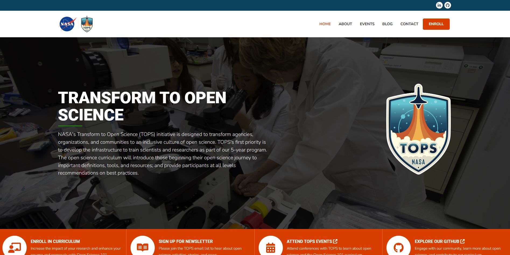

## Table of Contents

- [Suggested Knowledge](#suggested-knowledge)
- [Website Content](#website-content)
  - [Editing a Page](#editing-a-page)
  - [Adding and Editing a Post](#adding-and-editing-a-post)
  - [Adding and Editing Events](#adding-and-editing-events)
  - [Adding and Editing FAQs](#adding-and-editing-faqs)
  - [Editing Menus](#editing-menus)
  - [Editing Social Links](#editing-social-links)
- [OS 101 Workshops](#os101-workshops)
  - [Workshops for Everyone](#workshops-for-everyone)
  - [NASA Internal Workshops](#nasa-internal-workshops)

## Suggested Knowledge

This guide will be easier to follow along with if you have the following skills:

1) Understanding of Open Science, TOPS, OS101, and other related subject matter - This will help you to identify content that needs to be updated or changed but is not required for simple changes such as correcting a typo.
2) Basic GitHub experience - Specifically opening pull requests, working with forks, and creating markdown.
3) Minimal Knowledge of Liquid templating language - Jekyll uses Liquid to template website content. It is not required to know this language to make basic changes and we will go through all the steps needed to edit the content within. However, it does help to have basic knowledge of how Liquid works within Jekyll, especially if more technical changes are desired.
4) Minimal Understanding of YAML - Used to edit front matter (essentially metadata) of content and menus, not required for most basic changes.

## Website Content

This section will cover making changes to content types such as Pages, Posts, Events, and FAQs.

### Editing a Page

#### Where are Pages Located?

Pages on the TOPS community website are stored in two places.

1)  The home page is stored in the **root directory** of the website branch as **"index.md".**<br>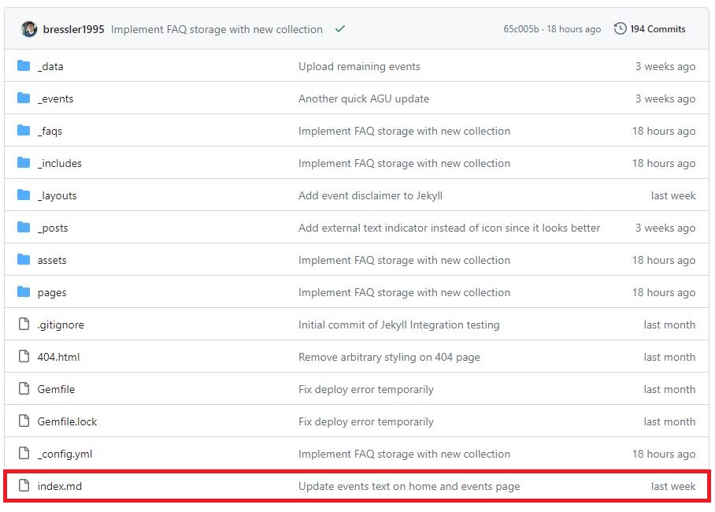

2)  All other pages are stored in the **“/pages” folder** with files named accordingly.<br>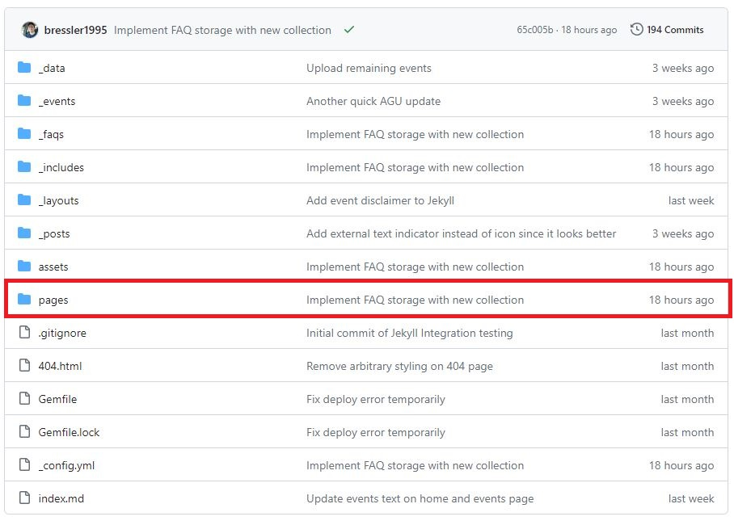

#### Front Matter

At the top of any content file, there is something called Front Matter. It will alway have three dashes "---" on the top and bottom indicating where it starts and ends. On pages, this content should not need to be changed most of the time, but is required for changing essential details such as page title, permalink, etc.

Take for instance the contents of about.md:

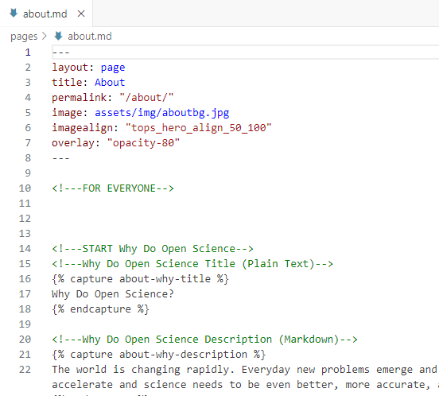

Within the dashes, the following YAML variables are defined:

- layout
  - Required, takes value of "default", "event", "newsletter", "page", or "post", since we are dealing with pages we will keep it as "page".
- title
  - Required, can be any value and is the title of your page shown in the hero section and in the title in your browser.
- permalink
  - Optional and defaults to title of page. Make sure this starts with a "/" and refrain from using spaces as is best practice for web links, use a "-" instead. For example: "take-os101". Dynamic values can be used for permalinks too, find out more about these values in [Jekyll's documentation](https://jekyllrb.com/docs/permalinks/).
- image
  - Required, points to a directory with your image, should always start with **assets/img/** as images are stored here. This defines the background image in the hero section of a page. This does not apply to the home page.
- imagealign
  - Optional, defaults to horizontal center and vertical center alignment of image when omitted. Refers to alignment class defined in **"assets/css/style.css"**. Only change this if you are familiar with the effect of the CSS class specified.
- overlay
  - Technically optional but your image will show as a black box if you do not. This refers to the opacity class names defined in “assets/css/style.css” and gives transparency to the overlay that is on top of your image. This allows the title text to be more readable. In this case we use “opacity-80”. Most of the time, you shouldn’t need to change this value.

#### Page Text

Editing text on the website requires some caution to make sure that you are preserving some of the Liquid templating that is incorporated into these pages. Let’s start with our homepage located in **index.md** in the **root directory** of the website.

You will notice that each section is wrapped in comments to identify what is being edited. For instance, the "What is TOPS?" section clearly indicates where a section starts and ends through comments. Editing comments has no effect and are simply meant to guide you.

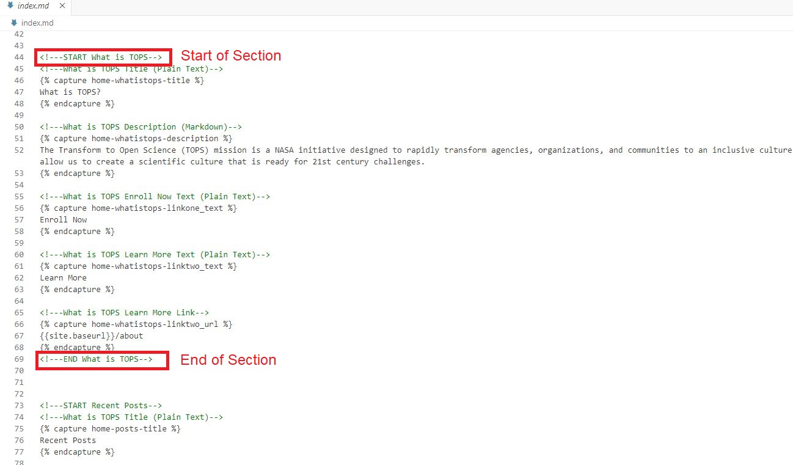

**Plain Text and Markdown Text Areas**

Within sections, there are individual text areas intended only for plain text, meaning no markdown can be used, and some text areas are markdown enabled. Comments are also employed to let you know what kind of text can be used. For instance the “What is TOPS?” title only takes plain text, However, the description area is Markdown enabled.

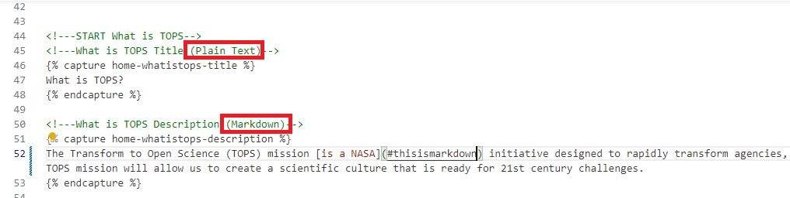

For plain text and markdown enabled text areas, button text, and button links, you will see the text is wrapped in the following syntax:

```


Your text or markdown here (This is the text you want to change)


```

Likewise you do not need to change the capture Syntax. Rather, you only need to change the text that is in between.

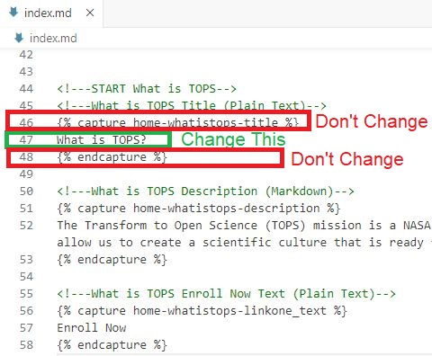

*Example of changing "What is TOPS?" title text*

**Lists**

Another example page we can look at is **"takeos101.md"** which is under the **"/pages"** directory. You will see standard text sections with the capture syntax discussed previously. But, you will also see some content areas have lists which use a slightly different syntax than the standard text areas.

For instance, make note of the **"Get Involved"** section.

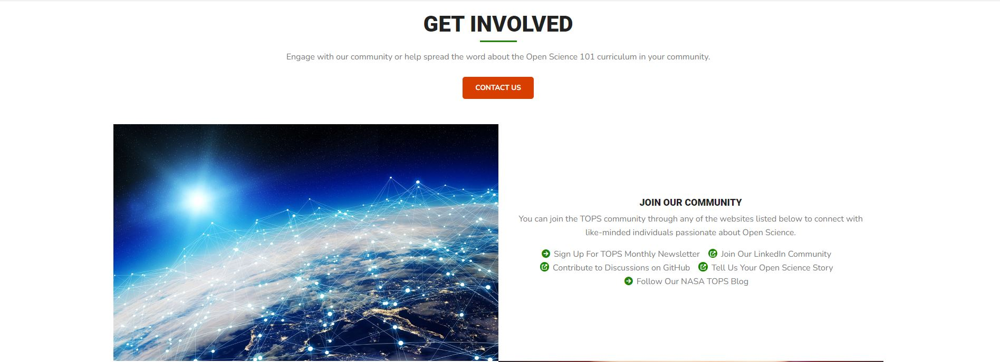

In the markdown file, the **"Get Involved / Join Our Community"** list titles and list links use the following syntax:

```

```

Likewise, you only need to edit what is between the quotes, make sure to keep the quotes at the start and end of the text. Furthermore, variable names ending in "title-one" and "link-one" represent the same list item.

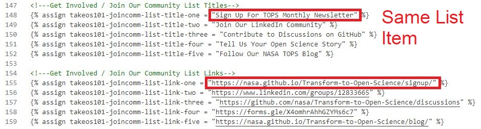

### Adding and Editing a Post

Posts are stored in the **"/\_posts"** folder. At this time, posts are expected to be hosted externally on our TOPS blog on nasa.gov and other sources. However, it is still useful to have a hub that lists these posts for people to find easily.

#### Naming and Sorting

Notice how each file name begins with the date formatted as yyyy-mm-dd followed by a "-" and followed by the desired text. For example: **"2023-10-03-open-science-101.md"**. Likewise, this is the naming convention you should follow when adding a new Post.

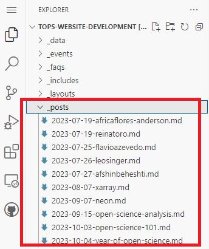

Having the date in the file name allows for Posts to be sorted. The most recent dates are shown towards the top and the oldest dates are shown towards the bottom.

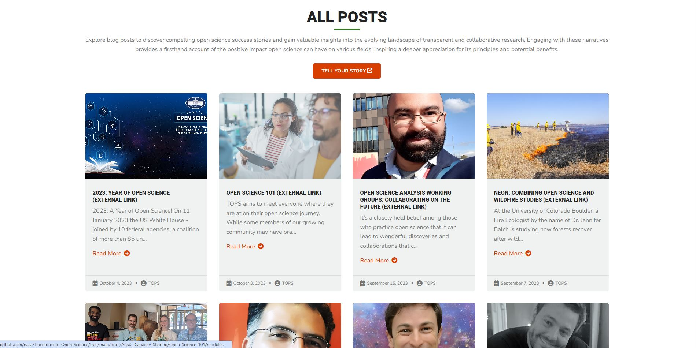

#### Front Matter

Front matter is defined in detail in the “[editing a page](#editing-a-page)” section of this guide. For the purpose of Posts, only these values are needed:

- layout - Required, takes value of "default", "event", "newsletter", "page", or "post", since we are dealing with posts we will keep it as "post".
- title - Required, title of Post.
- author - Optional, currently only takes value of "TOPS".
- image - Required, points to a directory with your image, should always start with **assets/img/** as images are stored here. This defines the featured image for a post.
- external - Required, specifies an external link. If omitted, no template is designed currently for locally hosted posts, as they are currently not needed.
- date - Optional as this is defined in the file name, but it is included to allow for fine grain control such as adding a time. More details can be found in [Jekyll's documentation.](https://jekyllrb.com/docs/front-matter/#predefined-variables-for-posts)

#### Content

Content is written in standard Markdown as is standard on a post or collection. Write it below the front matter. For posts this is used for the post excerpt which is a trimmed version of this content.

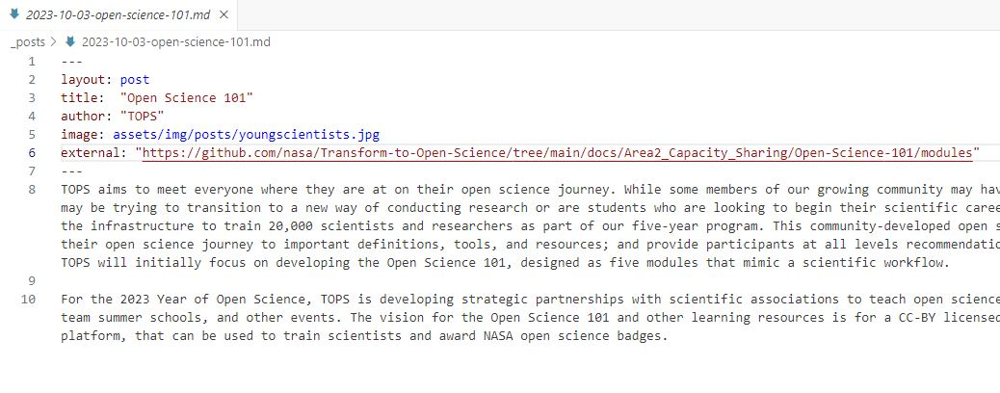

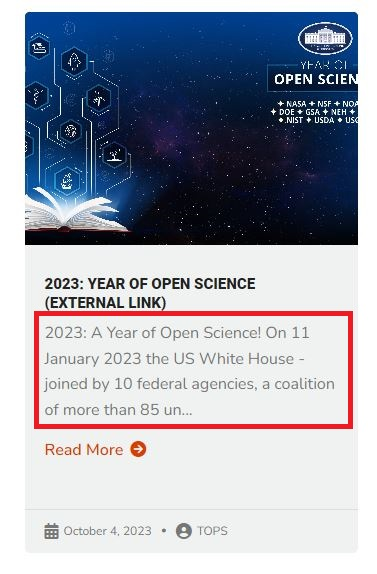

### Adding and Editing Events

Events are stored in the **"/\_events"** folder. 

**The editing of Events is only intended for use by TOPS internally.  Pull requests outside of this will be rejected.**

#### Naming and Sorting

Notice how each file name begins with the date formatted as yyyy-mm-dd followed by a “-” and followed by the desired text. For example: **"2023-11-27-agu.md"**. Likewise, this is the naming convention you should follow when adding a new Event.

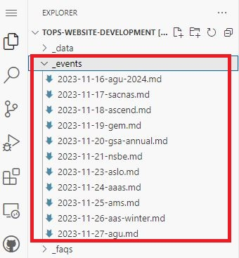

Having the date in the file name allows for Events to be sorted. The most recent dates are shown towards the top and the oldest dates are shown towards the bottom.

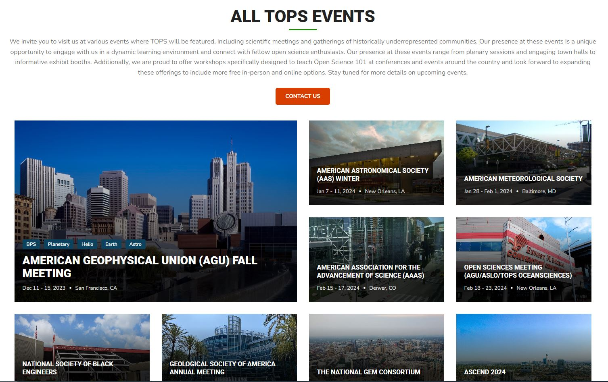

#### Front Matter

Front matter is defined in detail in the "[editing a page](#editing-a-page)" section of this guide. For the purpose of Posts, only these values are needed:

- layout - Required, takes value of "default", "event", "newsletter", "page", or "post", since we are dealing with events we will keep it as "event".
- title - Required, title of Event.
- permalink - Optional and defaults to **"/events/yourtitle"**. Make sure this starts with a "/events/" and refrain from using spaces as is best practice for web links, use a "-" instead. For example: **"/events/agu-2023"**. Dynamic values can be used for permalinks too, find out more about these values in [Jekyll's documentation](https://jekyllrb.com/docs/permalinks/).
- image - Required, points to a directory with your image, should always start with **assets/img/** as images are stored here. This defines the featured image for an event.
- imagecaption - Optional, short caption for image.
- daterange - Required, format for date range is flexible but keep it consistent. A good example is: **"Dec 9 -13, 2024"**.
- date - Optional as this is defined in the file name, but it is included to allow for fine grain control such as adding a time. More details can be found in [Jekyll's documentation.](https://jekyllrb.com/docs/front-matter/#predefined-variables-for-posts)
- location - Required, city and state abbreviation, has flexible formatting but is suggested to use this format: **"Pheonix, AZ"**.
- venue - Required, venue of event, if there is none then just put "To be announced".
- acronyms - Optional, comma separated values defined [here](https://github.com/nasa/Transform-to-Open-Science/blob/main/docs/Area1_Engagement/Outreach/tops_conferences.md). An example with several values is **"BPS,Planetary,Helio,Earth,Astro"** or for a single value **"BPS"**.
- map - Required, generate embed code from a maps service, the result should start with "\<iframe…" and end with "\</iframe".
- imageattribution: Optional, but if image requires attribution then write the properly formatted attribution. Tools exist to generate proper attributions depending on image license. Images from stock photography websites often don't need attributions but be aware of the license for that image.

#### Content

Content is written in standard Markdown as is standard on a post or collection. Write it below the front matter.

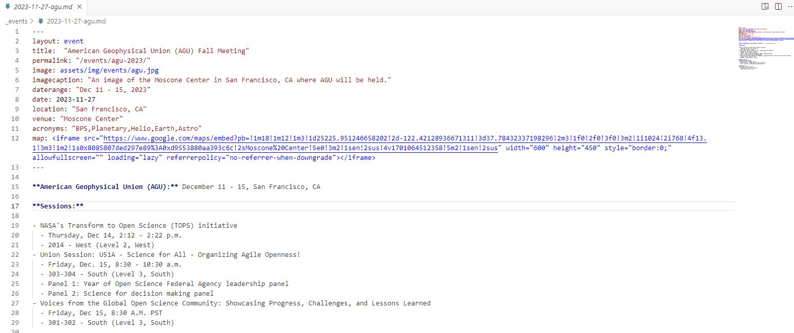

### Adding and Editing FAQs

FAQs are stored in the **"/\_faqs"** folder.

#### Naming and Sorting

Notice how each file name begins with the date formatted as yyyy-mm-dd followed by a “-” and followed by the desired text. For example: **"2023-10-01-whatisoss.md"**. Likewise, this is the naming convention you should follow when adding a new FAQ.

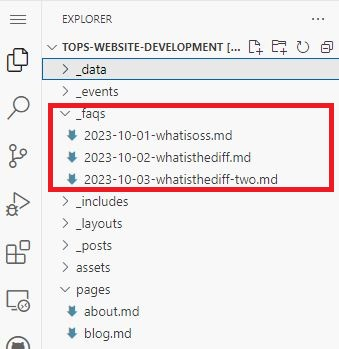

Having the date in the file name allows for FAQs to be sorted. The most recent dates are shown towards the top and the oldest dates are shown towards the bottom.

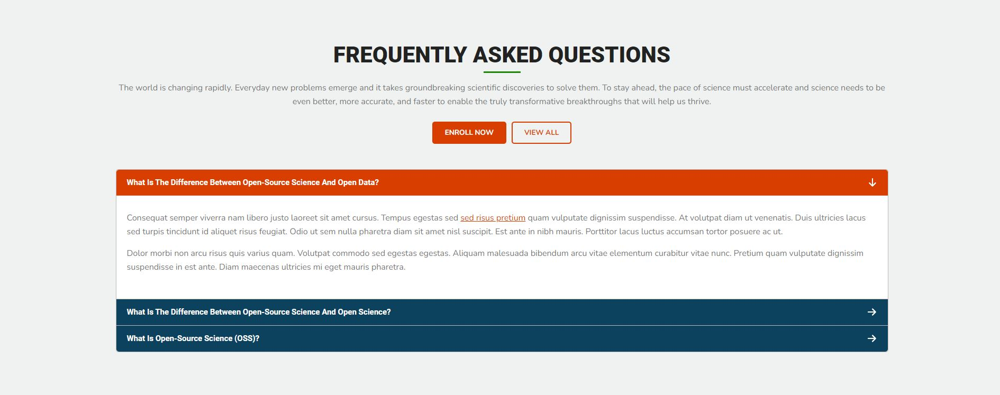

#### Front Matter

Front matter is defined in detail in the "[editing a page](#editing-a-page)" section of this guide. For the purpose of FAQs, only these values are needed:

- title - Required, title of FAQ that is displayed on the buttons shown on the FAQ accordion menu.
- date - Optional as this is defined in the file name, but it is included to allow for fine grain control such as adding a time. More details can be found in [Jekyll's documentation.](https://jekyllrb.com/docs/front-matter/#predefined-variables-for-posts)

#### Content

Content is written in standard Markdown as is standard on a post or collection. Write it below the front matter.

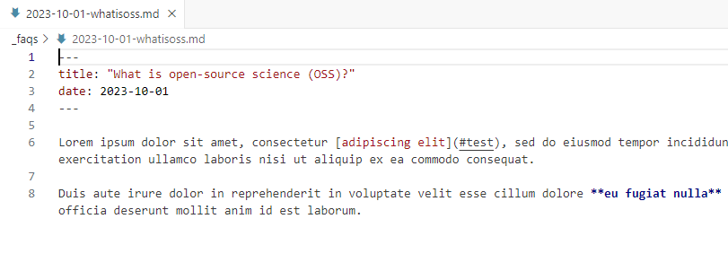

### Editing Menus

This is where YAML knowledge would be handy. Menus are defined for the Top Menu, Footer Menu, and Curriculum Modules. To make changes to these, you will edit the **"/\_data/menus.yml"** file. Menu items can have specific values assigned depending on the menu you are working on:

**The editing of Menus is only intended for use by TOPS internally.  Pull requests outside of this will be rejected.**

- topmenu
  - title - title of menu item can be any text
  - url - link to page, by default this will point to https://nasa.github.io/Transform-to-Open-Science/yourlink
  - external - if set to true you can use an external url in the url value, for example "[https://nasa.gov](https://nasa.gov)"
  - special - sets menu item style to orange block, you shouldn’t need to use this as this is reserved for the "Take OS 101" page
- footermenu
  - title - title of menu item can be any text
  - url - link to page, by default this will point to https://nasa.github.io/Transform-to-Open-Science/yourlink
  - external - if set to true you can use an external url in the url value, for example "[https://nasa.gov](https://nasa.gov)"
- cmodules
  - title - title of menu item can be any text
  - url - link to page, this only takes external links by default

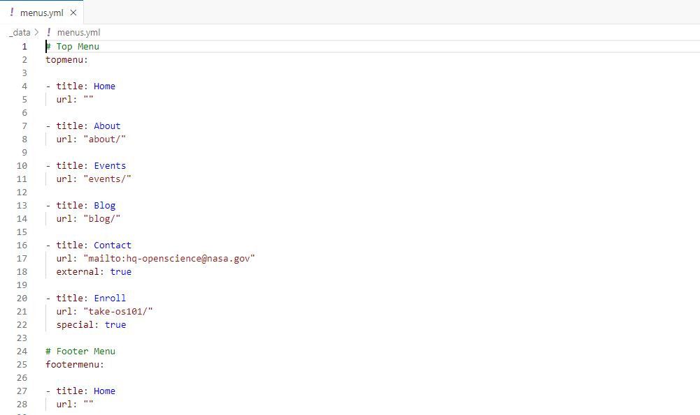

### Editing Social Links

Social links are handled by the **“\_config.yml”** in the **root directory** which is also written in YAML. Scrolling down within this file, you will see the social section.

**The editing of Social Links is only intended for use by TOPS internally.  Pull requests outside of this will be rejected.**

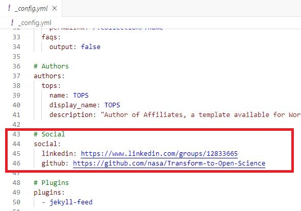

For our purposes only LinkedIn and GitHub are defined and these links should stay the same. If you were to want to remove a social link, you would simply remove that line or comment it out.

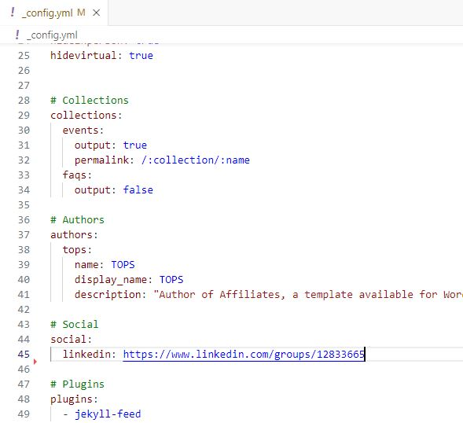

## OS101 Workshops

This section will cover adding your OS101 workshop to our website which is available to all interested researchers. Alternatively, you can request your workshop be added to our NASA internal link which is only available for NASA civil servants and contractors.

Before attempting to add a workshop to the TOPs community website, make sure that you have cleared it with TOPS.  If you have not already, please email us at [hq-openscience@nasa.gov](mailto:hq-openscience@nasa.gov).

### Workshops For Everyone

Workshop data is stored in the **"/\_data "** folder in the **root directory** within two CSV files: **inperson.csv**, and **virtual.csv**. Each of these likewise corresponds to in person workshops and virtual workshops. Each row in these files is representative of a separate workshop.

#### Request for Your Workshop to be Added for You

Understandably, adding workshops to the TOPS website may come with a technical learning curve. If you wish, you can [submit an issue](https://github.com/nasa/Transform-to-Open-Science/issues) on GitHub where we can ask for more information.

#### Editing Files Yourself

The most convenient method of changing these files is by making use of a fork of the TOPS repository, containing the **Website Branch.** Find out more about working with forks [here](https://github.com/nasa/Transform-to-Open-Science/blob/main/CONTRIBUTING.md).


You can download the files, change them in Excel or an equivalent open source program, and replace them with your updated files ensuring to retain the same file name and CSV format. If you are using **git** or **GitHub Desktop**, you can even more conveniently edit these files on your computer and push changes to your fork.

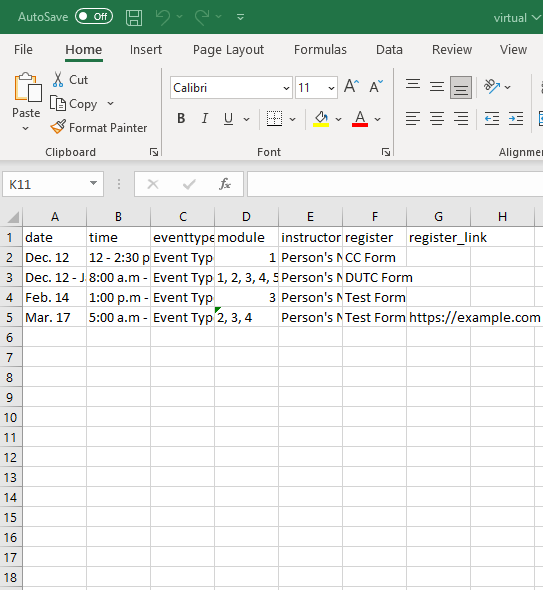

*Editing virtual.csv in Excel*

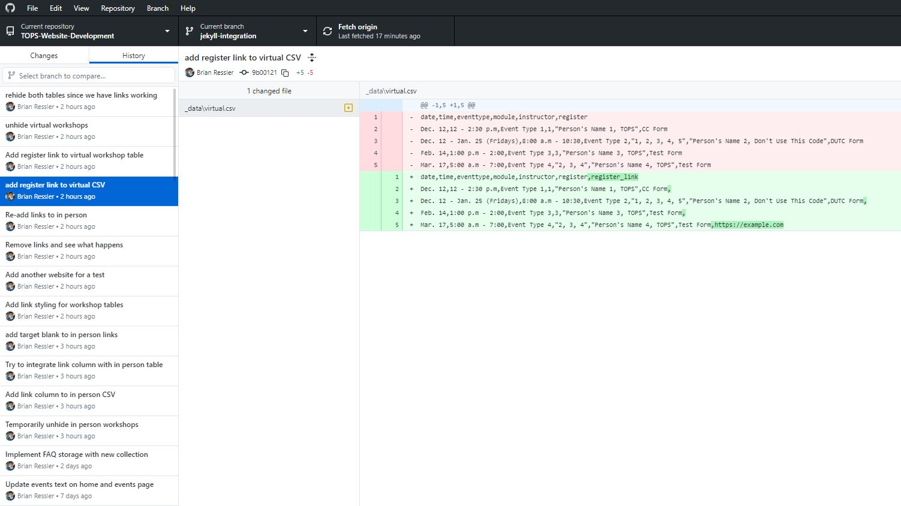

*Commiting changes to fork in GitHub Desktop*

**Note: Do not change the first row in either workshop file as they are the columns that Jekyll will be looking for.**

#### In Person Columns

Each row contains these columns that are specific to in person workshops.

- date (Date)
  - Date or date range when the workshop will occur
  - No specific format is required, but it is recommended to keep this consistent with other entries.
- time (Time)
  - Time or time range when the workshop will occur
  - No specific format is required, but it is recommended to keep this consistent with other entries.
- Eventtype (Event Type)
  - Generic description of workshop, it can be anything but if another workshop exists with an event type that matches yours, make sure to use the same wording as that one.
  - For example you see a workshop with an event type of **"TOPST Summer School"** and that seems to describe your workshop as well. So you copy and paste how that has been worded into the eventtype column on the row you are working on.
- location (Location)
  - Location of your workshop, anything can be put in here but it is suggested that you use this format: Venue Name, City Name, State Abbreviation
  - For example: **Moscone Center, San Francisco, CA**
- module (Module)
  - Module(s) that your workshop will be teaching, it is suggested that if you are teaching multiple modules that you separate each with a comma.
  - Example of one module being taught: **2**
  - Example of multiple modules being taught: **2,3,4**
- moreinfo (More Info)
  - Label for your more info / registration link, i.e **Learn More** or **Register Now.**
- moreinfo_link (More Info Link)
  - Link to a website.

#### Virtual Columns

Each row contains these columns that are specific to virtual workshops.

- date (Date)
  - Date or date range when the workshop will occur
  - No specific format is required, but it is recommended to keep this consistent with other entries.
- time (Time)
  - Time or time range when the workshop will occur
  - No specific format is required, but it is recommended to keep this consistent with other entries.
- eventtype (Event Type)
  - Generic description of workshop, it can be anything but if another workshop exists with an event type that matches yours, make sure to use the same wording as that one.
  - For example you see a workshop with an event type of **"Virtual Cohort"** and that seems to describe your workshop as well. So you copy and paste how that has been worded into the eventtype column on the row you are working on.
- module (Module)
  - Module(s) that your workshop will be teaching, it is suggested that if you are teaching multiple modules that you separate each with a comma.
  - Example of one module being taught: **2**
  - Example of multiple modules being taught: **2,3,4**
- instructor (Instructor)
  - Instructor for you workshop, anything can be put in here but it is suggested that you use this format: Person’s Name, Organization
  - For example: **John Doe, NASA**
- register (Register)
  - Label for your registration link, i.e **Learn More** or **Register Now.**
- register_link (Register Link)
  - Link to a website.

### NASA Internal Workshops

You can request a NASA internal workshop by [submitting an issue](https://github.com/nasa/Transform-to-Open-Science/issues) where we can request more information.