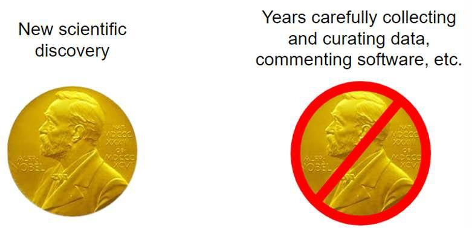
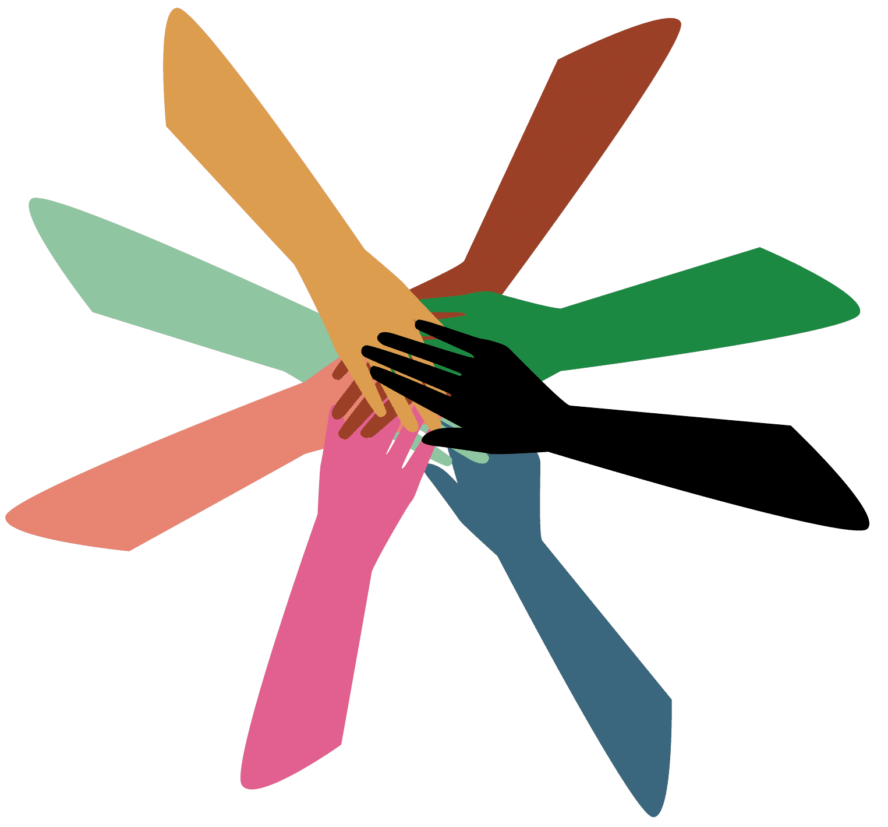

# Lesson 4: When Not to be Open

## Navigation
* [Common Fears Around Openness](#common-fears-around-openness)
* [Misaligned Incentives](#misaligned-incentives)
* [Social Barriers](#social-barriers)
* [Institutional and Infrastructure Barriers](#institutional-and-infrastructure-barriers)
* [Lesson 4: Summary](#lesson-4-summary)
* [Lesson 4: Knowledge Check](#lesson-4-knowledge-check)

## Overview

In this lesson, you will consider potential barriers to adopting open science practices. Barriers can come in the form of personal fears, as a result of misaligned social challenges, or institutional/infrastructure barriers. We begin with an exercise to identify your own concerns or fears around adopting open science. This leads into a discussion about common barriers and mitigation strategies.

## Learning Objectives

After completing this lesson, you should be able to:

- Recognize your own fears and concerns for adopting open science, and list mitigation strategies for overcoming them.
- List common barriers to practicing open science that occur from misaligned incentives and mitigation strategies.
- List several social challenges that can arise when practicing open science and strategies for communicating effectively to overcome differences in perspective.
- List several institutional and infrastructure barriers to doing open science and mitigation strategies where available.

## Common Fears Around Openness

### Activity 4.1: Self Reflection on Open Science Concerns

Take a moment to think about what fears or concerns you have around adopting open science. These could be concerns you have experienced in your work, or fears you have for being more open moving forward. There are no wrong answers here – this is a time for you to reflect on what might be keeping you back from doing open science.

**Some Fears Around Adopting Open Science Practices** 

Now that you've reflected on some of your concerns or fears around open science, below we have listed a few common fears of doing open science and some potential mitigation strategies. Even if you personally don’t have this fear, it can be useful to think about the different concerns that others may have to better understand and even help others address them.

**Table:** Common Fears About Open Science

<table>
<colgroup>
    <col style="width: 33%" />
    <col style="width: 66%" />
</colgroup>
<thead>
    <tr>
        <th>Fear</th>
        <th>Discussion/Mitigation</th>
    </tr>
</thead>
<tbody>
    <tr>
        <td><strong>Mistakes:</strong> What if my work is wrong?</td>
        <td>
            
It can be intimidating to share your research materials publicly, because someone might find a mistake. But isn’t it better for science if we can quickly find and fix mistakes? Peer review is a core pillar of the scientific method, and is a mechanism for others to help find and correct mistakes. To make this work, we will need to be more open to finding and fixing mistakes. It’s true that in many science communities, a mistake is considered a failure. However, open science policies aim to change the perception of mistakes from that of failure to a step in the discovery process that can be aided with open community feedback.

        </td>
    </tr>
    <tr>
        <td><strong>Scooping:</strong> What if someone re-uses my work and gets the credit?</td>
        <td>
            
Yes, this can happen.

            
Depositing your work early and making it citable are ways to establish your work.

            
This serves as evidence for when you started working on it and makes it easier for others to cite you. Details of how to do this are provided in the following modules.

            
In many fields, if it is clear that someone is actively working on a problem, the decision to scoop that work may have a short term gain but long-term loss. In science, reputations are very important and being collaborative generally leads to increased career successes. Read more about scooping <a href="https://datascience.codata.org/articles/10.5334/dsj-2017-029">here</a>.

        </td>
    </tr>
    <tr>
        <td><strong>Misinterpretation of my work.</strong></td>
        <td>
            
This can happen regardless of the form or openness of your work - many publications have ended up being misinterpreted.

            
Openness does help to provide further context of the work. Documentation of your research plan and software management practices allow others to understand your work fully, and thus help reduce the risk that others will misinterpret your work. For example, if you share code, you can include a description of what the code does, along with brief usage instructions and examples. In Module 4, we will discuss proper data and code documentation that can help reduce misinterpretation.

        </td>
    </tr>
    <tr>
        <td><strong>My work will be used, but not cited.</strong></td>
        <td>
            
Science ethics dictates that you should be cited if your work is used. Part of open science is valuing all steps of the scientific workflow, and encouraging researchers to cite code, data, or other non-published articles. Make it easy for others to cite you by adding a digital object identifier (DOI - discussed later in the course) to your research product. Remember to cite others' materials, so you're not adding to the problem.

        </td>
    </tr>
    <tr>
        <td><strong>Data is too sensitive to share.</strong></td>
        <td>
            
Following appropriate anonymization or using controlled access can address this concern.

        </td>
    </tr>
    <tr>
        <td><strong>I don't want to maintain or update my work.</strong></td>
        <td>
            
Sharing what you did allows others to reproduce, replicate, and build upon your work. That doesn’t mean you have to maintain it for the rest of your life, or even at all. If you don’t plan to maintain your code, it is still recommended that you share the code publicly and archive it. By adding appropriate licensing, documentation, and contributing guidelines, you can make it clear how long you plan to keep your materials maintained (if at all). In fact - others might help maintain it for you!

        </td>
    </tr>
    <tr>
        <td><strong>My work won't be useful to anyone else.</strong></td>
        <td>
            
You never know how materials might be used. Individuals who contributed to all different types of software projects ended up helping NASA land a rover on Mars!

        </td>
    </tr>
</tbody>
</table>

Partially drawn from [Malvika Sharan's "Ten Lessons Against Open Science You Can Win"](https://www.software.ac.uk/blog/2020-12-17-ten-arguments-against-open-science-you-can-win)

Some of the fears listed above are not unique to open science and can occur in closed scientific systems. For example, scooping and reuse without citation are both examples of scientific misconduct that can happen in closed science scenarios. Open science practices can provide more avenues for recourse, such as making a preprint available or giving your data or code a DOI and license. Having more of your work shared in citable ways gives you more power to prove when misconduct has occurred.

Another example of a fear that occurs in both open and closed spaces is the commitment to maintaining your work beyond publication. Maintenance is a consideration regardless of whether your work was shared - you need to decide how long to store your data and code for yourself in order to reproduce your work, should any questions arise even after publication (we cover sharing and archiving data and code in later modules, Open Data and Open Code.) By sharing your research materials, you may actually increase the longevity and impact of what you’ve done if others find your materials useful and help maintain and build on top of them.

We recognize that this is not an exhaustive list of concerns and fears toward adopting open science. NASA has developed this module of the TOPS curriculum to provide guidance and instill confidence for researchers who intend to do their work more openly moving forward.

## Misaligned Incentives

Previously, we discussed some fears and concerns of adopting open science. In this section, we discuss barriers that block participation in open science that stem from misaligned incentive structures. These all relate to scientific incentives for individuals and organizations, and are not aligned with open values.

We distinguish between concerns and fears; those associated with changing the culture of how we do science; from the structural barriers that block researchers' abilities to adopt open science practices. We recognize that there is overlap in these categories, but this framing might be useful for understanding what we have control of as individuals, and where we need to encourage more structural changes to our scientific ecosystem.

### Overview: Misalignment of Incentives

Incentives can come in many forms, but most in science involve proposal funding and career advancement. In both of these cases, metrics are used for measuring scientific success (e.g., publication and citation count, as discussed earlier in this course). These current metrics do not capture the entire impact of activities that scientists spend their time doing. Below, we present a few examples of misaligned incentives. While there aren’t perfect answers for overcoming these yet, agencies like NASA and initiatives like [DORA](https://sfdora.org/) and [COARA](https://coara.eu/) are actively working to update these metrics that define what success means in science, and it will take community action to ensure that open and inclusive practices get the merit they deserve.

#### Challenge: Overvaluing Novelty

Awards (for example prizes or funding) are often given to those who make a big, new scientific discoveries or who create a new, exciting tool. This practice overlooks the community that wrote code, curated datasets, maintained fundamental existing tools, and many other important steps that enabled these novelties.

Prizes often disincentivize crediting a team, since only one or a small group can be awarded a prize (for example, a Nobel Prize can be awarded to up to 3 people only). This emphasis on novelty and the individual are starting to change, with awards being offered to groups (e.g., The White House Office of Science & Technology Policy [Open Science Recognition Challenge](https://www.challenge.gov/?challenge=ostp-year-of-open-science-recognition-challenge)) and addition of funding solicitations offered for maintaining tools and infrastructure. However, it will take time for these changes to become the norm.

#### Challenge: It Takes More Time to be Open

Doing open science often requires more time and effort from researchers to start and maintain. For instance, it can take significantly more time to document and clean code to a degree that the public can easily understand and use it. At the moment, the scientific system doesn’t always reward extra effort like this, which can make it difficult for individuals to spend their time on open activities because it takes time away from starting their next paper. After all, published papers are the main currency of the current scientific system.

Updated metrics of success can help to incentivize individuals to do their work openly. The science community is currently in a transition phase where new metrics are being developed, but the old metrics still dominate in many fields and organizations. It’s important for researchers to recognize that they might not be able to achieve complete openness until the system and culture shifts.

### Activity 4.2: To be Open or Not to Be...

In this activity, reflect on your answers to the questions and then compare your thoughts to the key takeaways.

Image credit: NASA 2023 @ Stennis Space Center.

---

Conferences are open places – most of the time. Think about who can attend a conference. How open/closed is it?

Publications can have both open and closed elements. How is it open?

## Social Barriers

### Challenge: Collaboration & Community - Open community members don’t always agree with one other

Meaningful collaborations across diverse communities can require additional time and effort to coordinate across groups and to address conflicts. While interacting with the community can be one of the most fulfilling things about Open Science, it might also be a source of disagreements about the direction of the project or how it should be used. That’s where licenses and codes of conduct come into play. Clear rules for community- and colleague- interactions and use of resources provide a framework to make decisions in a fair and agreed-upon manner. This can all take additional time, especially at the beginning of a research project, but can save time and headaches down the road.

### Strategies for Communicating Across Differences

These are ways you can encourage openness in your discussions around research. For in-person sessions, it's good to encourage discussion of these strategies:

- Presume that everyone you work with is doing the best they can at the time.
- Attempt collaboration before conflict.
- Listen carefully and actively.
- Encourage other people to listen as much as they speak.
- Practice empathy and humility.
- Ask questions that seek to understand your colleagues’ context.
- Participate in an authentic and active way that supports the health and longevity of your community.
- Exercise consideration and respect in your speech and actions.
- Treat other people's identities and cultures with respect: e.g., make an effort to say people's names correctly, and refer to them by their chosen pronouns.
- Be mindful of your surroundings and of your fellow participants, and take action if you notice a dangerous situation or someone in distress.

## Institutional and Infrastructure Barriers

### Institutional Barriers: Institutions Often Move Slowly 
 
Institutional barriers to the researcher or practitioner present an additional challenge to adopting open science practices. Researchers interested in adopting open science practices might lack support from their department or project supervisors. The budget, resources, or time in a project cycle might be insufficient to practice open science. Institutions might not recognize open science practices in recruiting, training, or promoting in the organization. Even if organizations show interest in moving toward open science, they can move slowly when setting up new systems of support.

In these situations, there isn’t always an obvious mitigation strategy. While we encourage individuals to practice open science, there may be aspects that just aren’t feasible at this point in time without spending a lot of extra time and effort, time that may not be recognized or supported by your institution. It’s best to work within the bounds of the system you are in, and while the entire scientific community is in a transition phase to being more open, it may be that it doesn’t make sense to be open in every way until the institutional barriers are lowered. That said, the more individuals that push for openness, the - more it will become part of the scientific mindset, and the more likely our organizations are to recognize and support our efforts.

### Tools & Infrastructure

#### Do the right tools and infrastructure exist to support my work?

There are many tools and resources for making our code, data, and results more open, but the required infrastructure is still being built, and may not be in place yet to support open science in each discipline. This is where community input can be helpful. Perhaps there is a community already working on implementing the infrastructure you need. If not, you can start discussions at conferences or on open online forums to help organize the creation of the tools and infrastructure you and your community need to effectively do open science.

#### How can I get around institute-specific infrastructure when trying to collaborate with people outside my organization?

Some of our infrastructure (like our computing platforms) are institute-specific, which can be a barrier to collaboration outside of our organization. However, by planning for open collaboration from the start, you can minimize these barriers. For example, you can use freely available tools like GitHub and Google Docs for communication and coordination, even if the computing facilities are institute specific.

### Open Science is Worth the Effort!

While there are many challenges to the adoption of open science, we believe that its benefits and its ethical imperative to the self and to scientific communities, citizens, and policy-makers outweighs the cost of barriers. In addition, the recognition of barriers and areas for caution provides a first step towards resolving them.

## Lesson 4: Summary

The following are the key takeaways from this lesson:

- There are valid concerns and fears around making our science more open, but there are often specific open science practices that can help to mitigate these fears.
- The misalignment of incentives creates real-world challenges that act as barriers to adopting open science practices. There are ways that individuals can minimize or work with these barriers, as well as organizations and groups that are actively working to update the incentive structure.
- Working openly and collaboratively has its challenges, but there are some strategies for communicating across differences.
- There are also institutional and infrastructure barriers to adopting open practices, but by using general tools and infrastructure we can minimize some of these challenges.

## Lesson 4: Knowledge Check

Answer the following questions to test what you have learned so far.

*Question*

**01/05**

Match the open science concern with a potential mitigation strategy.

<table>
  <tr>
    <td>Share your work early and make it easily citable</td>
    <td>Someone might reuse my work and get the credit</td>
  </tr>
  <tr>
    <td>Add clear licensing, documentation, and contributing guidelines</td>
    <td>Someone might misinterpret my work</td>
  </tr>
  <tr>
    <td>Provide appropriate documentation for your research products</td>
    <td>I don't want to maintain my work</td>
  </tr>
</table>

*Question*

**02/05**

Read the statement below and decide whether it's true or false.

*Open science can take more time and resources.*

- True
- False

*Question*

**03/05**

Which of the following are strategies to encourage openness in your discussions?

Select all that apply.

- Attempt collaboration before conflict.
- Speak loudly.
- Listen carefully and actively.
- Presume that everyone you work with is doing the best they can.
- Use jargon specific to your discipline.

*Question*

**04/05**

Read the statement below and decide whether it's true or false.

*All the needed infrastructure is in place to support open science across all disciplines.*

- True
- False

*Question*

**05/05**

There are times when open science can be a source of disagreements about the direction of the project or how it should be used. What factors should project creators consider to overcome those obstacles?

Select all that apply.

- Governance
- Planning
- Licenses
- Codes of Conduct
- Setting expectations for community interactions