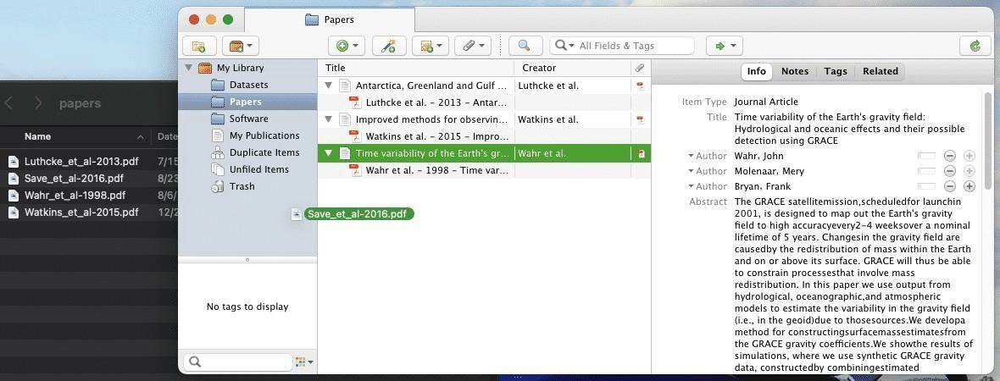

# Lesson 5: Tools for Open Results

## Navigation
* [Tools for Open Publications](#tools-for-open-publications)
* [Tools for Reproducibility](#tools-for-reproducibility)
* [Additional Tools for Open Results](#additional-tools-for-open-results)
* [Lesson 5: Summary](#lesson-5-summary)
* [Lesson 5: Knowledge Check](#lesson-5-knowledge-check)
* [Open Tools and Resources Summary](#open-tools-and-resources-summary)

## Overview

This lesson focuses on the tools available for sharing research products. It begins with a discussion of the tools for management of research projects. Then it introduced the tools for open publications and how to find them. Next, this lesson discusses the tools for open results. Lastly, this lesson discusses the concept of reproducibility. Journals are a tool for sharing your results and these are discussed in more detail in Module 5 - Open Results.

## Learning Objectives

After completing this lesson, you should be able to:

- Describe some of the benefits of preprints and identify resources for open access journals.
- List commonly used tools that increase the reproducibility of a result.
- List applications for project management and reference management.

## Tools for Open Publications

### Pre-Prints

 Open science tools can be used for writing, as tools to produce content, such as data management plans, presentations, and pre-prints. Pre-prints are early versions of research papers that are shared publicly before they are published in scientific journals. In some fields, they are shared prior to peer review while in other fields, it may only be after peer review and prior to publication. They are a vital component of open science content creation, as they promote transparency, rapid dissemination of knowledge, and collaboration among researchers.

By sharing pre-prints, scientists can receive feedback from the global research community, refine their work, and rapidly communicate their findings. This accelerates the pace of scientific discovery and ensures that valuable research is accessible to a broader audience, which aligns with the principles of open science.

Pre-prints have gained particular significance during the COVID-19 pandemic, where they played a crucial role in rapidly sharing information about the virus and its effects, emphasizing their importance in advancing science and public health. Fundamentally, pre-prints are important to open science. Consider the following highlights:

1. **Rapid Dissemination:** Pre-prints enable researchers to swiftly share their findings with the scientific community and the public, sometimes within days of completing their research. This swift dissemination is particularly beneficial when dealing with urgent or rapidly evolving topics.
2. **Peer Review:** While pre-prints are not peer-reviewed, they often undergo a form of community review. Researchers and experts can provide feedback and constructive criticism, helping authors improve their work before formal journal publication.

3. **Variety of Fields:** Pre-prints are not limited to any specific scientific discipline. They are used in fields ranging from medicine and biology to physics and social sciences, making them a versatile tool for disseminating research.
4. **Versions and Citations:** Pre-prints can have different versions, and the final peer- reviewed paper may differ. Researchers are encouraged to cite pre-prints when discussing ongoing research, allowing for transparency in the academic discourse.
5. **Free Access:** Pre-prints are typically freely accessible to anyone with an internet connection. This open access promotes equality and inclusivity in science, enabling researchers from various backgrounds and institutions to engage with the latest research.
6. **Not a Replacement for Peer Review:** Although pre-prints are valuable tools for early sharing and collaboration, they are not a substitute for a formal peer-reviewed publication. Researchers and readers should examine pre-prints with the understanding that they have not undergone the rigorous peer review process that journals provide.

Pre-prints are typically hosted on dedicated pre-print servers for different scientific fields. Examples include: [arXiv](https://arxiv.org/) (physics, mathematics), [bioRxiv](https://www.biorxiv.org/) (biology), [medRxiv](https://www.medrxiv.org/) (medicine), and [many others](https://en.wikipedia.org/wiki/List_of_preprint_repositories). These platforms help organize and facilitate pre-print sharing. The [OSF provides a services](https://osf.io/preprints/#!) for searching over multiple preprint servers.

Remember, pre-prints play a significant role in open science by promoting rapid, transparent sharing of research findings across various scientific domains. They offer a valuable platform for researchers to disseminate their work and gather feedback, ultimately advancing scientific knowledge.

### Discover an Open Access Journal to Share Your Results

A common way to share a paper is to pick a journal that is already fully open access and adopt their license. One way to discover open journals is by using the Directory of Open Access Journals (DOAJ).

To identify the best open-access journal, you can use the [Directory of Open Access Journals](https://doaj.org/) (DOAJ) which provides a searchable index of all known open-access journals and articles. The DOAJ and its synergetic webpage, Sherpa Romeo, serve as useful tools in the early stages of research planning to help a researcher determine what journals to consider when the time comes to publish their results.

### Activity 5.1: Identify an Open-Access Journal

 To become more familiar with the [DOAJ](https://doaj.org/), visit [https://doaj.org/](https://doaj.org/) and search for *The Astronomical Journal* published by the American Astronomical Society. Once you select the journal, you can see costs to publish, details about licensing, author retention rights, time to publication, and other details.

Once you have found the journal, answer the following questions:

1.  When did it begin publishing as open access?
2.  What license is used for the publications?
3.  What rights do the authors retain in their publications?

**Note:** If journals did not have any open access, the journal will not have appeared in the search results. Also, because DOAJ has strict criteria for being listed in its directory, it is not likely you will find predatory publishers listed here, either.

## Tools for Reproducibility

In this lesson, we take a deep dive into a few available tools for (computational) reproducibility.

### What is Reproducibility?

The [National Academies Report 2019](https://www.nationalacademies.org/our-work/reproducibility-and-replicability-in-science) defined reproducibility as:

- Reproducibility means obtaining consistent computational results using the same input data, computational steps, methods, code, and conditions of analysis.
- Replicability means obtaining consistent results across studies aimed at answering the same scientific question, each of which has obtained its own data.

The pursuit of reproducibility aims to ensure researchers reach the same result when using the same steps, as well as to enable researchers to copy an environment and build upon a result by editing the environment in order to apply it to a similar problem. This additional feature gives others the ability to directly build upon previous work and get more science out of the same amount of funding.

Tools to support reproducibility in research outputs:

-  [Jupyter Notebooks](https://jupyter.org/) - A web application for creating and sharing computational documents. It offers a simple, streamlined, document-centric experience.
-  [Jupyter Books](https://jupyterbook.org/en/stable/intro.html) - Build beautiful, publication-quality books and documents from computational content.
-  [R Markdown](https://rmarkdown.rstudio.com/) - Produces documents that are fully reproducible. Use a productive notebook interface to weave together narrative text and code to produce elegantly formatted output.
-  [Binder](https://mybinder.org/) - Create custom computing environments that can be shared and used by many remote users.
-  [Quarto](https://quarto.org/) - Combine Jupyter notebooks with flexible options to produce production quality output in a wide variety of formats.

**Note:** As you might have noticed, a lot of open science tools require intermediate to advanced skills in data and information literacy and coding, especially if handling coding-intensive research projects. One of the best ways to learn these skills is through engaging with the respective communities, which often provide training and mentoring.

## Additional Tools for Open Results

### Tools for Open Project Management

Advancements over the past few decades to tools that manage research projects and laboratories have helped to meet the ever-increasing demand for speed, innovation, and transparency in science. Such tools are developed to support collaboration, ensure data integrity, automate processes, create workflows and increase productivity.

 Research groups can now use project management tools for highly specialized efforts. They use existing platforms or develop their own software to share materials within the group and manage projects or tasks.

 Platforms and tools, which are finely tuned to meet researchers’ needs (and frustrations), are available. They are often founded by scientists, for scientists. To explore a few examples, let’s turn to experimental science.

 A commonly used term and research output is protocol. Protocol can be defined as "A predefined written procedural method in the design and implementation of experiments. Protocols are written whenever it is desirable to standardize a laboratory method to ensure successful replication of results by others in the same laboratory or by other laboratories." according to the University of Delaware (USA) Research Guide for Biological Sciences.

 In a broader sense, protocol comprises documented computational workflows, operational procedures with step-by-step instructions, or even safety checklists.

 [ Protocols.io](https://www.protocols.io/) is an online and secure platform for scientists affiliated with academia, industry and non- profit organizations, and agencies. It allows users to create, manage, exchange, improve, and share research methods and protocols across different disciplines. This resource can improve collaboration and recordkeeping, leading to an increase in team productivity and facilitating teaching, especially in the life sciences. In its free version, protocols.io supports publicly shared protocols, while paid plans enable private sharing, e.g. for industry.

Some of the tools are specifically designed for open science with an open-by-design concept from ideation on. These tools aim to support the research lifecycle at all stages and allow for integration with other open science tools.

As an example, the [Open Science Framework](https://osf.io/) (OSF), developed by Center for Open Science, is a free and open source project management tool. The OSF supports researchers throughout their entire project lifecycle through open, centralized workflows. It captures different aspects and products of the research lifecycle, including developing a research idea, designing a study, storing and analyzing collected data, and writing and publishing reports or papers.

The OSF is designed to be a collaborative platform where users can share research objects from several phases of a project. It supports a broad and diverse audience, including researchers that might not have been able to access certain resources due to historic socioeconomic disadvantages. The OSF also contains other tools in its own platform.

"While there are many features built into the OSF, the platform also allows thirdparty add-ons or integrations that strengthen the functionality and collaborative nature of the OSF. These add-ons fall into two categories: citation management integrations and storage integrations. Mendeley and Zotero can be integrated to support citation management, while Amazon S3, Box, Dataverse, Dropbox, figshare, GitHub, and oneCloud can be integrated to support storage. The OSF provides unlimited storage for projects, but individual files are limited to 5 gigabytes (GB) each."

**[Center for Open Science](https://www.ncbi.nlm.nih.gov/pmc/articles/PMC5370619/)**

---

### Best Practices for a Project Registry

 It is common for different types of outputs to be preserved in different places to optimize discovery and reuse. An up-to-date Project Registry provides a quick overview of all the outputs. Best practices for managing a Project Registry include:

- Create and update a Project Registry in conjunction with preserving outputs (as described above) in the form of a spreadsheet or other type of list. This can be one registry for the entire project that is updated, or a new registry for each milestone.
- Include in each registry entry a description of the object, preferred citation, and the persistent identifier (e.g., DOI), and any other useful information supporting the project. For outputs that do not have a persistent identifier, provide a URL and description.
- Preserve the Project Registry as a project component. Many funders require in their yearly reports a list of both peer-reviewed publications and all project outputs. The Project Registry can be provided to the funder during the reporting process, or used as a tracking tool to assist with completing the report.

### Managing Citations Using Reference Management Software

Keeping track of every paper you reference, every dataset you use, and every software library you build off of is critical. A single paper might cite dozens of references, and each new thing you produce only adds to that list. Reference Management Software can be employed to help you manage these references and automatically create a list of citations in whatever format you need (BibTeX, Word, Google docs, etc.).

 While you are writing up results, keeping track of references and creating a correctly formatted bibliography can be overwhelming. A management software can keep track of references and can be shared with colleagues who are also working in the document.

 Some of the common capabilities of reference management software are:

- Keep database of article metadata
- Import article metadata from PDFs
- Track datasets and software versions and DOIs
- Create formatted references and bibliography for many different journal styles

 Examples of reference management software include:

- Mendeley
- EndNote
- Zotero

### Open Highlight: Zotero

Zotero helps manage software, data, and publication metadata and citations through a drag-and-drop interface. Researchers can use the tool to automatically generate citation files (for example, in BibTeX format).

- Open Source
- Drag and Drop PDFs to import metadata
- Word + Browser plugins
- Export citations to BibTeX

## Lesson 5: Summary

 In this lesson you learned:

- Benefits of preprints and resources for open access journals.
- Tools for reproducibility and replication of your studies.
- Additional tools that are available to help manage open results including project management and reference management.

## Lesson 5: Knowledge Check

 Answer the following questions to test what you have learned so far.

*Question*

**01/03**

Read the statement below and decide whether it's true or false:

*Reproducibility means obtaining consistent computational results using the same input data, computational steps, methods, code, and conditions of analysis.*

- True
- False

*Question*

**02/03**

Which of the following steps would you take to manage a project registry for outputs? Select all that apply.

- Create and update a Project Registry in conjunction with preserving outputs in the form of a spreadsheet, or other type of list.
- Include in each registry entry a description of the object, preferred citation, and the persistent identifier (e.g., DOI), and any other useful information supporting the project.
- Preserve the Project Registry as a project component.
- Log all outputs in a paper notebook

 *Question*

**03/03**
 
 Which is NOT a capability of Reference Management Software?

- Keep database of article metadata
- Import article metadata from PDFs
- Track datasets and software versions and DOIs
- Create summaries of research articles

## Open Tools and Resources Summary

 Throughout this module, you learned about some of the concepts and tools that support the discovery and use of open research, that can be used to make data and software, and that can be used to share your results. These included:

- The foundational elements of open science, which includes research products such as data, code, and results.
- Resources used to discover and assess research products for reuse, including repositories, search portals, publications, documentation, metadata, and licensing.
- Making and sharing data that employs the FAIR principles by incorporating a data management plan, using persistent identifiers and citations, and utilizing the appropriate data formats and tools for making data and sharing results.
- The use of the tools needed for development of software including source code, kernels, programming languages, third-party software and version control.
- The tools and documentation types used for publishing and curating open software.
- Resources for sharing research products including preprints, open access publications, reference management systems, and resources to support reproducibility.