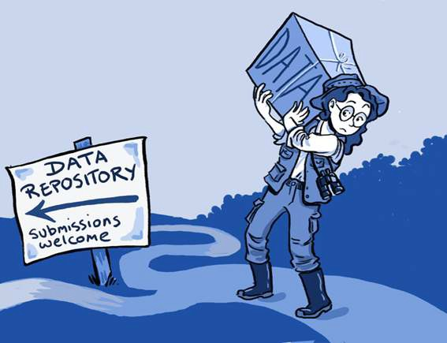
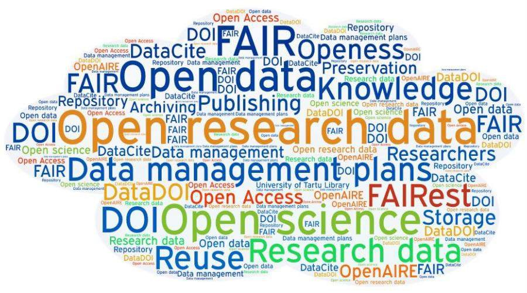
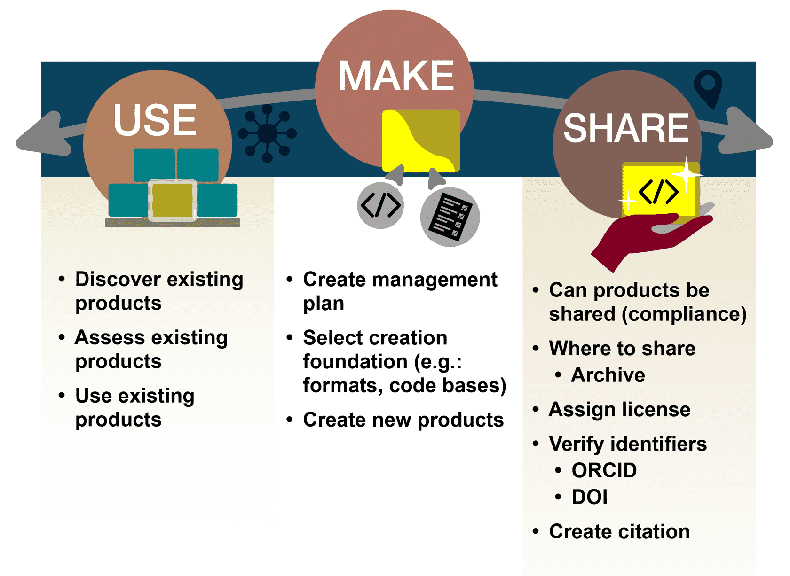

# Lesson 1: Introduction to Open Data

## Navigation
* [Overview](#overview)
* [Learning Objectives](#learning-objectives)
* [Introduction](#introduction)
* [Definition and Considerations of Open Data](#definition-and-considerations-of-open-data)
* [Benefits of Open Data](#benefits-of-open-data)
* [Challenges of Open Data](#challenges-of-open-data)
* [Applying FAIR Principles](#applying-fair-principles)
* [Planning for Openness: Using the Use, Make, Share Framework for Open Data](#planning-for-openness-using-the-use-make-share-framework-for-open-data)
* [Lesson 1: Summary](#lesson-1-summary)
* [Lesson 1: Knowledge Check](#lesson-1-knowledge-check)

## Overview

This lesson defines open data, its benefits, and the practices that enable data to be open. In addition, the lesson takes a closer look at how FAIR applies to open data as well as at the criticall role of metadata. It wraps up with a brief discussion on how to plan for open data in the scientific workflow and tasks guided by the use, make, share framework.

## Learning Objectives

After completing this lesson, you should be able to:

- Define what open data is and how the FAIR and CARE principles are used to guide open data practices
- List the benefits of open data
- Explain how the use, make, share framework can be used to modify the scientific plan for open data

## Introduction

Data drives science forward. Data are stored electronically to enable further analysis and research. Digital technologies integrated into every aspect of modern scientific research has led to the production of large amounts of data.

Open data is an essential pillar of open science. In many ways, open data are a natural expansion of open science beyond scholarly publications to include digital research outputs. It has since become an integral part of the open science movement as open data allows anyone to see, use, and verify published results. Open data makes science more accessible, inclusive, and reproducible. In order to support this, data needs to be made available in formats that others can use, include metadata that describes the data, and provided with helpful documentation. When made available, open data enables new discoveries and unforeseen uses.

### Example: How Will Humans Live on the Moon or Travel to Mars When the Space Environment Threatens Human Health in Multiple Ways?

Bone loss, vertigo, anemia, muscle atrophy, increased risk for cancer - these are just some of the human side effects of space travel. To study these human health risks of space travel, scientists around the world use NASA's open-source GeneLab platform. GeneLab aggregates large volumes of space biology data on human and model organism samples exposed to spaceflight conditions. Their digital and physical repositories include cell info as well as DNA, RNA, and proteins. As an open-source platform, GeneLab data are publicly accessible at no cost.

**Example:** Using astronaut biological data from GeneLab, [scientists recently found](https://www.nature.com/articles/s41576-020-00322-8) what may be the culprit behind many of the side effects from travel to space: mitochondrial stress.

[Watch Video](https://www.youtube.com/watch?v=c9moR-KQpDQ&embeds_referring_euri=https%3A%2F%2Fopenscience101.org%2F&feature=emb_imp_woyt)

Mitochondria are components within our cells that affect respiratory and energy function. This discovery could be crucial to overcoming human health- related problems in space. Understanding the source of this issue could help scientists develop countermeasures and therapies to keep people healthy in space for longer periods of time.

## Definition and Considerations of Open Data

### What is Data?

The Turing Way Community. This illustration is created by Scriberia with The Turing Way community, used under a CC-BY 4.0 licence. DOI: 10.5281/zenodo.3332807

---

Data are any type of information that is collected, observed, or created in the context of research. Today, data are increasingly stored electronically in a digital format.

Data includes:

**Primary (raw) data** – Primary data refers to data that are directly collected or created by researchers. Research questions guide the collection of the data. Typically, a researcher will formulate a question, develop a methodology and start collecting the data. Some examples of primary data include:

- Responses to interviews, questionnaires, and surveys.
- Data acquired from recorded measurements, including remote sensing data.
- Data acquired from physical samples and specimens form the base of many studies.
- Data generated from models and simulations.

**Secondary & Processed data** – Secondary data typically refers to data that is used by someone different than who collected or generated the data. Often, this may include data that has been processed from its raw state to be more readily usable by others.

**Published data** – Published data are the data shared to address a particular scientific study and/or for general use. While published data can overlap with primary and secondary data types, we have "published data" as its own category to emphasize that such datasets are ideally well-documented and easy to use.

**Metadata** – Metadata are a special type of data that describe other data or objects (e.g. samples). They are often used to provide a standard set of information about a dataset to enable easy use and interpretation of the data.

The term open data are defined in the open data handbook from the Open Knowledge Foundation:

"Open data are data that can be freely used, reused and redistributed by anyone – subject only, at most, to the requirement to attribute and share alike."

**Open Data Handbook from the Open Knowledge Foundation**

---

When talking about data in the context of this module, we focus on the data that you are preparing to share, such as data affiliated with a scientific publication, regardless of what type that is. While you could share (and many do) laboratory notebooks, preliminary analyses, intermediate data products, drafts of scientific papers, plans for future research and similar items, these aren't usually required by funding agencies or institutions and thus won’t be in focus for this module.

To quote from a [published paper about data reuse](https://www.ncbi.nlm.nih.gov/pmc/articles/PMC9542848/), researchers are mostly looking for data which is "comprehensive, easy to obtain, easy to manipulate, and believable." For these criteria to be fulfilled, the data should:

- Be sufficiently described with appropriate metadata, which greatly affects open data reusability. There is no one size fits all for metadata as its collection is guided by your data.
- Have the appropriate license, copyright, and citation information.
- Have appropriate access information.
- Be findable in an accredited or trustworthy resource.
- Be accompanied with history of changes and versioning.
- Include details of all processing steps.

Not all data may be shared or shared with all this information. There are different reasons why it might not be possible. However, the more information shared about data helps increase the reliability and reusability of the information.

## Benefits of Open Data

Data underpins almost all of science. Openly sharing data with others enables reproducibility, transparency, validation, reuse, and collaborations. Data plays a significant role in our day-to-day lives. Open data, in particular, plays a key role. Open data are only common in our society and you have likely already benefited from this form in some way. The impacts of open data include facilitating:

---

**Greater Good** – Data plays a significant role in our day-to-day lives. Open data, in particular, has played a key role. If you pause and think about it, you may realize that open data are not only common in our society, but you might have benefited from and used open data yourself.

Each country or territory often provides open access to a variety of socioeconomic information about the population, community, and business in its jurisdiction. These data are often called census survey data which may include the aggregated statistics of gender, race, ethnicity, education, income, and health data of a community. These data are often used to understand the composition of a local neighborhood and are critical to inform decisions on resource allocation to ensure the quality of life for the community.

#### Example: Open Data Helps Provide Life-Saving Information in the Face of Climate Change

The changing climate poses a significant risk to our daily lives and has been responsible for intensifying drought, increasing flooding and devastating fire incidents worldwide. Open data are therefore critical in providing life-saving information to adapt to the changing climate and help assess the climate risks where we live. Government agencies have been providing public access to long-term weather and climate information for decades (e.g., National Oceanic Atmospheric Administration in the U.S., UK Met Office, European Centre for Medium-Range Weather Forecasts). A more recent initiative stems from organizations developing value-added open-data products to advise society on the risk of a changing climate. One recent example is the flood and fire risk in the United States developed by a non-profit organization [First Street Foundation.](https://firststreet.org/)

**Policy Change**

#### Example: Predicting Climate Change Effects in Arctic Communities

Open data can lead to policy change that directly impacts the lives of communities, such as those destined to suffer first from the slow changes to the Arctic. A [study](https://www.nature.com/articles/s41467-018-07557-4) in Nature employed [OpenStreetMap](https://www.openstreetmap.org/about) data to help produce maps of projected environmental changes in the Arctic. These maps helped emphasize the need for adaptation-based policies at community and regional levels to avoid stagnation of change in the light of a sudden and dramatically worsening situation fueled by climate change.

**Global Emergency Response**

#### Example: COVID-19

The COVID-19 pandemic demonstrated to the world, in real-time, how the collective movement of researchers sharing their data (such as [sharing of
coronavirus genome data](https://www.nature.com/articles/d41586-021-00305-7#:~:text=Other%20researchers%20say%20that%20restrictions,while%20protecting%20data%20providers)) can lead to an unprecedented number of discoveries in a relatively short amount of time. This directly impacted radical vaccine development efforts and the timely control of the COVID-19 infection. These insights will continue to pay off, with this research spurring future developments.

Data sharing has many benefits and can aid access to knowledge. However, it is important to consider where the data has come from, who should have a say in its interpretation and use, and how the data can be shared responsibly.

**Citizen Science**

#### Example: Water Quality Testing in Beirut

A citizen scientist is a citizen or amateur scientist who collaborates with professional researchers to help gather or interpret data on a broader spatial and temporal scale than the researchers might be able to achieve on their own. This outsourcing of responsibility helps members of the public engage in scientific pursuits that ultimately benefit them and allow research to be conducted on a grander scale than that might be possible with only professional researchers. Citizen science is gaining popularity and recognition as a valuable contribution to scientific advancements.

For example, volunteer citizen scientists in Beirut were recruited from 50 villages to help test water quality [cite: chapter 5 of [Contextualizing
Openness: Situating Open Science](https://idrc-crdi.ca/en/book/contextualizing-openness-situating-open-science)]. These volunteers were trained to be able to conduct the tests and in turn, not only was the data collected to inform the scientific advancements, the citizen scientists had the opportunity to learn to better manage their water resources and were able to improve conditions, creating a mutually beneficial interaction.

**Open Data and Equitable Sharing of Knowledge**

Free distribution of knowledge increases participation in science. Open data are central to fostering science that is inclusive and diverse, with direct and relevant benefits to impacted individuals and communities. This integration with communities is particularly important in the mission towards the equitable sharing of knowledge.

In a research ecosystem where knowledge is a commodity, with the main currency in the form of published papers and hoarded datasets, exclusion from research can limit scientific progress and negatively impact community outcomes. Those excluded from traditional science resources are often from low and lower middle income countries. Opening our data in an inclusive and easily reusable way is one step toward purposeful inclusion of underrepresented groups in science.

#### Example: Recognition and Compensation for the Work of African Ebola Researchers

During the West African Ebola outbreak from 2014-2016, West African researchers actively worked to collect blood sample data to better understand the Ebola virus and to help put a stop to the rapid spread of the virus. However, most of the blood samples were sent overseas to the US and Europe, where researchers used those data samples to author papers about Ebola. According to the paper ["Science under fire: Ebola researchers fight to test drugs and vaccines in a war zone",](https://www.nature.com/articles/d41586-019-02258-4) "This frustrated researchers in the countries ravaged by the virus, who had hoped that studying aspects of the epidemic would strengthen their ability to respond to future infectious- disease outbreaks."

By fostering a global research culture of transparency and validation, where the work of underrepresented groups is celebrated and compensated, we will create a sustainable model that ensures under-represented communities (such as women, under-represented communities, indigenous scholars, non- Anglophone scholars) a voice in how the global and nuanced narrative of science is developed.

---

Open data that are purposefully inclusive and open to scrutiny, benefit scientific innovation by allowing for a more diverse and robust scientific process that draws from multiple perspectives. This openness also allows for the early identification of mistaken insights as well as early intervention for unforeseen harms to impacted communities.

Open data allows non-traditional researchers to contribute to scientific development and bring their unique insights to the table. With these benefits in mind, we should always bear in mind that Open Data requires careful consideration of its potential downsides that results from failure to provide due credit and consultation with potentially vulnerable and/or marginalized communities. The next lesson “Using Open Data” discusses important considerations for the responsible management, collection, and use of open data by all stakeholders.

### Benefits to You

Open data also benefits your research and career. For starters, you are your own future collaborator!

Doing open science not only lets other people understand and reproduce your results, but lets you do so as well! Implementing open science principles like good documentation and version control helps you, potential collaborators, and everyone else to understand your results. In 2 hours, 2 weeks, or 2 years, you will still be able to understand what you did.

Specific benefits of opening data for you as an individual:

- You will never lose access to your previous work, no matter what institute you are affiliated with. Many researchers move around institutions and organizations and by having your data publicly accessible in repositories, you will always have access to them.
- Your data can be cited and you will get credit.
- Publications that include links to data are cited more, according to a 2020 [study.](https://journals.plos.org/plosone/article?id=10.1371/journal.pone.0230416)

Implementing best practices for open science can strengthen your funding proposals. Funding agencies are realizing that openly sharing research provides more return on their investment. Well-documented research products also demonstrate the quality of your work, which helps with public communication and can also attract quality collaborators. Everybody prefers to work with people who are reliable and do a good job.

### Activity 1.1 Open Data Review

Take a moment to reflect on what data sharing means to you.

Image source: CC-by [openaire](https://www.openaire.eu/blogs/open-research-data-the-fairest-data-is-the-future-of-science-estonia-national-openaire-event-1)

---

The word cloud showcases the variety of meanings and interpretations that people have about open data. How many terms in the word cloud do you
recognize? Are any of them new to you?

## Challenges of Open Data

While open data has many benefits, there can also be challenges to its creation and use. Throughout this Module, we discuss many of these challenges and possible solutions. In this section, we discuss a few of the most common concerns along with actions to mitigate them.

**Example: Are There Any Harms to Open Data?**

Open data has been demonstrated to further marginalize or exploit small- scale and community driven initiatives, such as in [the case](https://thebulletin.org/2022/05/how-a-dispute-over-sharing-coronavirus-genomes-is-threatening-a-vital-tool-for-tracking-variants/) of African researchers neither receiving due credit nor compensation for their genome sequencing during the COVID-19 pandemic. This is further explored in the next section as we introduce ways of mitigating harms that could happen via unthoughtful and irresponsible sharing of data.

### Restrictions on Sharing Data

Some data should only be shared very carefully or not at all. Reasons not to share can include:

- Data includes a country’s military secrets or violations of national interests.
- Data includes private medical information or an individual’s personally identifiable data.
- Indigenous/cultural/conservation concerns.
- Data includes intellectual property.

It is important to be familiar with the policies around sharing of your data and policies from your funding agency, institution, or laws around data protection. These are further discussed in later modules.

### Common Fears Around Sharing Open Data

####  NOTE: We will discuss many of the concepts mentioned in the discussion/mitigation column later in this module.

|  |  |
|---|---|
| Fear: Scooping: What if someone re-uses my data to publish a result I was working on? | Yes, this can happen. But, in many fields, if it is clear that someone is actively working on a problem, the decision by another to scoop may have a short term gain but long-term loss. In science, reputations are very important and being collaborative generally leads to increased career successes. If you are sharing your data, ensure it has a digital object identifier (DOI). This does not prevent someone from using your data without attribution, but it helps make it easy for others to cite your data. There is a nice article about this [here](https://datascience.codata.org/articles/10.5334/dsj-2017-029). |
| Fear: Misinterpretation or Misuse | Provide sufficient contextual information (documentation) to allow others to understand your data fully to reduce this risk. |
| Fear: My data will be used but not cited | While it is not common for researchers to cite data, science ethics dictates that you should be cited if your work is used. And remember to cite others' data, so you’re not adding to the problem! |
| Fear: Data are too sensitive to share | Use controlled access to help maintain sensitivity and security. |
| Fear: My data won't be useful to anyone else | You never know how materials might be used! [Sailors in the 1800s collected temperature data](https://www.npr.org/templates/story/story.php?storyId=113916471) that is an important part of our ocean climate record today! |

These are all valid concerns when sharing data openly, but as indicated by the global move towards open science, the overall benefits outweigh the concerns. 

Ultimately, you are free to deploy the open data principles and resources in your research to maximize its impact and meet the expectations of your sponsors and community while managing costs.

## Applying FAIR Principles

Image by Patrick Hochstenbach, CC0 1.0; image illustrates the each FAIR principle

---

### FAIR: Findable, Accessible, Interoperable, Reusable

The vast majority of data today is shared online. FAIR principles help researchers make better use of, and engage with a broader audience with, their scientific data than outdated techniques would allow. FAIR data are more valuable for science because they are easier to use. Data can be FAIR regardless of whether it is openly shared or not. If data are openly shared, being FAIR helps with reuse and expands the scientific impact of the data.

FAIR principles don’t encompass comprehensive implementation instructions for every type of data, but offer general insights to improve shareability and reusability. Sometimes it takes a group effort and/or a long production process to make data and results FAIR. The process starts in the planning stage of a research project. A well-coordinated open science and data management plan is often needed for full compliance with FAIR, depending on the size and type of project the data are used for.

**Up-to-date information about FAIR Principles can be found at the GO FAIR Initiative website**

[CLICK TO LEARN](https://www.go-fair.org/)

Let's review how to make data FAIR for your community.

*Select each tab to find out more information.*

<table>
  <thead>
    <tr>
        <th>FINDABLE &#9745;</th>
        <th>ACCESSIBLE</th>
        <th>INTER-OPERABLE</th>
        <th>REUSABLE</th>
    </tr>
  </thead>
  <tbody>
    <tr>
        <td colspan="4">
            
To ensure that data are findable by those in your community:

            <ul>
            <li>Deposit data in repositories to preserve the data over time.</li>
            <li>Assign your dataset a persistent identifier (PID), such as a digital object identifier (DOI).</li>
            <li>Add rich, self-describing metadata in your data files and register the metadata in a metadata catalog that will enable your data to be properly curated.</li>
                <ul>
                <li>Note that some images or binary files cannot be readily indexed or searched and will need to have companion metadata files or dictionaries to ensure they can be discovered in a search.</li>
                </ul>
            <li>Automate the sharing of your metadata with targeted communities, if applicable.</li>
            </ul>
        </td>
    </tr>
  </tbody>
</table>

<table>
  <thead>
    <tr>
        <th>FINDABLE</th>
        <th>ACCESSIBLE &#9745;</th>
        <th>INTER-OPERABLE</th>
        <th>REUSABLE</th>
    </tr>
  </thead>
  <tbody>
    <tr>
        <td colspan="4">
            
To ensure that data can be accessed by those in your community:

            <ul>
                <li>Archive in a data repository/data center with standardized access protocols.</li>
                <li>Repository access protocols should be well-defined and ideally should support machine-to-machine access.</li>
                <li>Provide information on how users can access your data, ideally in an automated, machine-based fashion.</li>
                <li>If the full content cannot be made openly available for any reason (data sensitivity, infrequent data access, file storage issues), the metadata can still be made openly available so that users can find out who they need to contact to request the data (if possible).</li>
            </ul>
        </td>
    </tr>
  </tbody>
</table>

<table>
  <thead>
    <tr>
        <th>FINDABLE</th>
        <th>ACCESSIBLE</th>
        <th>INTER-OPERABLE &#9745;</th>
        <th>REUSABLE</th>
    </tr>
  </thead>
  <tbody>
    <tr>
        <td colspan="4">
            
To ensure that data are interoperable for those in your community:

            <ul>
                <li>Report the data in community standard format.</li>
                <li>Use existing standardized metadata if available to minimize "lost in translation" issues and support machine-readability.</li>
                <li>The use of controlled terminologies, vocabularies, and ontologies is necessary to support interoperability, but may not yet be available in all research fields.</li>
            </ul>
        </td>
    </tr>
  </tbody>
</table>

<table>
  <thead>
    <tr>
        <th>FINDABLE</th>
        <th>ACCESSIBLE</th>
        <th>INTER-OPERABLE</th>
        <th>REUSABLE &#9745;</th>
    </tr>
  </thead>
  <tbody>
    <tr>
        <td colspan="4">
            
To ensure that data are reusable by those in your community:

            <ul>
                <li>Ensure that metadata accurately describes the data and its variables as well as any particularities or limitations.</li>
                <li>Specify clear usage licenses for your data.</li>
                <li>Provide accurate information on provenance in your metadata.</li>
                <li>Add enough metadata information so that your data can be properly cited when it is used.</li>
            </ul>
        </td>
    </tr>
  </tbody>
</table>

### Metadata's Central Role in Applying FAIR

Metadata are important for search engines to find data and for people to be able to easily compare what is returned.

- Metadata are essential to the implementation of FAIR Principles and enable the data to be used by machines in an automated fashion.
- The richer and more self-describing metadata are, the better they will be handled by anyone who is interested in your data.

### Licensing Data

A license is a legal document that tells users how they can use a particular dataset. If you don’t license your dataset, others can’t/shouldn’t re-use it - even if you want them to! It is imperative to understand the licensing conditions of a dataset before data reuse. Without a good understanding of what a license allows, data users may run into copyright infringement or other intellectual property issues.

To ensure open reuse of your data, you can use an open license. An open license has language that describes the user’s ability to access, reuse and redistribute the dataset. There are many types of data licenses that are open to varying degrees, and these will be discussed further in the lesson "Making Open Data".

## Planning for Openness: Using the Use, Make, Share Framework for Open Data

### Open Science and Data Management Plans

Most scientific funding agencies and organizations ask for a plan for sharing your research when you propose a project. One example of an open science plan is the Open Science and Data Management Plan ([OSDMP](https://science.nasa.gov/researchers/sara/faqs/osdmp)) for NASA's Science Mission Directorate (SMD) that describes how the scientific information that will be produced from scientific activities will be managed and made openly available. The OSDMP includes sections on data management, software management, and publication sharing; the latter two will be discussed in future modules. If your study has other types of outputs, such as physical samples, hardware, or anything else, you should include those in the plan too. More information and templates can be found [here](https://github.com/nasa/smd-open-science-guidelines/blob/main/OSS_Guidance/OSDMP.md#osdmp-templates).

A best practice when beginning your open data journey is to create a Data Management Plan, or DMP which goes within the OSDMP. This describes how you will manage, preserve, and release data, during and after a research project. Common elements of DMPs relevant to open data include a description of the following:

|  |  |
|---|---|
| What? | Data types, volume, formats, and (where relevant) standards. |
| When? | The schedule for data archiving and sharing. |
| Where? | The intended repositories for archived data. |
| How? | How the plan enables long- term preservation of the data. |
| Who? | Roles and responsibilities of the team members in implementing the DMP. |

Investigate if your home institution or funding source has guidance, standards, or templates for DMPs. Other organizations have DMP guidelines and examples as well:

- [USGS](https://www.usgs.gov/data-management/data-management-plans)
- [NOAA](https://marinedebris.noaa.gov/sites/default/files/DataManagementPlanGuidance%26Sample.pdf)
- [NSF](https://new.nsf.gov/funding/data-management-plan)

More details about how to create these plans will be provided in the lesson "From Theory to Practice".

### Scientific Workflow

There are a variety of scientific workflow models that explain open science. Data plays a central role in the scientific workflow, where users can propose to create new data, collect and package their data during their project, then archive it for long term storage/use/reuse.

For this curriculum, we use the workflow model from [Opensciency](https://opensciency.github.io/sprint-content/open-results/lesson1-research-process-and-results.html#what-research-objects-are-commonly-associated-with-research-stages). It is used to illustrate that regardless of the workflow model you use, the adoption of open data is performed throughout the entire workflow and production of associated deliverables.

If your project is already in progress, it is a good idea to update future data releases to adhere to open data principles as much as possible. For new projects, your proposals should include creating open data from the start of your project.

In this curriculum, content is organized by how you might use it, make it, and share it. Part of doing open science is building on others’ materials (using), creating materials yourself (making), and sharing those so others can use those results (sharing). The lessons are all organized around these steps in the scientific workflow.

The "Use, Make, Share" framework categorizes the tasks commonly used in the practice of open science.

### Roles in Use, Make, Share

Individuals interacting with data at various points in the scientific workflow can take on different roles. It is possible that these roles can overlap depending on project requirements, the size of your team, and even funding. All should be using open data principles to perform their tasks. Generally, roles include:

*Select each tab to find out more information.*

<table>
  <thead>
    <tr>
        <th>DATA USERS &#9745;</th>
        <th>DATA MAKERS (DATA PROVIDERS)</th>
        <th>DATA SHARERS (DATA PUBLISHERS)</th>
    </tr>
  </thead>
  <tbody>
    <tr>
        <td colspan="3">
            
Data users primarily discover, assess, and utilize data in research projects.

        </td>
    </tr>
  </tbody>
</table>

<table>
  <thead>
    <tr>
        <th>DATA USERS</th>
        <th>DATA MAKERS (DATA PROVIDERS) &#9745;</th>
        <th>DATA SHARERS (DATA PUBLISHERS)</th>
    </tr>
  </thead>
  <tbody>
    <tr>
        <td colspan="3">
            
Data makers often process data collected by a project/activity and package it according to open science principles.

        </td>
    </tr>
  </tbody>
</table>

<table>
  <thead>
    <tr>
        <th>DATA USERS</th>
        <th>DATA MAKERS (DATA PROVIDERS)</th>
        <th>DATA SHARERS (DATA PUBLISHERS) &#9745;</th>
    </tr>
  </thead>
  <tbody>
    <tr>
        <td colspan="3">
            
Data sharers bear the responsibility of disseminating and building awareness of the data to the public.

        </td>
    </tr>
  </tbody>
</table>

Making data open (and FAIR) is a group effort – everybody in the data pipeline has a role to play.

## Lesson 1: Summary

In this lesson, you learned:

- Open data is an essential pillar of open science. Openly sharing data with others enables reproducibility, transparency, validation, reuse, and collaborations.
- Several challenges to creating open data exist, but most have straightforward mitigation measures.
- FAIR principles can be applied to data to make them more open.
- Open-data principles and tasks are used throughout the entire scientific workflow.

## Lesson 1: Knowledge Check

Answer the following questions to test what you have learned so far.

*Question*

**01/04**

Read the statement and decide whether it is true or false.

*Open data can be freely used, re-used and redistributed by anyone - subject, at most, to the requirement to attribute and share alike.*

- True
- False

*Question*

**02/04**

Finish the sentence:

*Making data open helps YOU because _____.*

- your data can be cited and you will get credit
- you won’t lose access to your data, even if you move institutions
- your publications are more likely to get cited when you link to open data
- all of the above

*Question*

**03/04**

Choose the FAIR Principles from the list below. Select all that apply.

- Reproducible
- Reusable
- Responsible
- Findable
- Interactive
- Interoperable
- Interspersed
- Accessible
- Authorizable

*Question*

**04/04**

Which of the following can help make your data FAIR? Select all that apply.

- Get a license for your data
- Develop your own metadata
- Obtain a PID for your data