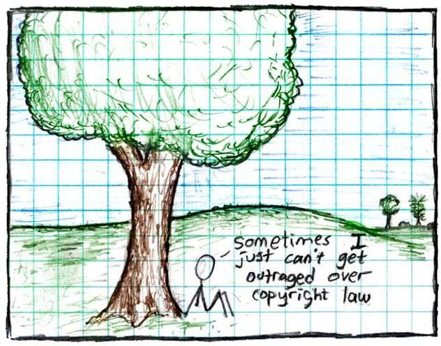

# Lesson 3: Making Open Data

## Navigation
* [Overview](#overview)
* [Learning Objectives](#learning-objectives)
* [Planning for Open Data](#planning-for-open-data)
* [Selecting Data Formats and Tools for Interoperability](#selecting-data-formats-and-tools-for-interoperability)
* [Making the Data Reusable Through Documentation](#making-the-data-reusable-through-documentation)
* [Making the Data Reusable Through Licensing](#making-the-data-reusable-through-licensing)
* [Lesson 3: Summary](#lesson-3-summary)
* [Lesson 3: Knowledge Check](#lesson-3-knowledge-check)

## Overview

In this lesson, you learn the criteria and tasks needed to ensure that the datasets you make are open and reusable. The lesson starts with a discussion on creating a data management plan and then continues with topics on selecting open data formats and how to include metadata, readme files, and version control for your data. It wraps up with a discussion on open licenses for data.

## Learning Objectives

After completing this lesson, you should be able to:

- Evaluate and select open data formats.
- Add documentation that enables other researchers to assess the relevance of the data. This includes metadata, README files, and version control.
- List two common open licenses used for datasets.

## Planning for Open Data

A best practice when beginning your open data journey is to create a Data Management Plan (DMP). This describes how you will manage, preserve, and release your data during and after a research project. Common elements of DMPs relevant to open data include a description of the following:

|  |  |
|---|---|
| What? | Data formats and (where relevant) standards |
| When? | When and if to share data |
| Where? | The intended repositories for archived data |
| How? | How the plan enables reuse of the data |
| Who? | Roles and responsibilities of the team members in implementing the DMP |

In this lesson, we will cover some commonly practiced steps to make data. Specifically, we will focus on the "what" of making data. This covers what data formats you should use and what standards to follow to make the data as open and as readily usable as possible.

As a first step, check if your home institution or funding source has guidance, standards, or templates for DMPs.

## Selecting Data Formats and Tools for Interoperability

### Data Format Considerations

Preferred data formats are community supported, machine-readable, non- proprietary, modifiable, and open. It might seem like there are as many data formats as there are different types of data. When you think about selecting a data format, consider the following:

- Is the format compatible with your data type, shape, and size?
- Does the data format have adequate metadata support?
- Are there tools readily available or any specialized tools are required for reading the data format?
- Is the data format routinely used in your field? Community standards ensure compatibility, interoperability, and ease of use when exchanging or sharing data among researchers or organizations of the same community.

Investigate if your funding agency, institutions, and/or data repository has additional requirements for or guidance on data formats.

### Non-Open Data Formats

A non-open (unsupported and closed/proprietary) data format refers to a file format that is not freely accessible, standardized, or widely supported by different software applications. Here are some examples of closed/proprietary data formats:

- **Adobe Photoshop (.psd):** The default proprietary file format for Adobe Photoshop, a popular image editing software.
- **Microsoft Word (.doc/.docx):** A proprietary file format used to store word processing data.
- **AutoCAD Drawing (.dwg):** A proprietary data format used for computer-aided design (CAD).

Software applications that can read but not create DOC, PSD, or DWG formatted data usually do not fully support all the features, layers, specifications, and inner workings of the original file.

Some challenges of using data in non-open formats include:

- Trouble opening the file due to compatibility issues.
- The need to install additional software or converters, leading to frustration and inconvenience.
- Initial setback dampens the enthusiasm for using your data.
- Converting the data to a universal format can lead to unique formatting or features that do not translate well, making the data lose part of its value.
- New open-data policies can limit the sharing of proprietary data as it is often non-compatible with the concept of easy distribution.

### Open Data Format Examples

Some examples of open data formats include:

*Select each card to find out more information.*

|  |  |
|---|---|
| Comma Separated Values (CSV) | For simplicity, readability, compatibility, easy data exchange. |
| Hierarchical Data Format (HDF) | For efficient storing and retrieving data, compression, multi-dimensional support. |
| Network Common Data Form (NetCDF) | For self-describing and portability, efficient data subsetting (extract specific portions of large datasets), standardization and interoperability. |
| Investigation-Study- Assay (ISA) model for life science studies | For structured data organization, data integration and interoperability among experiments, reproducibility and transparency. |
| Flexible Image Transport System (FITS) | As a standard for astronomical data, flexible and extensible metadata and image headers, efficient data compression and archiving of large datasets. |
| Common Data Format (CDF) | For self-describing format readable across multiple operating systems, programming languages, and software environments, multidimensional data, and metadata inclusion. |

By embracing open standards, authors can avoid unnecessary barriers and maximize their chances of making data useful to their communities.

## Making the Data Reusable Through Documentation

### Adding Documentation and Metadata for Reusability

Metadata and data documentation describe data so that we and others can use and better understand data. While metadata and documentation are related, there is an important distinction. Metadata are structured, standardized, and machine readable. Documentation is unstructured and can be any format (often a text file that accompanies the data).

To better understand documentation and metadata, let’s take an example of an online recipe. Many online recipes start with a long description and history of the recipe, and perhaps cooking or baking tips for the dish, before listing ingredients and step-by-step cooking instructions.

- The ingredients and instructions are like metadata. They can be indexed and searched via Google and other search engines.
- The descriptive text that includes background and context for the recipe are like documentation. They are more free-form, and not standardized.

We already discussed metadata earlier in this module, but it’s important enough that we will repeat ourselves a little bit! We will also discuss other types of documentation, like README files.

### Metadata: for Humans and Machines

Metadata can facilitate the assessment of dataset quality and data sharing by answering key questions. It is also the primary way users will find information about your dataset. It includes key information on topics, such as:

- How data were collected and processed
- What variables/parameters are included in the dataset
- What variables are included and what variables are related to
- Who collected the data (science team, organization, etc.)
- How and where to find the data (e.g., DOI)
- How to cite the data
- Which spatio-temporal region/time the data covers
- Any legal, guideline, or standard information about the data

### Why Add Metadata?

Metadata enhances searchability and findability of the data by potentially allowing both humans and machines to read and interpret datasets. Benefits to creating metadata about your data include:

- Helps users understand what the data are and if/how they can use/cite it.
- Helps users find the data, particularly when metadata is machine- readable and standardized.
- Can make analysis easier with software tools that interpret standardized metadata (e.g. Xarray).

To be machine readable, the metadata needs to be standardized. See an example of a community-accepted standard for labeling climate datasets with the [CF Conventions](http://cfconventions.org/).

There are also software packages that can read metadata and enhance the user experience significantly as a result. For instance, [Xarray](https://docs.xarray.dev/en/stable/index.html) is an open-source, community developed software package that is widely used in the climate and biomedical fields, among many others. According to their website, "Xarray makes working with labeled multi-dimensional arrays in Python simple, efficient, and fun!". It's the "labeled" part where standardized metadata comes in! Xarray can interpret variable and dimension names without user input, making the workflow easier and less prone to making mistakes (e.g. users don’t have to remember which axis is "time" - they just need to call the axis with the label "time").

Many standards exist for metadata fields and structure to describe general data information. Use a standard from your domain when applicable, or one that is requested by your data repository.

### Metadata Tagging Best Practices

Useful and informative metadata:

- Uses standards that are commonly used in your field.
- Complies with FAIR Principles.
- Is as descriptive as possible.
- Is self-describing.

Remember, the more metadata you add, the easier it will be for users of your data to use it effectively. When in doubt:

- Seek and comply with repository/community standards.
- Investigate open science online resources for metadata, e.g., [Turing Way.](https://the-turing-way.netlify.app/reproducible-research/rdm/rdm-metadata.html)

**NASA Metadata Tagging Addendum**

SPD-41a requires metadata fields that validate the scientific conclusions of publications. Metadata should:

- Be robust, meet standards, and clearly and explicitly describe the data. 
- Have replicability and/or can be combined in different settings.
- Include information on how the data were collected (e.g. which equipment/instruments were used).
- Include information on which variables/parameters were included in this dataset.

### Accompanying Documentation

When creating your data, in addition to adding metadata, it is a best practice to create a document that users can refer to. The document can be done as a README file, a user guide, or even a quick start (or all three).

README and other documentation files can include information such as:

- Contact information
- Information about variables
- Information about uncertainty
- Data collection methods
- Versioning and license references
- Information about the structure and file naming of the data
- References to publications that describe the dataset and/or it's processing

The intent is to help users quickly understand how they might use the data and to answer any commonly asked questions about your data. You can read more information and view a README template along with an example (particularly relevant for the medical sciences) at [this Harvard Medical School website.](https://datamanagement.hms.harvard.edu/collect-analyze/documentation-metadata/readme-files)

### Data Versioning Guidelines

Establish a versioning schema for your data. This is a method for keeping track of iterations of data that features track changes and the ability to revert to a previous revision.

Proper versioning generates a changed copy of a data object that is uniquely labeled with a version number. This enables users to track changes and correct errors.

Proper versioning preserves data quality and provenance (the origin, history, and processing steps that lead to the dataset) by:

- Providing a record of traceability from the data's source through all aspects of its transmission, storage, and processing to its final form.
- Saving data files at key steps along the way.
- Aiming for downstream verification/validation of original findings.

## Making the Data Reusable Through Licensing

Image source: [xkcd.com](https://www.explainxkcd.com/wiki/index.php/File:copyright.jpg)

---

Data is the intellectual property of the researcher(s), or possibly of their funder(s) or supporting institution(s). Data is intellectual property, but that does not mean it cannot be used by other researchers (with appropriate attribution).

"By applying a license to your work, you make clear what others can do with the things you're sharing, and also the conditions under which you're providing them (like cite you). You can also require others who copy your work to do things in return."

**[Open Science Knowledge Base](https://www.cos.io/)**

---

If you don't license your work, others can’t/shouldn’t re-use it - even if you want them to. As mentioned previously in this module, a license is a legal document that tells users how they can use the dataset. It is important to understand the licensing conditions of a dataset before data reuse to avoid any copyright infringement or other intellectual property issues.

A dataset without a license does not mean that the data is open; using a licenseless dataset is not ethical. Contacting the data creator and getting explicit permission, while suggesting they apply a license, is the best path forward.

Understanding when and where the license applies is crucial. For example, data created using US Government public research funds is, by default, in the public domain. However, that only applies to the jurisdiction of the United States. In order for this to apply internationally, data creators need to select an open license.

There are several different types of licenses that build on each other. Creative Commons (CC) licenses are often used for datasets. CC0 (also known as "public domain") is the license that allows for the most reuse because it has the least restrictions on what users can do with it. Although the CC0 license does not explicitly require citation, you should still follow community best practices and cite the data source. CC-BY is another common license used for scientific data that requires citation. From there, you can add restrictions around commercial use, ability to adapt or modify the data, or requirements to share with the same license. These other flavors all reduce usability by adding restrictions, such that other scientists may be unable to use the data because of institutional or legal restrictions. Funding agencies may require use of a specific license. For public agencies, this is often CC-0 or CC-BY, to maximize their return on investment and ensure widest possible re-use.

### Example Data Licenses and Reuse

Here is an example of how a data license can affect reuse. Coupled Model Intercomparison Project Phase 6 (CMIP6) consists of the "runs" from around 100 distinct climate models being produced across 49 different modeling groups. This is the data that is used to understand what our future climate might look like. You have probably seen images that use this data in articles about Earth’s changing climate and how it may impact our lives. Previous versions of these data were licensed CC-BY-NC-SA (cite-noncommercial- sharealike).

Figure citation: IPCC "[Framing and Context in : In: Global warming of 1.5°C. An IPCC Special Report](https://www.researchgate.net/publication/369301788_Framing_and_Context_in_In_Global_warming_of_15C_An_IPCC_Special_Report?_tp=eyJjb250ZXh0Ijp7ImZpcnN0UGFnZSI6Il9kaXJlY3QiLCJwYWdlIjoiX2RpcmVjdCJ9fQ)" 2020

---

This meant that any commercial use was restricted. Insurance companies, global corporations, and any type of organization that wanted to use them for commercial use - were having to do their own modeling or just deciding to not develop resources related to climate projections (such as fire risk, flooding risk, and how that may affect transportation, commerce, and where we live). This directly impacted the reuse of this data and created additional work. The [latest version of CMIP data is moving to CC-BY](https://pcmdi.llnl.gov/CMIP6/TermsOfUse/TermsOfUse6-2.html) because of the negative impacts from the -NC-SA restrictions.

## Lesson 3: Summary

Following are the key takeaways from this lesson:

- It is best practice to create an open data management plan that includes open-related topics.
- A critical step to making open data is evaluating and selecting open data formats.
- Always add documentation that enables other researchers to assess the relevance and reusability of your product. This includes metadata, README files, and version control details.
- It is important to assign an open license to your data to enable reuse.

## Lesson 3: Knowledge Check

Answer the following questions to test what you have learned so far.

*Question*

**01/04**

Which of the following are steps you should take when making a Data Management Plan?

- Evaluate different data formats
- Test your metadata for compliance
- Create a small collection of test data

*Question*

**02/04**

Which of the following are considerations when choosing a file format?

- The format has adequate metadata support
- Tools are readily available to read the data format
- The data format is widely used in your community
- All of the above

*Question*

**03/04**

Read the statement below and decide whether it's true or false.

*Metadata is only useful for using data in interoperable tools and does not enhance searchability and findability of data.*

- True
- False

*Question*

**04/04**

Read the statement below and decide whether it's true or false.

*When a dataset does not explicitly require citation, such as the CC0 license, it is still recommended that you cite the data source.*

- True
- False