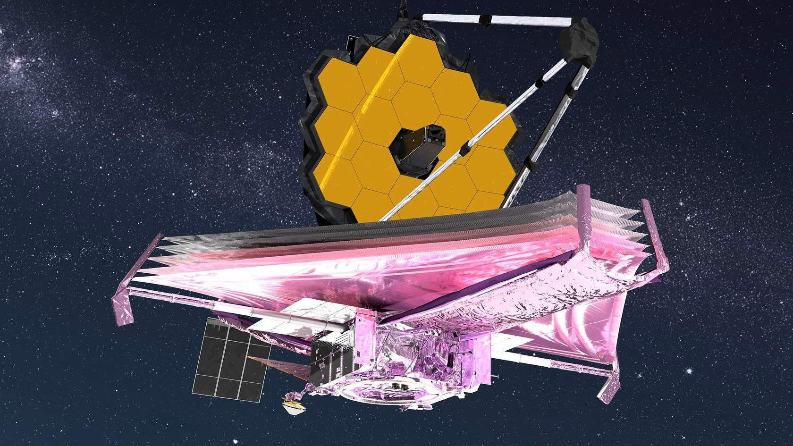
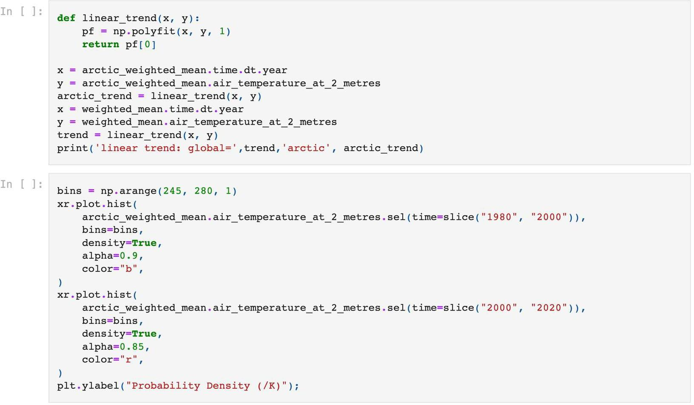
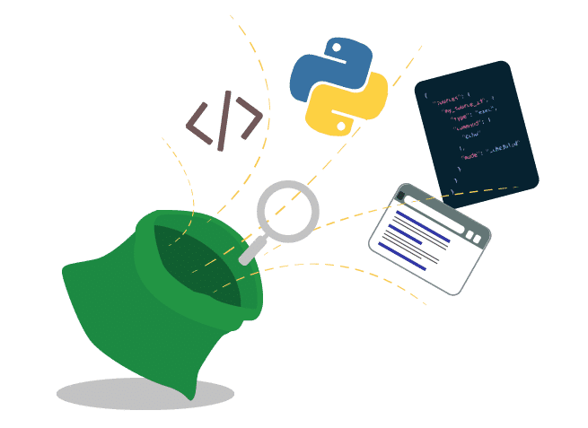
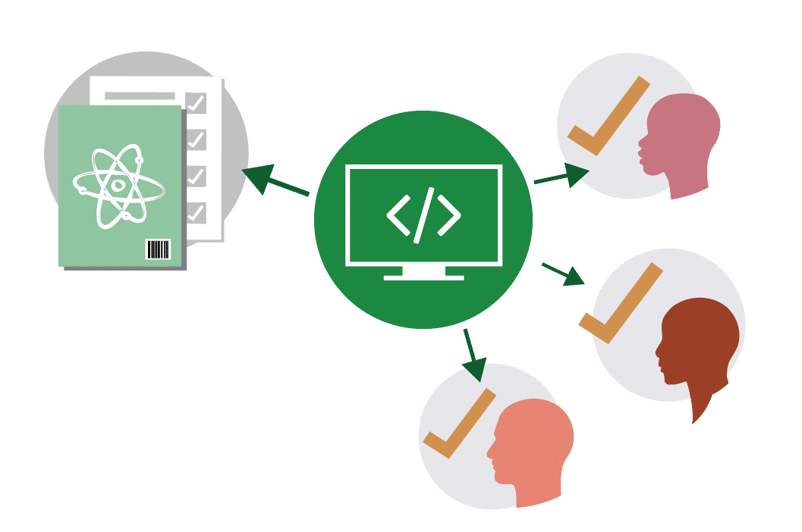

# Lesson 1: Introduction to Open Code

## Navigation
* [Overview](#overview)
* [Learning Objectives](#learning-objectives)
* [Success Stories](#success-stories)
* [Definitions and Considerations of Open Code](#definitions-and-considerations-of-open-code)
* [Principles, Benefits, and Challenges](#principles-benefits-and-challenges)
* [When Not to Share](#when-not-to-share)
* [Software Management Plans (SMP)](#software-management-plans-smp)
* [Lesson 1: Summary](#lesson-1-summary)
* [Lesson 1: Knowledge Check](#lesson-1-knowledge-check)

## Overview

This lesson defines the key terms, core principles, benefits, and challenges of open code. The practice of making code openly available to the public occurs within a spectrum from more to less protected. Ethical and legal conditions can limit the degree of openness that researchers can permit. This lesson will introduce the critical questions to consider when determining the appropriate accessibility of code to external users along with best practices to overcome common constraints to maximize availability. The lesson concludes with a discussion on the software lifecycle and how it fits with the "Use, Make, Share" framework and its relationship to a management plan.

## Learning Objectives

After completing this lesson, you should be able to:

- Define open-source software and distinguish it from closed-source software.
- List common benefits and challenges to the production of open code and describe how researchers can respond to some of the challenges while maximizing openness when appropriate.
- Describe the function and purpose of a Software Management Plan, as its utility as a guidebook for everyone involved in a scientific project.

## Success Stories

Why does good science demand that researchers make their code open-access? Sharing your code (and data) makes it easier for others to reproduce your results, helping to validate findings and reduce resources required to duplicate experiments. As a bonus, this decision can lead to new collaborations made possible through a shared dataset and common understanding of scientific material.

Many journals and funding agencies require that you share your code at the time of publication. However, the prospect of opening code up to criticism, not receiving attribution, or missing out on a result that external researchers discover can deter scientists from making their code open-access. What if people find an error? What if they criticize your coding style? What if they take your code and publish a new result without including you? This module will help you gain confidence in sharing your code by walking you through the basic details to consider when practicing open-science.

Let's review some well-known examples of groups that shared their code and what the impacts were:

Use buttons to navigate between the examples.

The first image of a black hole would not have been possible in this decade if all the required code had to be written solely by the scientists involved. These scientists were able to use well-tested, community accepted open-source software to conduct their analysis and create this now famous image. Dr. Katie Bouman and her team commended the critical role that open-source contributors played in her team's effort to image the first black hole. This breakthrough was made possible by open-source libraries that provided robust and freely available code. The code used to capture this image was crafted by 21,485 contributors. Sophisticated iterative data processing pipelines and algorithms used by Dr. Bouman's team were community developed and tested, making robust and reproducible science possible without having to rewrite every piece of software needed.

This is the Ingenuity helicopter, or as the engineers call her, Ginny. She got to Mars by hitching a ride on the Perseverance rover, landing in the Jezero Crater in 2021.

This is a video of Ginny's first flight. She took off, got about ten feet off the ground, did a spin and landed. This groundbreaking flight proved that powered flight on Mars is achievable, opening up the door for an entirely new era of exploration.

But Ginny's achievements also reflect another new era; one of truly open and inclusive science.

Behind that 4-pound helicopter are more than 12,000 people who contributed code, documentation, design, and more thanks to the open-source software which was used to power her. Everyone who contributed to the open-source software libraries that Ginny used received a badge on their GitHub page that showed they helped fly the first helicopter on Mars.

In addition, Ginny's final software developed at the Jet Propulsion Lab, called F prime, was itself open-source and has been used since in flight research, drones, and CubeSats. In fact, F prime had been copied to other people's repositories more than 1,200 times.

Most space telescope data is embargoed for 12 months with only the lead scientist and their selected team allowed to work with the data. In a unique case, a small portion of data from NASA's new James Webb Space Telescope (JWST) offered an early-release program. This JWST data was made available immediately.

How scary is that? To know that everyone you know is going to have access at the exact same time. The anxiety and stress of feeling as if you don’t publish first, you might not have a job, or you might not have the next job that you want.

In one case, a team decided to work fully in the open and collaborate with this early- release data. The result? 20+ planned papers and the first discovery of carbon dioxide on another planet - hinting at the possibility of discovering new life.

Co-author Dr. Natasha Batalha employed open science principles to enable this rapid discovery using the new JWST data. In the years leading up to the JWST release, Dr. Batalha's team formed a collaborative group of 341 members. Once JWST data was made public, the data reduction and scientific interpretation could be reproduced through open software then archived. The research team’s first article was made available as open- access on an archived preprint server and published in Nature.

Notably, Dr. Batalha's team published the first identification of CO2 in an exoplanet’s atmosphere from spectra taken with JWST. This was conducted with JWST’s Early Release Science Program data, the first science data taken by the facility. The team worked in an open-format from ideation, to analysis, through to publication and communication.

This example illustrates the benefits of applying open science principles to rapidly produce meaningful research. The team worked in an open format from ideation, to analysis, through to publication and communication.

New open-source sets of climate models incorporate features that aim to make climate research more collaborative, efficient and reliable.

Scientists have published an open-source framework of climate models (Isca) which contains models that are easy to obtain, completely free, documented, and come with software to make installation and operation easier. All changes are documented and can be reverted. Therefore, anyone can easily use the same models.

Although the Isca model was initially used to examine the tropical upper atmosphere, researchers from other fields of science have used it to study the life cycle of weather systems, the Indian monsoon, and the effect of volcanic eruptions on climate.

New research across all of these fields was possible within only one year of the Isca’s first publication. This is how we want all of science to work!

Credit: 

[https://theconversation.com/making-climate-models-open-source-makes-them-even-more-useful-90929](https://theconversation.com/making-climate-models-open-source-makes-them-even-more-useful-90929)

## Definitions and Considerations of Open Code

All science builds on what has already been accomplished. Code is no different. Many scientists use code to do data analysis. This process begins with the acquisition of data, either by running an experiment or model that generates data or by identifying observational data that may be useful to test a hypothesis. Next, the data is analyzed. It is very likely that the code required to read or analyze a new data set was already created by someone. The existing code might require some degree of modification to meet a researcher’s unique parameters. Even the development of a new model can incorporate specific elements of existing code from different sources.

Understanding how to find and use others' code, create your own, and share it is an important part of advancing open science. Just like good data management practices, knowing some of the details about how to share it will not only help you use it later, but also help others understand how to use and cite it so you get credit!

Code example from [https://github.com/UCB-stat-159-s23/site/blob/main/lectures/climate-data.ipynb](https://github.com/UCB-stat-159-s23/site/blob/main/lectures/climate-data.ipynb)

### What is Code vs Software?

When we write "software," we are actually writing text code and using an interpreter or compiler to translate it into a program that the machine can run. Code is a language that humans can type and understand. Software is often a collection of programs, data, and other information that a computer system uses to perform specific tasks. An example is a software library, which is a suite of data and programming code that is used to develop software programs and applications.

Often, scientists write and publish code that helps others reproduce their results rather than creating software packages. But many scientists aren’t starting their code from scratch. There are large open- source software libraries that scientists use and contribute to, such as scipy, astropy, matplotlib, and others. These libraries let everyone do science faster and better because they have been written, tested, and are used by thousands if not hundreds of thousands of people. These libraries have been widely adopted because they are open-source – which makes it easier to collaborate with anyone, anywhere.

### What is Open Source Software

**Open-source software** is distributed with its source code without cost, making it available for others to use, modify, and distribute with its original rights and permissions.

Often, open-source software is transparently shared in a public repository, and sometimes maintained through collaboration. Open-source software development is the basis for a vast range of research software packages.

There are a variety of license choices that can be made for open software which can allow the creator to retain various levels of ownership and rights. The choice of license impacts reuse by others. But first, let’s break down the main types of software scientists use based on their purpose by showing examples of each type.

### Types of Software

Scientists use and produce a wide variety of different types of software during projects. While many researchers might just use equations in a spreadsheet, others may use open source libraries for advanced machine learning model development and plotting results, while others may contribute to open-source libraries in their field and grow their reputation and impact that way. Here are some examples of different types of software that you might encounter.

**General Purpose Software** – General purpose software is produced for wide use and not specialized scientific purposes. This includes both commercial software and open-source software. Many widely used productivity software packages are open- source success stories:

- Linux kernel, GNU userspace, and various Linux and UNIX distributions 
- PostgreSQL – open source enterprise-grade database
- WordPress and Apache web hosting tools
- Firefox and Chrome
  - Chrome's engine is Chromium which is forked from WebKit which was forked KHTML. This was possible because it had a license that allowed for this type of reuse. All major browsers today except Firefox can be traced back to KHTML.
- Android operating system among others
  - You can look at the Android source code, but you can't modify it and install it on a device. And even if you could, you couldn't use any of the standard services (e.g. Google Store) with that. So it's "open" in the same sense that last night's lottery numbers are "open".

**Operational Software** – Operational software is used by data centers and large information technology facilities to provide data services. For example:

- [Fprime](https://nasa.github.io/fprime/) – Space mission flight software

**Infrastructure Software** – Infrastructure software is used by data centers and large information technology facilities to provide data services. Examples include:
- [Fprime](https://nasa.github.io/fprime/) – Space mission flight software
- [PODAAC](https://github.com/podaac) – Distributed archiving and processing software
- [UFS](https://github.com/ufs-community) – Operational weather forecasting model software
- Metadata Compliance Checker, APIs, Web apps, [Giovanni](https://www.earthdata.nasa.gov/technology/giovanni), [McIDAS](https://en.wikipedia.org/wiki/McIDAS)

**Libraries** – Libraries are generic tools for implementing well-known algorithms, providing statistical analysis, or visualization which are incorporated in other software categories. Examples include:
- [NumPy](https://github.com/numpy) – Scientific computing with python
- [scikit-image](https://github.com/scikit-image/) – Image processing algorithms in python
- [deal.II](https://github.com/dealii/dealii) – Library of algorithms to solve partial differential equations with finite elements

**Modeling and Simulation Software** – Modeling and Simulation Software either implements solutions to mathematical equations given input data and boundary conditions, or infers models from data. They often use libraries.
Examples include: first-principles models, data-assimilation tools, empirical models, machine learning, mission planning and engineering tools, among others.
- [OpenFOAM](https://github.com/OpenFOAM) – Computational fluid dynamics software
- [MOM6](https://github.com/mom-ocean/MOM6) – General ocean circulation model
- [ASPECT](https://github.com/geodynamics/aspect) – Planetary convection software
- Atmospheric radiative transfer, stellar evolution, upper ocean turbulence, solar wind predictions, orbit
propagation (e.g., OpenGGCM, MESA)

**Analysis Software** - Analysis software is developed to manipulate measurements or model results to visualize or gain understanding. This software often evolves from single-use utility software and may incorporate libraries.
- [Photutils](https://photutils.readthedocs.io/en/stable/index.html) – tools for detecting and performing photometry of astronomical sources

**Single-Use Utility Software** – Single-use utility software is written for use in unique instances, such as making a plot for a paper, or manipulating data in a specific way. This code often uses libraries for analysis, plotting, or reading data. This software is the most common type that gets included into Open Science and Data Management Plans (OSDMP), which we will talk about shortly. Examples include:
- [Angus et al. 2019](https://ui.adsabs.harvard.edu/abs/2019AJ....158..173A/abstract) – [Fitting a gyro relation to Praesepe](https://github.com/RuthAngus/stardate/blob/master/paper/code/Fitting_Praesepe.ipynb)
- [Webb telescope spots CO2 on exoplanet for the first time: what it means for finding alien life](https://www.nature.com/articles/d41586-022-02350-2). All the data and models presented in this publication can be found [here](https://doi.org/10.5281/zenodo.6959427).
- [Constraining the increased frequency of global precipitation extremes under warming](https://www.nature.com/articles/s41558-022-01329-1)
- Code at: [https://doi.org/10.5281/zenodo.6288035](https://doi.org/10.5281/zenodo.6288035) (2022)

## Principles, Benefits, and Challenges

### Principles of Open Code

Open software principles are derived from open-source software best practices. They establish guidelines that advance open science and aim to enhance the value and impact of research.

|  |  |
|---|---|
| Transparency | Whether you are developing software or solving a business problem, we all have access to the information and materials necessary for doing our best work. When these materials are accessible, we can build upon each other's ideas and discoveries. We can make more effective decisions and understand how those decisions affect us. |
| Collaboration | When we're free to participate, we can enhance each other's work in unanticipated ways. When we can modify what others have shared, we unlock new possibilities. By initiating new projects together, we can solve problems that no one can solve alone. And when we implement open standards, we enable others to contribute in the future. |
| Share early and often | Rapid prototypes can lead to rapid discoveries. An iterative approach leads to better solutions faster. When you're free to experiment, you can look at problems in new ways and seek answers in new places. You can learn by doing. |
| Inclusive | Good ideas can come from anywhere, and the best ideas should win. Only by including diverse perspectives in our conversations can we be certain we've identified the best ideas, and good decision-makers continually seek those perspectives. We may not operate by consensus, but successful work determines which projects gather support and effort from the community. |
| Community | Communities form when different people unite around a common purpose. Shared values guide decision making, and community goals supersede individual interests and agendas. |

Credit: [The open source way \| Opensource.com](https://opensource.com/open-source-way)

Sharing code enhances science because it enables reproducibility, reusability, and replicability. The decision to share code benefits the scientific community because it increases transparency, participation, and collaboration. Sharing code at any point in the research process can be valuable.

In most cases, the source code used to generate results in peer-reviewed papers should be published, cited, and accessible.

### Benefits of Moving to Open Software

Science moves faster when researchers are able to work together, help correct errors, build on each other's results, and share resources. Sharing software is a key part of open science that:

- Accelerates science by making it easier to use and build on software developed in previous work.
- Minimizes the time and cost of repeated development of similar software and the reproduction of scientific computations.
- Increases the potential number of users and developers and thus helps improve quality and trust in the software.
- Increases the likelihood that developers gain visibility, sustainability, software quality, and advance their employability.

### Challenges of Moving to Open Software

It is not uncommon for research groups to spend years developing code, writing papers with the results, and gaining scientific influence by not sharing the code. Anyone new who wants to work on a similar project is at a huge disadvantage because they would have to start from scratch. Also, anyone wanting to work in that area is forced to collaborate with the group. This group retains a very real competitive advantage by keeping it closed source. However, this approach stifles innovation and hurts scientific progress. Many funding agencies are now requiring that code is shared at the time of publication, if not before. But challenges and fears remain:

- Openness has costs: time spent documenting, publishing, responding to users/maintenance and cleaning up/enhancing quality.
- Effort is required to learn how to leverage the new tools and knowledge (resources are available to ease this effort).

| Fear | Discussion/Mitigation: |
|---|---|
| Scooping: What if someone re-uses my code to publish a result I was working on? | Yes, this can happen. But, in many fields, if it is clear that someone is actively working on a problem, the decision by another scoop may have a short term gain but long-term loss. In the scientific community, reputations serve as a cultural currency and being collaborative generally leads to increased career successes. If you are sharing your code, ensure it has a digital object identifier (DOI) so you get credit. This does not prevent anyone from using it or extending your analysis, but it does ensure you will get credit for your contribution. There is a nice article about this here. |
| Misinterpretation or misuse | Provide sufficient contextual information (documentation) to allow others to understand your code fully to reduce this risk. |
| My code will be used, but not cited | While it is not common for researchers to cite code, data, or other non-published articles, science ethics dictates that you should be cited if your work is used. Remember to appropriately cite the material of others so that you're not adding to the problem. |
| Code is too sensitive to share | User controlled access to help maintain sensitivity and security. |
| It won't be useful to anyone else | You never know how materials might be used. Individuals who contributed a wide variety of seemingly unrelated software projects ended up helping NASA land a rover on Mars! |

#### Ultimately, you are free to deploy the open software principles and resources in your research to maximize its impact and meet the expectations of your sponsors and community while managing costs.

### Activity 1.1: Relating Principles to Benefits and Challenges
Determine whether a statement is a benefit or challenge by dragging each to the correct box.

<table>
  <thead>
    <tr>
      <th colspan="2">Benefits</th>
    </tr>
  </thead>
  <tbody>
    <tr>
      <td>Makes it easier to use and build on software developed in previous work.</td>
      <td>Users are free to use and modify Open Software minimizing duplicated effort.</td>
    </tr>
    <tr>
      <td>Can increase usage of the software, which can help improve software quality.</td>
      <td>Open Software developers can gain visibility & sustainability of their software.</td>
    </tr>
  </tbody>
</table>

<table>
  <thead>
    <tr>
      <th colspan="2">Challenges</th>
    </tr>
  </thead>
  <tbody>
    <tr>
      <td>Requires extra time for activities like documenting, publishing, & maintenance.</td>
      <td>Effort is required to learn how to leverage the new tools and knowledge.</td>
    </tr>
  </tbody>
</table>

**Key Takeaways: Relating Principles to Benefits and Challenges**

- Making software more open by following the principles has benefits and challenges, which are related.
- Greater benefits typically come with greater challenges.
- In most cases, individual scientists and society will both benefit from more open software.

## When Not to Share

There are valid reasons that restrict a researcher’s ability to share their complete code or software packages. Some of these reasons may include:

- The code incorporates a country’s military secrets or its dissemination violates national interests or security concerns.
- The code incorporates intellectual property or patented data and information.
- Institutional policies or organizational regulations do not permit the sharing of code.
- Think about what you are sharing and the implications of sharing it (for example - do you have permission from everyone involved?).

### Licensing Code

The [collaborative data science handbook by The Turing Way](https://the-turing-way.netlify.app/reproducible-research/licensing) says of restrictions to open source sharing, "As with anything else in society, some of what you can and cannot do in software (or hardware) development is determined by the law. Licensing is therefore an important aspect of sharing/publishing open source projects as it provides clarity for anyone looking to reuse an open source project. Without licenses in place, anyone who wants to reuse it will be left with legal ambiguity as to the status of using your intellectual property."

To be considered open source, software requires a license that complies with the Open Source Definition. One criteria of this definition demands that open source licenses "[must allow modifications and derived works, and must allow them to be distributed under the same terms as the license of the original software](https://opensource.org/licenses/)."

In the next lessons, licenses will be discussed in more detail. As you are working on a project, you may want to use code developed by others, develop your own code, and then share it. Licenses affect all aspects of this process and it is important to understand how different licenses may affect your ability to share your code at the time of publication. It is also important to consider any requirements from your funder or institution about how you license your software.

### Planning for Openness: Using the Use, Make, Share Framework for Open Code

Funding agencies and journals are increasingly requiring researchers to share software.

For example, NASA's ROSES, which solicits Earth science research proposals, requires researchers to make their software publicly available:

#### "Data and software developed using Research Opportunities in Space and Earth Sciences (ROSES) funding in support of a peer-reviewed publication shall be made publicly available at the time of publication"

[https://science.nasa.gov/researchers/sara/faqs/osdmp](https://science.nasa.gov/researchers/sara/faqs/osdmp)

Planning for a research project requires researchers to determine their mode of collaboration and method of sharing code. This step is often documented in a Software Management Plan (SMP) within a research proposal. An SMP details the what, when, where, how, and who will be sharing the code or software.

## Software Management Plans (SMP)

Software management plans encompass both code and software.

|  |  |
|---|---|
| What? | Description of types, management, preservation, and release of software. |
| When? | The schedule for software archiving and sharing. |
| Where? | Location where software will be shared and archived over the long term. |
| How? | Enable reuse of software through assigning a DOI, license, contribution guidelines, etc. |
| Who? | Roles and responsibilities of the team members. |

As your research starts using, creating, and sharing code, the SMP provides a guidebook for everyone on the project that establishes a common understanding.

Is your project sharing all code publicly or just code that goes into a publication? Will your team be contributing back to open-source projects or just writing code that builds on them to produce results? Considering these questions early will influence how much time and energy you may want to spend on documentation and how you plan to share the code.

### Open Code is a Spectrum

Just like data, code can be shared in many different ways to increase reusability. Code can be shared without any documentation, purely as a reproducibility artifact, or code can be well-written, documented, and openly-licensed to maximize re-use. Both of these approaches have value and depend on the time, energy, and funding that researchers have available.

- There is a spectrum of openness when it comes to open software that ranges from open- source software to closed source software.
- An example of something “in between” could be an executable file with documentation on how the code works.
- Some projects may be open from inception and continuously share all code throughout development. Others may share some of the code at the time of publication. Other projects may only make code available once funding ends. A variety of valid reasons factor into a project’s approach to sharing.
- While some factors restrict the degree of openness that software can be, each step towards sharing advances the open science movement.
- By sharing more ideas and software, communities have driven creative, scientific, and technological advancement faster than the restricted pace of closed science. Peer production and mass collaboration creates more sustainable software development.

While researchers and institutions may not be able to share all their code, they can make efforts to shift on the openness spectrum from closed code to open-source code and software.

*In the activity below, drag each slider to explore the spectrum of openness.*

### The Practice of 'Open'

Review how the key tasks in the software development life cycle are covered in the "Use, Make, Share" framework flow.

As with open data, different aspects of open software are described in terms of Using, Making, and Sharing of open software.

A key difference with software is that the process is typically more cyclical and repetitive than with data or results. Typically, software constantly evolves. Thus, the boundaries between "Use-Make- Share" are less rigid and the process is typically more dynamic and circular than pre-planned/fixed and sequential.

### Activity 1.2: How Can You Use Open Software in Your Work to Advance Open Science

In this activity, you are asked to reflect on how you have used and can use the open software principles to advance your work.

Consider the following questions:

1. Have you used open software principles 1 in your work?
2. What are some of the successes and challenges you have encountered?
3. What resources did you find useful for advancing open software in your work?

#### Key Takeaways: How Can You Use Open Software in Your Work to Advance Open Science

- Open software is a collaborative activity.
- We can all learn and benefit from each other in making our scientific software more open.

## Lesson 1: Summary

In this lesson, you learned that:

- In open-source software, anyone can see the underlying source-code.
- Open-source principles promote transparency, collaboration, sharing, inclusiveness, and communities.
- Open-source software accelerates science, minimizes time and cost of repeated development of similar software and reproducing scientific computations, and can improve quality and trust in science.
- Licenses for open-source software dictate its shareability and reusability to developers and prospective contributors. Funding entities and affiliated institutions may impose restrictions on how developers license their software.
- A software management plan (SMP) is a project guidebook with a common understanding of data management practices that a research team can work from.

## Lesson 1: Knowledge Check

Answer the following questions to test what you have learned so far.

*Question*

**01/03**

Read the statement below and decide whether it's true or false:

*Software is referred to as open source when it is publicly accessible; anyone can see, modify, and distribute the code as they see fit.*

- True
- False

*Question*

**02/03**

Which of the following are valid reasons why scientists keep their source code closed? Select all that apply.

- National security concerns
- Institutional policies
- Data privacy concerns
- Attribution concerns
- Quality concerns

*Question*

**03/03**

What are the main sections in a software management plan?

- Types of code and software
- Schedule for sharing software
- Where software will be shared and archived
- What license it will be assigned
- Roles and responsibilities of team members
- All of the above