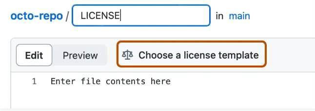

# Lesson 4: Sharing Open Code

## Navigation
* [Overview](#overview)
* [Learning Objectives](#learning-objectives)
* [Planning to Share Your Code](#planning-to-share-your-code)
* [Legal and Security Concerns](#legal-and-security-concerns)
* [When: The Schedule for Code Archiving and Sharing](#when-the-schedule-for-code-archiving-and-sharing)
* [Where: Where To Share Open Code](#where-to-share-open-code)
* [How: How to Enable Reuse of Code](#how-how-to-enable-reuse-of-code)
* [Who: Roles and Responsibilities of the Team Members in Implementing the SMP](#who-roles-and-responsibilities-of-the-team-members-in-implementing-the-smp)
* [Lesson 4: Summary](#lesson-4-summary)
* [Lesson 4: Knowledge Check](#lesson-4-knowledge-check)

## Overview

In this lesson you learn the steps for sharing the software that you developed. These steps include determining if, when, and where software should be shared, which roles are needed, and how to enable others to use the code.

## Learning Objectives

After completing this lesson, you should be able to:

- Describe what it means to share code: for archiving or for code development.
- Evaluate whether you should share your code and list important security considerations.
- Describe best practices for when and where to share code.
- Recall commonly used practices to help others reuse your code.
- List the roles and responsibilities for sharing and maintaining shared code.

## Planning to Share Your Code

"I've been working on code, and now a new collaborator wants to use the code. Awesome! What is the best way to share the code? By email? When should I share the code, and what should I include to ensure the colleague can easily use it?"

### What Does it Mean to "Share" Your Code?

There are two major categories of sharing: sharing for development and providing a long-term record.

### Open Source Code Development

Writing scientific code is often a dynamic and collaborative process in which multiple people contribute and the code evolves over time. In such projects, it is beneficial to develop open code within a public repository hosting platform such as Github, Bitbucket, GitLab etc. from the beginning of a project. This ensures that all updates are shared openly on the web and can reach potentially interested collaborators and users in near real time.

### Archiving Open Code

Archiving ensures your scientific code is accessible for the long-term, and may satisfy archiving requirements from funding agencies and organizations. Long-term accessibility helps others to reproduce your results long after publication. Archiving alone does not promote continued development or collaboration. Archiving is a static and long-term preservation of your software, not an evolution of it.

### Should You Share Your Software?

There are several legal and security concerns to keep in mind when creating or using open software.

- Any software you create is usually considered intellectual property and might be controlled by your organization’s policies.
- Such policies may influence how openly the software can be shared, and therefore, its license.
- Downloading and contributing to open software projects can be regulated by your organization's IT security policies.

In contrast, if the software was created with external (government) funding, some funding agencies may require the software be openly shared.

### Deep dive: Software Management Plans (SMP)

Remember the parts of the Software Management Plan? What do we need to consider when it comes to sharing?

- **What:** Description of management, preservation, and release of software.
- **When:** The schedule for code archiving and sharing.
- **Where:** Location where software will be shared and archived over the long-term.
- **How:** Enable reuse of software through assigning a DOI, license, contribution guidelines, etc.
- **Who:** Roles and responsibilities of the team members.

## Legal and Security Concerns

<table>
  <thead>
    <tr>
        <th>LEGAL CONCERNS &#9745;</th>
        <th>SECURITY CONCERNS</th>
    </tr>
  </thead>
  <tbody>
    <tr>
        <td colspan="2">
            
Anyone writing research code and software should familiarize themselves with their organization's policies on sharing and publishing software. Funding agencies, government or private, may have strict software openness requirements. In other cases, sharing software may not be allowed by the organization.

            
Legal concerns can include questions such as:

            <ul>
                <li>Does a developer or institution own the software?</li>
                <li>Does sharing (or not sharing) the software violate the funding agency’s policies?</li>
                <li>Are there any local laws or regulations in your area that govern the sharing of intellectual property?</li>
                <li>What software license is required?</li>
            </ul>
            
<strong>Once you decide to participate in or begin a new open software project, familiarize yourself with your organization’s policies and practices.</strong>

            
Find out more about the legal concerns <a href="https://opensource.guide/legal/">here</a>.

        </td>
    </tr>
  </tbody>
</table>

<table>
  <thead>
    <tr>
        <th>LEGAL CONCERNS</th>
        <th>SECURITY CONCERNS &#9745;</th>
    </tr>
  </thead>
  <tbody>
    <tr>
        <td colspan="2">
            
Security is a concern when sharing software. Bad actors can attach malicious code to software in an attempt to infiltrate computer systems through security vulnerabilities, potentially exposing sensitive and proprietary information that can lead to great financial loss for users. Security risks must be considered when sharing software.

            
Security concerns can include:

            <ul>
                <li>Does your organization’s Information Technology (IT) policy allow you to checkout the code you want to use on your machine?</li>
                <li>Is the repository you want to contribute to reputable?</li>
                <li>Are there any open security-related issues with the code?</li>
            </ul>
            
<strong>Once you decide to participate in or begin a new open software project, familiarize yourself with your organization's IT policies.</strong>

            
Find out more about the security concerns <a href="https://opensciency.github.io/sprint-content/open-software/lesson2-pros-cons.html#security-concerns">here</a>.

        </td>
    </tr>
  </tbody>
</table>

### Sharing Software Created with US Agency Funding

Many federal agencies are now allowing (if not requiring) the sharing of code created under their grant programs. For example:

- [NASA](https://www.nasa.gov/open/open-source-development.html) "...we are actively reaching out to projects within NASA to make use of ...resources for publishing open source."
- [US Department of Commerce](https://www.commerce.gov/about/policies/source-code) "...requires agencies to develop plans to release at least 20 percent of new custom-developed source code as Open Source Software (OSS) when commissioning new custom software."
- [USGS](https://www.usgs.gov/survey-manual/im-osqi-2019-01-review-and-approval-scientific-software-release) "...software releases are considered to be public domain assets and are generally made available free of restrictions."

Are you funded by a grant? Read the original grant call to see if publishing your code is allowed/required and check whether it has any language about software management and any conditions to publish your code. When in doubt, contact your organization for additional information.

### Activity 4.1: Find Your Organization’s Software Release Policies

Assume you want to start a new open-source project:

- Find your organization's policies on software releases. 
- What is the process for releasing your software?
- Does anybody in your organization have to approve this release? 
- Are there any policies regarding external contributors?
- Does your organization require a specific attribution or credit?

#### Key Takeaways: Find Your Organization’s Software Release Policies

Software release policies differ by organization and each piece of software is different. Therefore, it is important that we do not make assumptions about the software release policies based on previous experience.

## When: The Schedule for Code Archiving and Sharing

Planning to share your code at the beginning of your project makes sharing easier to do when you are ready. Exactly when in your workflow you decide to publicly share your code depends on your work and the requirements of the funding agency, organization, or publisher.

As an example, what does NASA say?

If you are writing scientific software for a project funded by the NASA Science Mission Directorate then:

"Scientific software needed to validate the scientific conclusions of peer-reviewed manuscripts resulting from SMD-funded scientific activities shall become publicly available no later than the publication date of the corresponding peer-reviewed article. This includes software required to derive the findings communicated in figures, maps, and tables, as well as scientifically useful software from models and simulations."

\- [**Open-Source Science Guidance**](https://smd-cms.nasa.gov/wp-content/uploads/2023/07/smd-open-source-science-guidance-v2-20230407.pdf)

Other organizations may have different guidance, so it is always best to check what the funding agency or organization requires.

## Where: Where To Share Open Code

### General Considerations

Like data, code can be shared in many ways, for example over email or on a personal website, but these methods are not recommended. So, where should you share your Open Code?

First, consider your institutional or funding agency policies that may dictate where you must share and where you can share. For example, some funding agencies specify long-term repositories where your code must be archived, and they may restrict you from sharing in other forms of repositories. Your scientific discipline may have a specific repository for open code.

#### What are some good options and best practices for archiving your code?

- Archive open code with an open access journal article.
- If the open code is in an active online development repository such as Github, then create a version and archive the code at a long-term repository with a DOI such as Zenodo, which can be integrated with Github (more details on this process later).
- Archive the code in other long-term public repositories, such as Software Heritage.

#### Is your code a substantial software package and of interest to a significant number of users from various disciplines? Where else can your open code be shared?

- Develop your software on a public repository such as GitHub.
- Publish to a software repository used by common package managers to make the software easy for users to install (ex. Anaconda, CRAN, PyPI).
- Present the software at conferences.
- Publish the software in a Journal dedicated to open software (ex. JOSS). 
- Get your software peer reviewed through communities like PyOpenSci.

#### To share my code, I can just add it to github, right?

Not necessarily. Sharing on a repository is encouraged, but a researcher’s funding organization may require a DOI from an archival repository, such as Zenodo, for long-term preservation of your code at the time of publication or version releases.

## How: How to Enable Reuse of Code

Now that you have shared your code in the appropriate way, it’s important to consider if you’ve made it easy for others (or your future self) to reuse your code.

### Assigning a License

As you may recall from the previous lesson, assigning an appropriate license is necessary for others to know how to use your code.

As an example, here's how you'd assign a license to a GitHub repository:

Choose the appropriate software sharing license that meets your organization requirements. To create a license template in GitHub, add a new file and type "LICENSE" in the name field, then the "Choose a license template" option will appear.

Make sure that your GitHub repository is public, making it searchable by anyone.

### Making the Code Citable

Not all code needs to be citable. When released on its own however, there are a few best practices for how to make your code citable.

Adding code to a GitHub repository is not sufficient for archiving code. To archive, we must assign a persistent identifier.

Producing a persistent identifier for your code is the best way to make it citable. This could take form through a peer reviewed publication that describes the software or by archiving the software with a long term repository that produces a DOI or similar identifier. For code shared on GitHub, a [DOI can be easily produced for each release of the software from Zenodo.](https://docs.github.com/en/repositories/archiving-a-github-repository/referencing-and-citing-content#issuing-a-persistent-identifier-for-your-repository-with-zenodo)

### Activity 4.2: Create a DOI for a Test Code File

You can create Digital Object Identifiers (DOIs) for your code that makes it citable. You do this by archiving a GitHub code repository at Zenodo and issue a DOI for the record.

Steps for this activity:

**Part 1: Create a test public GitHub repository.**

1. Navigate to the login page for [GitHub](https://github.com/) and login. If you haven’t already, create a free user account.
2. Create a new repository with this [link](https://github.com/new).
3. Type a short, memorable name for your repository. For example, "os-test".
4. Set the repository visibility 'Public' by selecting this option below the repository description.
5. In the following section 'Initialize this repository with:' select 'Add a README file'.
6.  Select any license.
7.  Click 'Create repository'.
8.  You will be automatically directed to your new repository webpage.
9.  Now we will get a DOI from the Zenodo application. Note that we are going to use [https://sandbox.zenodo.org/](https://sandbox.zenodo.org/) to do this. This offers all the same capabilities as [https://zenodo.org](https://zenodo.org/) but is a testing site! Create a free account if you have not already.

**Part 2: Create an archived repository and affiliated DOI.**

1.  Navigate to the [Zenodo GitHub page](https://sandbox.zenodo.org/account/settings/github/). Click on the button 'Connect' to allow Zenodo to access your GitHub repositories.

2. Review the information about access permissions, then click 'Authorize Zenodo'.
3. Sync your GitHub with Zenodo by clicking 'Sync now' in the upper right corner.

4. To the right of the name of the repository you want to archive ('os-test'), toggle the button to On.
5. Click on the name of the repository.
6. Click the big green button that has 'username/os-test'

7. Add a tag 'test'. You may have to create a new tag for 'test' if prompted.
8. Scroll down and click the green 'publish release' button

9. Navigate to the [Zenodo GitHub page](https://sandbox.zenodo.org/account/settings/github/) and see the DOI for 'os-test'
10. Share your DOI below.

Zenodo archives your repository and issues a new DOI each time you create a new GitHub [release](https://docs.github.com/en/repositories/releasing-projects-on-github/about-releases). Follow the steps at "[Managing releases in a repository](https://docs.github.com/en/repositories/releasing-projects-on-github/managing-releases-in-a-repository)" to create a new one.

### Making it Easy to Cite Your Code

Information about how to cite the software can then be added to your README or other documentation in your repository. Another useful step for making your repository citation information accessible is to add a CITATION file to the repository.

### Why use CITATION files?

CITATION files are a means to make citation information easily accessible in open source software repositories. A [citation file format (CFF)](https://citation-file-format.github.io/) is a human and machine-readable standard format that has been developed for CITATION files.

### Adding Contributor Guidelines

If you are hoping for community input on your software, it is a best practice to include CONTRIBUTING and CODE_OF_CONDUCT files in your repository that outline expectations for member interactions.

We won't go into these in detail here, but you can check out the [Xarray package's github repository](https://github.com/pydata/xarray/tree/main) for a good example.

## Who: Roles and Responsibilities of the Team Members in Implementing the SMP

When writing a SMP, it's important to include a plan for the roles and responsibilities needed to share and (if applicable) maintain your code. Your community will consist of members in different roles – some actively engaged, some with only a passing interest. Sometimes, multiple roles can easily be done by one person (e.g. if you are just archiving a piece of code).

Some roles might include:

**Who will add the code to a public repository?**
- Uploading the code
- Assigning a license

**Who will take care of code documentation**
- Writing a README
- Adding explanatory comments to the code

**Who will help with code reuse?**

Adding CITATION, CONTRIBUTING, and CODE_OF_CONDUCT files

**Who will maintain the software (if applicable)?**
- Who will respond to community input (e.g. via GitHub issues)?
- Who will be responsible for making decisions about which code to add/update from other contributors? (e.g. via GitHub pull requests)

---

All of these roles may or may not be needed, depending on the size of your project. Have a transparent process for assigning any roles to community members.

### Responsibilities after Sharing

If the software is meant for others to use, then the developer should maintain the software.

- It is polite for the developer to let users know whether or not they intend to maintain the software/code.
- Do this in the documentation where you discuss the development status of the project.
- This will help users know if it will continue to be supported in the future and allow them to make choices about basing ongoing work off your project.
- In the case that a developer/researcher may not have the time or continued funding to keep up with a project but others are interested in keeping it maintained, consider handing ownership of the software to another researcher/developer, involved user or entity invested in its continued use.
- Users of software that is no longer maintained may consider contacting the owner/developer and volunteering either as a maintainer or to take over ownership of the project.
- If you decide to maintain your software, you should respond to requests for features and fixes as you are able.

## Lesson 4: Summary

In this lesson, you learned the key steps in sharing open software:

- Should you share? When sharing software, the policies of your institution and funding agency must be followed. These may limit the openness of the software. Software sharing policies also vary by organization.
- When to share? Follow guidance from your organization, funding agency, or publisher.
- Where to share? It depends on whether you are archiving or sharing for community input. Use domain-specific repositories where appropriate.
- How to enable reuse? Enable reuse through assigning a DOI, and include a license, citation information, and contributor guidelines.
- Who helps share? Plan for the roles and responsibilities when sharing and (if applicable) for maintaining software.

## Lesson 4: Knowledge Check

Answer the following questions to test what you have learned so far.

*Question*

**01/06**

Read the statement and decide whether it's true or false:

*I don’t need to share my code if I don't plan to continue developing it.*

- True
- False

*Question*

**02/06**

Read the statement and decide whether it's true or false:

*Adding code to a GitHub repository is sufficient for archiving my code.*

- True
- False

*Question*

**03/06**

Read the statement and decide whether it's true or false:

*Organization and government software-sharing policies follow a standard practice.*

- True
- False

*Question*

**04/06**

Read the statement and decide whether it's true or false:

*Publishing your software to a software repository used by common package managers makes it easier for users to install your software.*

- True
- False

*Question*

**05/06**

Which, if any, of the following are ways you can help others to reuse your code? Select all that apply.

- Assign an appropriate license
- Add a file named "CONTRIBUTING" with contributor guidelines
- Add a "CITATION" file with citation information

*Question*

**06/06**

Which of the following are roles that you should plan for when writing a SMP? Select all that apply.

- Who will help maintain the software
- Who will create the repository and add the necessary files
- Who will contribute to the software after it is shared
- Who will add documentation to the software