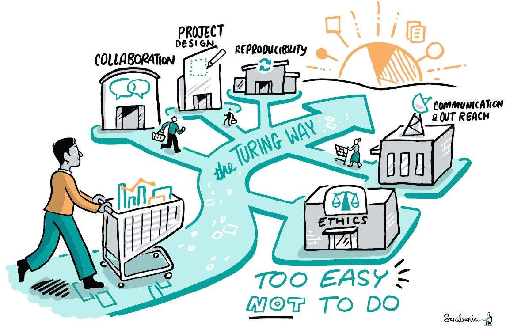
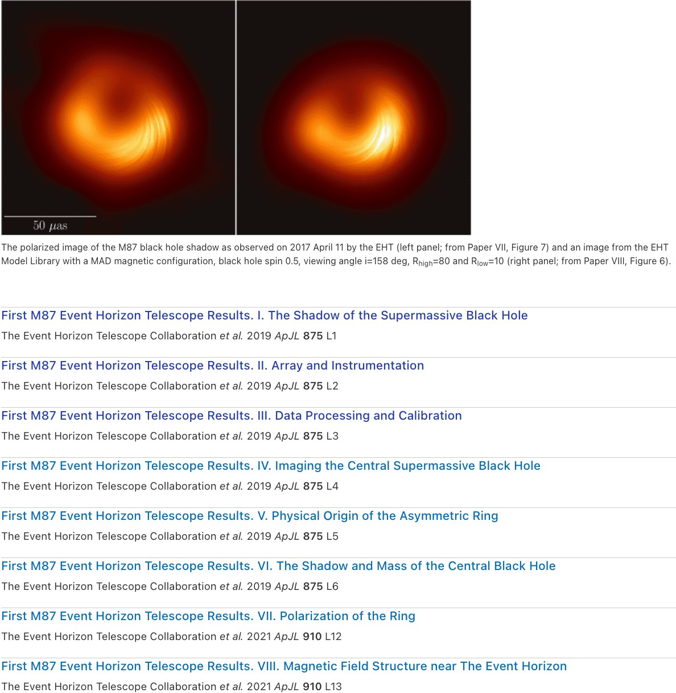

# Lesson 3: Making Open Results

## Navigation

* [How to Make Open Results](#how-to-make-open-results)
* [Role of Contributors in Open Science](#role-of-contributors-in-open-science)
* [How to Give Open Recognition](#how-to-give-open-recognition)
* [Combining Open Results for Scientific Reporting and Publications](#combining-open-results-for-scientific-reporting-and-publications)
* [Lesson 3: Summary](#lesson-3-summary)
* [Lesson 3: Knowledge Check](#lesson-3-knowledge-check)

## Overview

In Lesson 2 you learned how to use other's results. In this lesson, we focus on making open results. We will start by discussing what it means to make reproducible results. Having earlier in the course discussed the computational reproducibility practices in open software, in this lesson, we specifically emphasize the importance of collaborations in making those results open and reproducible. This begins with acknowledging that the scientific results are not made by single individuals. We will then teach how to ensure equitable, fair, and successful collaborations when making your open results that acknowledge all contributions. Once you’ve planned the rules of engagement, we will provide you with ways to ensure that your reporting and publication abide by open results principles and combat the reproducibility crisis.

## Learning Objectives

After completing this lesson, you should be able to:

- Identify approaches to make different types of open results.
- Recognize the importance of collaboration in making results.
- Develop contribution guidelines to enable recognition of contributors who make results.
- Combine different open results to create scientific reports and reproducible outputs.

## How to Make Open Results

### Capturing the Research Process Accurately in the Making of Results

> I am aware of the reproducibility crisis and how open science can help combat it. What practical ways can I apply to my research outputs to make open results? How can I ensure that the results I share can be reproduced by others? How can I publish scientific publications that do not add to, but combat the reproducibility crisis?

In the Ethos of Open Science, you learned about the ethics and principles underlying responsible open science practices. In Open Software, you explored and identified the right tools and methods that ensure the usability and reproducibility of your analysis. In Open Data, you developed a data management plan that can ensure the Findability, Accessibility, Interoperability and Reusability (FAIR) of your data throughout the research process, and not just at the end when the final report from the project is released. These open science approaches directly address the root causes of the reproducibility crisis, which are a lack of openness throughout the scientific process, lack of documentation, poor description of intermediate methods or missing data that were used at intermediate stages of the research process. In this lesson, you will learn to put all of these together to ensure that you are prepared to make your open results easy to reproduce by others.

In Lesson 1, we identified different research components that can be considered open results at various stages of research. In this lesson, we want to specifically explain what processes are involved in making them.

### Case Study: Open Results from Distributed Multi-Team Event Horizon Telescope Collaboration (EHTC)

**Example:** Capturing results on activities ranging from collaboration to observations, image generation to interpretation.

In 2017, the Event Horizon Telescope targeted supermassive black holes with the largest apparent event horizons: M87, and Sgr A\* in the Galactic Center on four separate days. This distributed collaboration led to the multi-petabyte yield of data that allowed astronomers to unveil the first image of a black hole providing the strongest visual evidence of their existence. The [EHTC website](https://eventhorizontelescope.org/) provides information about research projects, scientific methods, instruments, press and media resources (such as blog posts, news articles and YouTube videos), as well as events, data, proposals and publications. This project shows large-scale and high-impact work that applies open practices in making their results. Different kinds of outputs shared under this project can be mapped to different stages of the research process and the teams involved in creating them.

### Making Results and Crediting Contributors Fairly at Different Stages of Research

The case studies listed above highlight that results associated with a project are more than a publication. By understanding how open results are created in different projects, we can gain deep insights into the processes for making them. With that goal, the rest of this lesson describes the process of making results into three parts: 1) making all types of research outputs; 2) recognizing all contributors; and 3) combining outputs for scientific reporting and publications.

### Making All Types of Research Outputs

New ways of working with creative approaches for collaboration and communication in research have opened up opportunities to engage with the broader research communities by sharing scientific outcomes as they develop, rather than at the end through summary articles. A range of research components are created throughout the research lifecycle that can be shared openly. For example, resources created in a scientific project include, but are not limited to the following:

<table>
  <thead>
    <tr>
        <th>IDEATION AND PLANNING &#9745;</th>
        <th>DATA COLLECTION AND EXPLORATION</th>
        <th>COMMUNITY ENGAGEMENT AND REPRODUCIBILITY</th>
        <th>PRESERVATION AND PUBLICATION</th>
    </tr>
  </thead>
  <tbody>
    <tr>
        <td colspan="4">
            
Ideation and planning – perhaps before the research project is funded or started:

            <ul>
                <li>Research proposals</li>
                <li>People and organizations involved</li>
                <li>Research ethics guidelines</li>
                <li>Data management plan</li>
            </ul>
        </td>
    </tr>
  </tbody>
</table>

<table>
  <thead>
    <tr>
        <th>IDEATION AND PLANNING</th>
        <th>DATA COLLECTION AND EXPLORATION &#9745;</th>
        <th>COMMUNITY ENGAGEMENT AND REPRODUCIBILITY</th>
        <th>PRESERVATION AND PUBLICATION</th>
    </tr>
  </thead>
  <tbody>
    <tr>
        <td colspan="4">
            
Data collection and exploration – research artifacts created during the active research process:

            <ul>
                <li>Project repository</li>
                <li>Project roadmap and milestones</li>
                <li>Resource requirements</li>
                <li>Project management resources (without sensitive information)</li>
                <li>Collaboration processes like Code of Conduct and contributor guidelines</li>
                <li>Virtual research environment</li>
                <li>Data and metadata information</li>
            </ul>
        </td>
    </tr>
  </tbody>
</table>

<table>
  <thead>
    <tr>
        <th>IDEATION AND PLANNING</th>
        <th>DATA COLLECTION AND EXPLORATION</th>
        <th>COMMUNITY ENGAGEMENT AND REPRODUCIBILITY &#9745;</th>
        <th>PRESERVATION AND PUBLICATION</th>
    </tr>
  </thead>
  <tbody>
    <tr>
        <td colspan="4">
            
Community engagement and reproducibility – most valuable during the project period:

            <ul>
                <li>Training and education materials</li>
                <li>Computational notebooks</li>
                <li>Computational workflow</li>
                <li>Code repository (version controlled)</li>
                <li>Blog posts</li>
                <li>Short form videos and podcasts</li>
                <li>Social media posts</li>
                <li>Forum discussions (for example when asking for feedback or troubleshooting)</li>
            </ul>
        </td>
    </tr>
  </tbody>
</table>

<table>
  <thead>
    <tr>
        <th>IDEATION AND PLANNING</th>
        <th>DATA COLLECTION AND EXPLORATION</th>
        <th>COMMUNITY ENGAGEMENT AND REPRODUCIBILITY</th>
        <th>PRESERVATION AND PUBLICATION &#9745;</th>
    </tr>
  </thead>
  <tbody>
    <tr>
        <td colspan="4">
            
Preservation and publication – expected to persist long-term:

            <ul>
                <li>Publication and authorship guidelines</li>
                <li>Open access peer-reviewed articles</li>
                <li>Conference abstracts and presentations</li>
                <li>End of project report</li>
                <li>User manual or documentation</li>
                <li>Public outreach and events</li>
            </ul>
        </td>
    </tr>
  </tbody>
</table>

Image credit: The Turing Way project illustration by Scriberia. Zenodo.

---

You have already come across some of these in the previous lessons, and hopefully, you could already identify which of these or additional outputs you are generating in your work. To make them part of your open results, it's important that they are shared openly with appropriate licensing and documentation so that others can read, investigate and when possible, reuse or build upon them.

### Making Open and Reproducible Results

Open science ultimately informs our decisions as scientists and guides the selection of approaches that contribute to making our results open at different stages. One of the main purposes of open results is to ensure research reproducibility, often explained through definitions such as the following by [Stodden (2015)](https://www.annualreviews.org/doi/10.1146/annurev-statistics-010814-020127):

"Reproducibility is a researcher's ability to obtain the same results in a published article using the raw data and code used in the original study."

**Stodden (2015)**

---

Using this definition, results that can be computationally reproduced by others would be called Reproducible Results. The EHTC case studies present open results as collections of research objects created at different stages of the research process. They also provide documentation and resources that allow reanalysis and reproduction of the original results.

Ideally, anyone, anywhere, must be able to read a publication and understand the results, easily find methods applied, as well as properly follow procedures to achieve the same results as shared in that study. However, as already learned, the issue of reproducibility is prevalent across all scientific fields (refer to this Nature [report](https://www.nature.com/articles/533452a)). A well-intentioned scientist may share all research objects and describe all steps applied in their research, but failing to provide the research environment or other technical setup they used for analyzing their data can prohibit others from reproducing their results. This issue is further compounded by [human bias and errors](https://www.ncbi.nlm.nih.gov/pmc/articles/PMC4776714/). For example, individuals may not always be able to identify how their interests and experiences inform their decisions that impact their research conclusions. This makes the issue of combating the reproducibility crisis even bigger.

Approaches for making open results should integrate reproducible tools and methods, such as version control, continuous integration, containerisation, code review, code testing and documentation. Furthermore, to extend the reproducibility beyond computational aspects of research, reporting and documentation for different types of outputs and decisions should also be supplied transparently.

### How to Make Different Types of Open Results

Sharing different types of results as early as possible not only helps you find solutions faster, but also helps your science be more reproducible because that openness helps you understand how to communicate your methodologies and your findings more clearly to others. Here we provide some easy places to start creating your results openly.

<table>
  <thead>
    <tr>
        <th>WRITING A FORUM POST &#9745;</th>
        <th>WRITING A GOOD BLOG POST</th>
        <th>MAKING A GOOD VIDEO</th>
        <th>WRITING A SOCIAL MEDIA POST</th>
    </tr>
  </thead>
  <tbody>
    <tr>
        <td colspan="4">
            
Often, when first starting in research, public forums are a great place to begin understanding and collaborating with communities. Most discussion forums have a code of conduct and guidelines on best practices for participation. Some common ones that may be helpful are guidelines from <a href="https://stackoverflow.com/help/discussions-guidelines">StackOverflow</a>, and <a href="https://github.com/pydata/xarray/discussions/5404">Xarray</a>, but most forums have some specific guidance. On forums, you increase trust by interacting with the community, so the more you interact, the more people are likely to respond! Often, best practices include making sure you are posting to the right area, using tags (when available), and including examples that document the question or issue you are having. If you review the <a href="https://discourse.pangeo.io/t/trick-for-improving-kerchunk-performance-for-large-numbers-of-chunks-files/3090">post</a> on the <a href="https://discourse.pangeo.io/">Pangeo Discourse Forum</a> with a large number of reviews you can see that they clearly state the problem they are trying to solve, reference other posts on similar topics, link to a computational notebook that has an example of their code, and give an example of the code they are trying to do.

        </td>
    </tr>
  </tbody>
</table>

<table>
  <thead>
    <tr>
        <th>WRITING A FORUM POST</th>
        <th>WRITING A GOOD BLOG POST &#9745;</th>
        <th>MAKING A GOOD VIDEO</th>
        <th>WRITING A SOCIAL MEDIA POST</th>
    </tr>
  </thead>
  <tbody>
    <tr>
        <td colspan="4">
            
Blogs are long-form articles that aren’t peer-reviewed. Blogs can be a great way to share your scientific process and findings before they are published, but also after they are published to provide another more accessible presentation of the material. For example, maybe you write a scientific article on your research that is highly technical, but then break it down in more accessible language in a blog post. Many scientists use blog posts to develop and test ideas and approaches because they are more interactive. There are science blogs all over the internet. Some popular ones are <a href="https://medium.com/tag/science">Medium</a>, <a href="https://sciencebites.org/sciencebites-sites-galaxy/">Science Bites</a>, and <a href="https://blogs.scientificamerican.com/">Scientific American</a>. One good way to get started is to find a blog post that you liked or found inspirational and use that as a guide for writing your own post.

        </td>
    </tr>
  </tbody>
</table>

<table>
  <thead>
    <tr>
        <th>WRITING A FORUM POST</th>
        <th>WRITING A GOOD BLOG POST</th>
        <th>MAKING A GOOD VIDEO &#9745;</th>
        <th>WRITING A SOCIAL MEDIA POST</th>
    </tr>
  </thead>
  <tbody>
    <tr>
        <td colspan="4">
            
Start small! Record a short video where you show how to do something that you struggled with or a new skill or tool that you learned how to use and post it to YouTube or other popular video platforms. Great videos often explain science concepts, ideas, or experiments to a target audience. Videos can inspire others to work in science, so talk about how you got into science, and show some of your research. There are a lot of online resources to help you out here as well!

        </td>
    </tr>
  </tbody>
</table>

<table>
  <thead>
    <tr>
        <th>WRITING A FORUM POST</th>
        <th>WRITING A GOOD BLOG POST</th>
        <th>MAKING A GOOD VIDEO</th>
        <th>WRITING A SOCIAL MEDIA POST &#9745;</th>
    </tr>
  </thead>
  <tbody>
    <tr>
        <td colspan="4">
            
Social media is also a good place to ask questions as you are just starting on a research topic and also as a place to share all types of results. Providing a link to a video, blog post, or computational notebook and/or sharing an image of a scientific result is a great way to start interactions. You can draw attention to your post by using hashtags and tagging other collaborators. There are a lot of online guides for how to write social media posts and it is always good to look at what others in your area are doing. Responding to comments and engaging with others can help you improve your research and learn about new tools or methods.

        </td>
    </tr>
  </tbody>
</table>

All these different ways of sharing information will help make your published report or article better. And as you start working more in the open, with others, think about how collaborations will work and how you will give credit. All resources can be centralized through reports and documentation on a repository or website so anyone, including the 'future you' can find them in the future.

More ways to communicate your work can be found in a [guide for communication](https://the-turing-way.netlify.app/communication/communication) in The Turing Way.

### Maintaining Ethical Standards

Open science, as learned in the Ethos of Open Science, should maintain the highest ethical standards. This can be enabled through the involvement of diverse contributors in the development of scientific outcomes. Participatory approaches allow multiple perspectives and expertise to be integrated into research from the start and ensure that peer review happens for all outputs in an iterative manner, not just for the articles at the end.

In making and planning to share open results, you can apply the "as open as possible, as closed as necessary" principle. This means, protecting sensitive information, managing data protection practices where necessary and not carelessly sharing sensitive data or people's private information that can be misused. Online repositories, such as GitHub and GitLab, allow online interaction in addition to serving the technical purpose of version control and content hosting. For example, you can use [issues](https://docs.github.com/en/issues/tracking-your-work-with-issues/about-issues) and [a project board](https://docs.github.com/en/github-ae%40latest/issues/organizing-your-work-with-project-boards/managing-project-boards/creating-a-project-board) to communicate what is happening in a project at any given point. The use of [Pull Requests](https://docs.github.com/en/pull-requests/collaborating-with-pull-requests/proposing-changes-to-your-work-with-pull-requests/about-pull-requests) signals an invitation for peer review on the new development of code or other content. Thanks to a number of reusable templates you don't have to set up repositories from scratch. For example, you can directly use a [template for reproducible research projects](https://github.com/the-turing-way/reproducible-project-template).

## Role of Contributors in Open Science

Collaboration is central to all scientific research. The positive impact of collaboration is achieved when diverse contributors are supported to combine a range of skills, perspectives and resources together to work towards a shared goal. Projects that apply open and reproducible approaches, make it easier for diverse contributors to be involved and get recognized for their contributions while supporting the development of solutions that they can all benefit from.

Involving and recognizing the roles of all contributors in making open results is an important part of open science, which we will discuss next.

### EHTC Case Study: Recognizing All Contributors

A map of the EHT. Stations active in 2017 and 2018 are shown with connecting lines and labeled in yellow, sites in commission are labeled in green, and legacy sites are labeled in red. From Paper II (Figure 1). IOPscience. https://iopscience.iop.org/journal/2041-8205/page/Focus_on_EHT

---

The Event Horizon Telescope (EHT) team involved 200 members from 59 institutes in 20 countries, from undergraduates to senior members of the field. They used an array that included eight radio telescopes at six geographic locations across the USA, Latin America, Europe and the South Pole. All collaborators were located in different geographic locations, had access to different instruments, collected data generated from telescopes in different locations and applied skills from across different teams to create groundbreaking results. Each contributor was acknowledged across different communication channels and given authorships in publications. EHTC also supports the "critical, independent analysis and interpretation" of their published results to facilitate transparency, rigor, and reproducibility ([EHTC website](https://eventhorizontelescope.org/blog/imaging-reanalyses-eht-data)).

### Making Open Results Starts with Contributors!

Making different research components and preparing to share them as open results involve a range of activities. Behind these activities are the contributors who engage in various responsibilities that include, but are not limited to:

- Conceptualizing the idea
- Designing the project
- Serving as advisor or mentor
- Conducting experiment as a student, researcher, or research assistant
- Creating tools essential for carrying out the research
- Providing data expertise
- Developing software
- Providing specialized expertise and support
- Managing community and project requirements
- Providing feedback to the results
- Designing experiments and interpreting results
- Manuscript writing and review
- And [more](https://the-turing-way.netlify.app/collaboration/shared-ownership/shared-ownership-projects.html)!

Too often conversations about contribution and authorship take place towards the end of a project or when a scientific publication is drafted. However, as you learned in the previous lessons, research outputs are generated throughout the lifetime of a research project. Therefore, it is important to build an agreement at the beginning of the project for how contributorship in the project will be managed.

Developing contribution guidelines and contributor agreements requires collaboratively defining what is considered contributions in your project, who among the current contributors will get authorship, who will get acknowledged as a contributor, what is the significance of the order in which authors are listed in a scientific publication, and who makes these decisions. Ensuring that all collaborators understand and agree to these guidelines before beginning the project is also important.

### Contributors and Authorship

First and foremost, you must ensure that anyone who has contributed to the research project has their contributions recognized. With that shared understanding, in this lesson, you will explore what those recognitions as contributors or authors in your research project might look like.

Let's first define contributor and author roles.

<table>
  <thead>
    <tr>
        <th>A "CONTRIBUTOR" &#9745;</th>
        <th>AN "AUTHOR"</th>
    </tr>
  </thead>
  <tbody>
    <tr>
        <td colspan="2">
            
A contributor is anyone who has done any activity that made it possible for the research to happen and results to be created, published or shared.

        </td>
    </tr>
  </tbody>
</table>

<table>
  <thead>
    <tr>
        <th>A "CONTRIBUTOR"</th>
        <th>AN "AUTHOR" &#9745;</th>
    </tr>
  </thead>
  <tbody>
    <tr>
        <td colspan="2">
            
An author of an open result is a contributor who has given a substantial contribution to the conception or design of the work or the acquisition, analysis, or interpretation of the data for the published work.

        </td>
    </tr>
  </tbody>
</table>

### Are All Authors Contributors and Vice Versa?

An author is a contributor who actively carries out one or several of the tasks listed above ([National Institute of Health - NIH](https://oir.nih.gov/sourcebook/ethical-conduct/authorship-guidelines-resources/authorship-resources) and [ICMJE](https://www.icmje.org/recommendations/browse/roles-and-responsibilities/defining-the-role-of-authors-and-contributors.html)). All authors are contributors, but all contributors may not be authors, for example, someone serving as a mentor, trainer or infrastructure maintainer. Ideally, all contributors are given the opportunity to author research outputs.

Given the importance traditionally placed on authorship in scientific publication and the fuzziness of the definitions (that often contain relative terms such as "substantial" or "extensive" leaving too much room for interpretation), it is not surprising that determining who amongst the contributors gets to be an author can lead to biased or unfair decisions, disputes between contributors, or at the very least leave someone resentful and feeling unappreciated.

There is no single approach for recognizing contributors as authors, but here is what you should consider:

<table>
  <thead>
    <tr>
        <th>GROUP POWER DYNAMICS &amp; EQUITY (E.G. SENIORITY, SYSTEMS OF OPPRESSION) &#9745;</th>
        <th>THE TYPE OF CONTRIBUTION</th>
    </tr>
  </thead>
  <tbody>
    <tr>
        <td colspan="2">
            
Consider this hypothetical scenario: You are a postdoctoral fellow and the leading author of a research project. A rotating student spends 4 months in the lab helping you set up and perfect the experimental protocol that you will then use to carry out the experiments needed to answer your research question. They may even help you collect some preliminary data, but then they leave and later decide to join another lab. Would you provide authorship for the student?

            
It would be unethical not to give authorship or credit to someone who has provided significant help and contributed to the success of a research, even when they are no longer involved. A fair path in this scenario could be to contact the previous contributor and involve them in writing a relevant section of the manuscript.

        </td>
    </tr>
  </tbody>
</table>

<table>
  <thead>
    <tr>
        <th>GROUP POWER DYNAMICS &amp; EQUITY (E.G. SENIORITY, SYSTEMS OF OPPRESSION)</th>
        <th>THE TYPE OF CONTRIBUTION &#9745;</th>
    </tr>
  </thead>
  <tbody>
    <tr>
        <td colspan="2">
            
The NIH guidelines for authorship outline what type of contribution does or does not warrant authorship. Each contribution is represented on a sliding scale and has no rigid cutoffs. Some contributions are given more weight than others. For example, for "design and interpretation of results", nearly all types of "original ideas, planning, and input" result in authorship. Whereas simply supervising the 1st author usually does not result in authorship (unless they are also contributing to the paper, of course). This is just one example. You will need to think about what this looks like for your own work!

        </td>
    </tr>
  </tbody>
</table>

Clear communication about roles and responsibilities early in the project, and guidelines for how credit will be determined, can help mitigate some of these issues.

### Diverse Role of Contributors

It is important to set a reference for each research team/project about different kinds of responsibilities and opportunities available for different contributors and how each of them are acknowledged. [CRediT Taxonomy](https://credit.niso.org/) represents roles typically played by contributors to research in creating scholarly output. Below, we provide a table with research roles that extends the CRediT taxonomy to include broader contributorship ([Sharan, 2022](https://zenodo.org/record/8403386)). Using this as a starting point, open dialogue and discussion among team members can be facilitated to set a shared understanding and agreement about diverse roles of contributors including authorship of publications. The distinction between contribution types can help set clear expectations about responsibilities and how they can be recognized in a project.

<table>
<colgroup>
    <col style="width: 33%" />
    <col style="width: 66%" />
</colgroup>
<thead>
    <tr>
        <th>Research Roles</th>
        <th>Definition</th>
    </tr>
</thead>
<tbody>
    <tr>
        <td>Project Administration</td>
        <td>Management and coordination responsibility for the research activity planning and execution</td>
    </tr>
    <tr>
        <td>Funding Acquisition</td>
        <td>Acquisition of the financial support for the project leading to the research and publications</td>
    </tr>
    <tr>
        <td>Community Engagement</td>
        <td>Connecting with project stakeholders, enabling collaboration, identifying resources, and managing contributors interactions</td>
    </tr>
    <tr>
        <td>Equity, Diversity, Inclusion and Accessibility (EDIA)</td>
        <td>Inclusive approaches to collaboration and research, involvement of diverse contributors, accessibility of resources, consideration of disability, neurodiversity and other considerations for equitable participation</td>
    </tr>
    <tr>
        <td>Ethics Review</td>
        <td>Ensure that if the research project needs to undergo an ethics review process</td>
    </tr>
    <tr>
        <td>Communications and Engagement</td>
        <td>Communications about the project and engagements with the stakeholders beyond the project and institution</td>
    </tr>
    <tr>
        <td>Engagement with Experts and Policymakers</td>
        <td>Pre-publication review, external advisory board meetings, regular reporting, post-publication reporting, and reaching out to the relevant policy makers actively</td>
    </tr>
    <tr>
        <td>Recognition and Credit</td>
        <td>Assessing incentives, creating a fair value system, fair recognition of all contributors</td>
    </tr>
    <tr>
        <td>Project Design</td>
        <td>Technical planning, expert recommendations, supervision or guidance, developing project roadmaps and milestones, tooling and template development</td>
    </tr>
    <tr>
        <td>Conceptualization</td>
        <td>Ideas; formulation or evolution of overarching research goals and aims</td>
    </tr>
    <tr>
        <td>Methodology</td>
        <td>Development or design of methodology; creation of models</td>
    </tr>
    <tr>
        <td>Software</td>
        <td>Programming, software development; designing computer programs; implementation of the computer code and supporting algorithms; testing of existing code components</td>
    </tr>
    <tr>
        <td>Validation</td>
        <td>Verification, whether as a part of the activity or separate, of the overall replication/ reproducibility of results/experiments and other research outputs - generalizable</td>
    </tr>
    <tr>
        <td>Investigation</td>
        <td>Conducting a research and investigation process, specifically performing the experiments, or data/evidence collection</td>
    </tr>
    <tr>
        <td>Resources</td>
        <td>Provision of study materials, reagents, materials, patients, laboratory samples, animals, instrumentation, computing resources, or other analysis tools</td>
    </tr>
    <tr>
        <td>Data Curation</td>
        <td>Management activities to annotate (produce metadata), scrub data and maintain research data (including software code, where it is necessary for interpreting the data itself) for initial use and later reuse (including licensing)</td>
    </tr>
    <tr>
        <td>Writing - Original Draft</td>
        <td>Preparation, creation and/or presentation of the published work, specifically writing the initial draft (including substantive translation)</td>
    </tr>
    <tr>
        <td>Writing - Review & Editing</td>
        <td>Preparation, creation and/or presentation of the published work by those from the research group, specifically critical review, commentary or revision – including pre-or post publication stages</td>
    </tr>
    <tr>
        <td>Visualization</td>
        <td>Preparation, creation and/or presentation of the published work, specifically visualization/ data presentation</td>
    </tr>
    <tr>
        <td>Supervision</td>
        <td>Oversight and leadership responsibility for the research activity planning and execution, including mentorship external to the core team</td>
    </tr>
</tbody>
</table>

## How to Give Open Recognition

To openly and fairly recognize all contributors, their names with the types of contributions they made should be listed in the project documentation. In manuscripts, it is a common practice to mention contributors’ roles under the ‘acknowledgement’ section, such as using CRedIT or similar taxonomy as provided in the table above. All contributors should be encouraged to provide ORCiDs associated with their names to make them identifiable.

Contribution statements in documentation and manuscripts can specify who did what in the official results. This is great for transparency. It is also a great way to guard against unfair power dynamics. Details about contribution type shows explicitly who works on which parts of results, and makes it easy to give fair authorship. For example: *"Pierro Asara: review and editing (equal). Kerys Jones: Conceptualization (lead); writing – original draft (lead); formal analysis (lead); writing – review and editing (equal). Elisha Roberto: Software (lead); writing – review and editing (equal). Hebei Wang: Methodology (lead); writing – review and editing (equal). Jinnie Wu: Conceptualization (supporting); Writing – original draft (supporting); Writing – review and editing (equal)."*

If a GitHub repository and website exist, a dedicated page should be created to list and recognize all contributors. If someone minorly contributed to the paper, code or data, you could add them as an author or contributor to the GitHub and Zenodo releases respectively. Engaged collaborators and contributors not already involved in making research outputs should be given the opportunity to contribute to open results such as through presentation, posters, talks, blogs, podcasts, data, software as well as articles.

### Activity 3.1: Draft a Contribution Guideline

A standalone contribution guideline should be created for each open project, even when that means reusing an existing draft that the research team has used in another project.

Note that this is different from "contributing" guidelines that describe "how" to contribute (for example on code repositories). Contribution guidelines should describe contribution types and ways to acknowledge them as discussed above.

Contribution guidelines are not set-in-stone, but rather:

- Are discipline-dependent
- Can be adapted for your unique situation

You can begin by reviewing guidelines by [NIH](https://oir.nih.gov/sourcebook/ethical-conduct/authorship-guidelines-resources/authorship-resources) and [ICMJEs](https://www.icmje.org/recommendations/browse/roles-and-responsibilities/defining-the-role-of-authors-and-contributors.html) for authorship contributions.

Notice that many categories and criteria for authorship, such as represented in the NIH guidelines' sliding scale, may be differently decided. For example, in some fields providing financial resources for a research project always warrants authorship. In other fields this is not the case.

Some projects may not follow traditional manuscripts as their outputs. For example, if software is a primary output from a project, there may be a need to define specific roles regarding code contributions. You can work with your research team to create a version of CRediT Taxonomy for your project, such as shared in an expanded version of the table above.

When different kinds of contributorship have been identified, clarify how different contributors will be involved and acknowledged. This may include recommended communication and collaboration processes for the team members, as well as recognition and credit for different kinds of contributions they make.

**Additional Information**

For additional tips on how to acknowledge different kinds of contributors to developing a resource including authorship, check out [Acknowledging Contributors The Turing Way](https://the-turing-way.netlify.app/community-handbook/acknowledgement.html).

If working with online repositories such as GitHub, an app like '[all-contributors](https://allcontributors.org/)' bot is a great way to automate capturing all kinds of contributions, from fixing bugs to organizing events to improving accessibility in the project.

More systematic work is being undertaken by [hidden REF](https://hidden-ref.org/) who constructed a broad set of [categories](https://hidden-ref.org/categories) that can be used for celebrating everyone who contributes to the research.

There are several [infrastructure roles](https://the-turing-way.netlify.app/collaboration/research-infrastructure-roles.html) like community managers, data stewards, product managers, ethicists and science communicators, who are also being recognized as valued members in research projects with an intention to provide leadership paths for technical and subject matter experts, even when their contributions can’t always be assessed in tangible or traditional outputs \[[Mazumdar et al. 2015](https://journals.lww.com/academicmedicine/fulltext/2015/10000/evaluating_academic_scientists_collaborating_in.14.aspx), [Bennett et al., 2023](https://journal.trialanderror.org/pub/manifesto-rewarding-recognizing/release/1)\].

[The Declaration on Research Assessment](https://sfdora.org/) (DORA) is also a good resource to understand what researchers, institutions, funders and publishers can do to improve the ways in which researchers and the outputs of scholarly research are evaluated.

## Combining Open Results for Scientific Reporting and Publications

Scientific publications have traditionally remained one of the most popular modes of reporting and publication. Over the last decade, it has become a standard practice to submit pre-peer reviewed manuscripts on preprint servers (such as [arXiv](https://arxiv.org/)) to speed access to research before the peer-reviewed journal articles are published (discussed in Lesson 2). The publication system has also evolved massively. Journal articles are no longer about writing overview and summary of research, but can be used to share articles on software, data, education materials and more.

### EHTC Case Study: Capturing Results on Activities Ranging From Collaboration to Observations, Image Generation to Interpretation

The polarized image of the M87 black hole shadow as observed on 2017 April 11 by the EHT (left panel) and an image from the EHT Model Library with a MAD magnetic configuration (right pane), with a list of papers describing different sets of results.

---

Across [several preprints](https://arxiv.org/search/astro-ph?searchtype=author&query=Event%2BHorizon%2BTelescope%2BCollaboration) and [eight peer-reviewed letters](https://iopscience.iop.org/journal/2041-8205/page/Focus_on_EHT), EHTC presented open results issued from different teams on instrumentation, observation, algorithm, software, modeling, and data management, providing the full scope of the project and the conclusions drawn to date.

Open results such as reports, publications, code, white papers, press releases, blog posts, videos, TED talks and social media posts add to the comprehensive repertoire of open results supported by EHTC. Resources are centralized on the [EHTC website](https://eventhorizontelescope.org/), [GitHub organization](https://github.com/eventhorizontelescope) and [YouTube channel](https://www.youtube.com/%40ehtelescope) among others to provide easy access to all open results.

It's important to highlight that their efforts have led to independent reanalysis and regeneration of black hole images. Specifically, [Patel et. al. (2022)](https://arxiv.org/abs/2205.10267) not only reproduced the original finding, but also contributed additional documentation, code, and a computational environment as open-source containerized software package to ensure future testing. Some of the original authors reviewed this work and [made their comments also available online](https://quarxiv.authorea.com/users/557984/articles/607408-review-reproducibility-of-the-first-image-of-a-black-hole-in-the-galaxy-m87-from-the-event-horizon-telescope-eht-collaboration) (Authorea).

### How Do I Connect Open Results to Make Reproducible Publications

If not considered from the start, it can become challenging to ensure result reproducibility at the publication stage. Assuming that you have maintained open results considering their reproducibility, you can start assembling them to connect with the final reporting and publication with appropriate references to previous studies.

- Before writing your manuscript, assess each output to make sure that appropriate license is attached for reuse, documentation has been provided and contributors are clearly listed. You can decide to create a version of the record and point to a permanent identifier such as via Zenodo so that the link never breaks when sharing them on a public repository (such as GitLab/GitHub) or manuscripts with a visible list of contributors.
- Your publications can be created individually (such as in EHTC case study) or by combining several outputs or pieces of information in manuscripts. These will include resource requirements, dependencies, software, data, repository where code is shared with documentation and contributor information, among other research artifacts.
- The manuscript itself will describe research questions, methods as well as individual figures and tables explaining the results. When writing a manuscript, you can begin with figures by packaging data, code and parameters used, ensuring that information represented can be reproduced. You can find a detailed checklist in the publication by [Gil et al.](https://agupubs.onlinelibrary.wiley.com/doi/full/10.1002/2015EA000136) (2016).

As demonstrated in the EHTC case study, a final step towards making open results could be to create a meta article and/or simple website/git page that centralizes all your research outputs. Different parts of research (individual open results) can be accessed centrally with details including open recognition for all contributors.

If you are looking for concrete actions you can take to make open results, pick one of these four items:

- Improve how you define contributorship in your project and how authorship is assigned.
- Ensure the data or software in your paper is uploaded to Zenodo with license and documentation including metadata and that the DOI is posted to your scientific report and publication.
- Ensure that the process you use to collect data and perform its analysis, including all the dependencies and methods used in your data analysis pipeline, are clearly described to allow others to reproduce your results.
- Create a centralized repository or a simple git page to centralize all research outputs with contributors list.

## Lesson 3: Summary

The steps that we highlight to make open results are not intractable. In fact, the steps we have highlighted are things we can do on a regular basis to ensure that all research artifacts can be shared later as open and reproducible results. In this lesson we learned:

- Approaches for making open results.
- The importance of collaboration in making results.
- How to recognize and credit all of the contributors who make results.
- How to combine different open results to create scientific reports and reproducible outputs.

## Lesson 3: Knowledge Check

Answer the following questions to test what you have learned so far.

*Question*

**01/02**

1. Which of the following roles would be most appropriately credited with contributorship? Select all that apply.

-  Original idea, planning, and input
- Supervision of the project
- Original experimental work
- Data analysis
- Drafting of manuscript

*Question*

**02/02**

What is not an example of open research results?

- Open access papers
- Conference presentation
- Internal team meeting notes
- Regular reports shared online
- Poster at a workshop
- Blog post
- Computational notebook on GitHub
- Figure with a DOI (e.g, Zenodo or Figshare)
- Pre-print of a paper