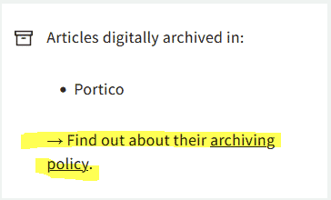
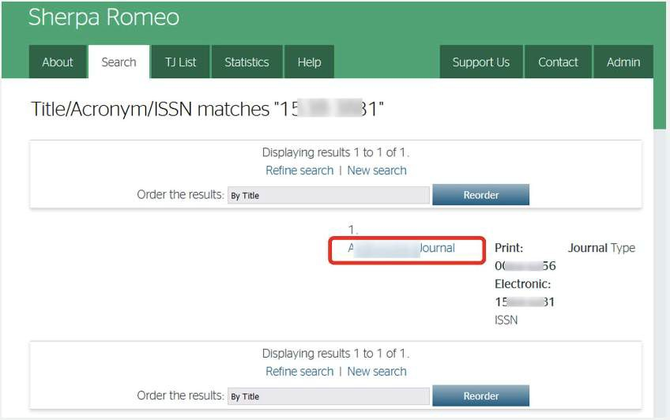
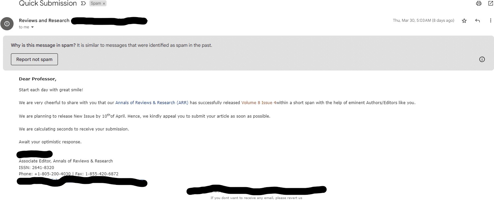

# Lesson 4: Sharing Open Results

## Navigation

* [When to Share](#when-to-share)
* [How to Share](#how-to-share)
* [Other Considerations When Sharing](#other-considerations-when-sharing)
* [Lesson 4: Summary](#lesson-4-summary)
* [Lesson 4: Knowledge Check](#lesson-4-knowledge-check)

## Overview

In lesson 3 you learned about how to make reproducible results. Now, we can finally think about how to best share those results. In this lesson we will place emphasis on publishing manuscripts as open access. You will learn what subtleties to consider when determining what journal to publish in, including how to make sense of a journal's policies on self-archiving. Finally, we discuss some commonly held concerns about sharing open access publications, and how to overcome them. Ultimately, we want to ensure that you have confidence in your decision to publish as open access.

## Learning Objectives

After completing this lesson, you should be able to:

- List ways that you can share open results to become a more collaborative, effective, scientist.
- List different types of open access publications and considerations when sharing like licenses.
- List some of the concerns around open access publishing, including responsibilities for authors, the threat of predatory publishers, and the fear of being wrong.

## When to Share

Part of doing open science is enabling collaborative, interactive results. Sharing different types of research objects earlier in your research process helps increase visibility to your work and accelerates your efforts by drawing from the collective knowledge of others. The internet has fundamentally changed the timing of and manner in which scientists communicate results.

Planning to share your intermediate results at the beginning of your project makes sharing final results easier. The figure above illustrates many of the different objects that can be shared before the 'final' report or publication. Sharing and talking about your research as you are doing it, as well as engaging with other scientists, will increase the robustness of your work.

Ask questions. Share what you are working on. You will find that many involved in the scientific community want to help. The more you engage, the larger the audience and the more impact you will have when that 'final' publication is published.

In the past few decades, scientists have made new connections and sought collaborators through letters and at conferences. However, this way of doing science tended to restrict who could participate. Today, most of these discussions take place on the internet, which has enabled new avenues for participatory science, open to all.

The platforms where you share research depends on what you want to share. Reference the figure above and think about where you might share different types of information. How will this influence who you have an ability to engage with?

Let's start with sharing in smaller groups (workshops and conferences) and move to larger audiences. There are distinct reasons for communicating results to different sizes of groups, as explored in the following sections.

### At Workshops and Conferences

Many of us attend scientific conferences, workshops, and other gatherings to discuss our science with peers. The costs associated with attendance and travel to these events may limit who has access to the material presented there. At these events, scientists often give talks or present posters that are not yet peer reviewed to invite feedback from the community and potentially recruit collaborators. These interactions are important for improving research projects, and are often done when a project is still ongoing so that researchers can gather feedback early in their scientific process.

It is important to think about what audience you will be reaching at an event. Conferences have different policies about open access to materials presented at an event. Consider what you are sharing and who you want to share it with. For example, not all events provide long-term open access to workshop materials after the event. If you want to reach a larger audience or preserve the materials long-term, as a scientist, you have options to license and publish presented materials yourself (for example using Zenodo with a DOI) if an event doesn't do so.

### Other Forms of Interactive Feedback

Other forms of sharing can serve a similar purpose to share and document your results and/or software packages, and also allow for additional flexibility and openness! There are a number of additional resources that you can use

- Blog posts and online articles
- Short form videos and podcasts
- Computational notebooks
- Social media posts
- Forum discussions

These different pathways allow for the dissemination of null results, intermediate science updates and/or software improvements. These alternative ways of sharing your work can benefit your research by facilitating extended dialogue between you and collaborators, and even the general public. Additionally, the public has easier access to these forms than they do to conferences.

Here are some specific examples of engagement across contemporary platforms for scientific collaboration:

- Blog posts such as the [Pangeo blog](https://medium.com/pangeo) - see examples of how to use different software tools for different science questions!
- Computational notebooks as a way to demo software techniques (e.g. the [Project Pythia Cookbook Gallery](https://cookbooks.projectpythia.org/) showcasing computational science workflows in the Earth sciences).
- Non-peer reviewed publications, such as [Research Notes of the AAS](https://journals.aas.org/research-notes/).
- Team and/or Mission Science Pages, such as the [LUVOIR team's page](https://asd.gsfc.nasa.gov/luvoir/) or the Juno [mission's page.](https://www.missionjuno.swri.edu/)
- Conference proceedings, such as from the [Society of Photo-Optical Instrumentation Engineers.](https://spie.org/publications/conference-proceedings)
- Social media posts: [https://twitter.com/MartianColonist/status/1706824699349488036](https://twitter.com/MartianColonist/status/1706824699349488036)

 **Over the course of a 3 year study, the Journal of Medical Internet Research found that highly tweeted articles were 11 times more likely to be highly cited than less tweeted articles.**

### Publishing Reproducible Reports and Publications

An open access report and paper can be reproducible when its data, software, and content are made available to the readers following best practices. There is a growing list of resources documenting how to make open results reproducible (such as [The Turing Way](https://the-turing-way.netlify.app/reproducible-research/reproducible-research) and [FORRT](https://forrt.org/)).

There are several examples (discussed in these lessons) that demonstrate how we can integrate technical and collaborative solutions to enable reproducibility. For example, executable notebooks allow interactivity and testing, training workshops invite feedback for improvement and GitHub/GitLab enable community based open review.

**Scholarly Journals**

Publishing work in a peer-reviewed journal forms the traditionally written basis of how we share our science, and is important for communicating scientific detail and rigor to colleagues. Academic journals also act as a long-term archive of scientific research papers. For many scientists, publishing in peer-reviewed journals and receiving citations are key factors in how they are evaluated for career advancement, positions appointments, committee memberships, and honors.

Traditionally, authors pay an Article Processing Charge (APC) that can range from \$200-\$12000 USD. Higher profile journals often charge higher fees to authors. Accessing articles has traditionally been restricted by pay-walls that require a subscription or charge per article. Journals have different options for making your published work accessible to various communities.

**Who Has Access to Journal Subscriptions?**

Paywalls limit who can access scientific research. This barrier acts to limit who can participate in science and erodes public trust in results. Part of open science is ensuring worldwide access to research.

**Open Access Journals**

Open access journals are peer-reviewed journals that are more accessible because they don’t require readers to have a subscription or pay to access the content. However, open access journals often require additional fees for the author. Open access peer-reviewed articles are archived by a more formal discussion of scientific ideas, interpretations, and conclusions. They form the basis of how researchers share results.

### Activity 4.1: Read the Open Access Policies of Publishers That You Use

In this activity, you will learn how to access information about a journal’s data archive policies. The Directory of Open Access Journals (DOAJ) provides an extensive index of open access journals around the globe. The DOAJ can be used to look up information, including data archiving policies, for journals that publish research. Let’s open up this website and look up the policies specific to your most-used journals.

1. First, navigate to the [DOAJ website](https://doaj.org/).
2. Type in the name of one of the following journals in the search box, and then click on the yellow "SEARCH" button.
- Atmospheric and Oceanic Science Letters
- Swiss Journal of Geosciences 
- History of Geo-and Space Sciences   Note: You may input any journal desired but for this exercise use one of those listed to see the Sherpa/Romeo link that is listed in Step 5.
3. The search results may show more than one match. Select the desired journal within the search results by clicking on the journal name.  A dashboard appears, giving information regarding publication fees, waiver policies, the type of open license used, and other information on multiple displayed titles.
4. Click on the "archiving policy" link appearing in one of the displayed boxes as seen here. This will provide links to extensive information regarding the journal’s open access policies for the manuscript itself:   An extensive amount of information will be presented, including details on the publishing policies specific to the selected journal.
5. Alternatively, to get a more condensed view of the journal’s policies, return to the DOAJ dashboard on the About page with the multiple boxes displayed, and click on the "Sherpa/Romeo" link as shown here. 
6. On the Sherpa Romeo page, click on the journal name that is displayed in the list (the only journal displayed). 
7. When you view the page, you see that it consolidates and summarizes the open access policies for that journal and associated materials. The published version is likely to be the most relevant (see red box in figure). 
8. Review the page and determine which license the journal you selected has defined for reusability for manuscripts.

#### Activity Key Takeaways: Read the Open Access Policies of Publishers That You Use

This is an example of a site that you can use to determine if a journal’s policy is consistent with how you wish to publish your open access results. Journal policies should always be reviewed and considered during the early planning phase of your project and well before submitting your manuscript for publication.

## How to Share

Perhaps the single most important step to make your results open is to assign them a globally unique and persistent identifier. This will give you a single code, URL, or number that you can use to uniquely refer to a research object. Any derived research object can use this identifier to link to it and create a traceable and rich history of use and development. Crucially, this identifier can be used by others to cite and credit your work ([source](https://opensciency.github.io/sprint-content/open-results/lesson3-apply-open-results.html)).

The identifier must also be persistent. This guarantees that the identifier points to the same research object for a long period of time. What counts as "persistent" is, of course, a matter of degree since even the most stable identifier probably won't survive the Sun engulfing the Earth in a few billion years. In this context, "persistent" implies that it is registered in a database managed by an organization or system that is committed to maintaining it as stable and backwards compatible for the foreseeable future.

For example, URLs (for example, a personal website, GitHub repository, or cloud storage) are notoriously not persistent since they can change their contents frequently or become invalid without maintenance. On the other hand, Journal publications have a Digital Object Identifier (DOI) whose persistence is guaranteed by the International DOI Foundation.

As well as uniquely identifying each research object, it is important to be able to uniquely identify and cite all the authors and contributors. For this, it is recommended to get the permanent digital ID of each of the authors and contributors. [ORCID](https://orcid.org/) (Open Researcher and Contributor ID) is an online service where you can get a permanent digital identifier.

There are examples of globally unique and persistent identifiers:

<table style="width:100%;">
  <thead>
    <tr>
        <th>DIGITAL OBJECT IDENTIFIER 10.1371/JOURNAL.PONE.0230416 &#9745;</th>
        <th>ISBN-13: 978-0735619678</th>
        <th>THE INTERNET ARCHIVE</th>
    </tr>
  </thead>
  <tbody>
    <tr>
        <td colspan="3">
            
The Digital Object Identifier is provided by the International DOI Foundation, which ensures that each ID is unique and ensures that a DOI link always links to the correct object.

        </td>
    </tr>
  </tbody>
</table>

<table style="width:100%;">
  <thead>
    <tr>
        <th>DIGITAL OBJECT IDENTIFIER 10.1371/JOURNAL.PONE.0230416</th>
        <th>ISBN-13: 978-0735619678 &#9745;</th>
        <th>THE INTERNET ARCHIVE</th>
    </tr>
  </thead>
  <tbody>
    <tr>
        <td colspan="3">
            
This is an International Standard Book Number, which has to be purchased by publishers by the International ISBN Agency.

        </td>
    </tr>
  </tbody>
</table>

<table style="width:100%;">
  <thead>
    <tr>
        <th>DIGITAL OBJECT IDENTIFIER 10.1371/JOURNAL.PONE.0230416</th>
        <th>ISBN-13: 978-0735619678</th>
        <th>THE INTERNET ARCHIVE &#9745;</th>
    </tr>
  </thead>
  <tbody>
    <tr>
        <td colspan="3">
            
<a href="https://web.archive.org/web/20220121051903/https://www.go-fair.org/">The Internet Archive</a> captures snapshots of websites and their links are really stable. Even if not ideal, it’s a handy tool for creating identifiers of websites easily.

        </td>
    </tr>
  </tbody>
</table>

### Licenses

By applying a license to your work, you make clear what others can do with the things you're sharing, as well as the conditions under which you're providing them (like the requirement to cite you). Another very important element to include with your research objects is clear rules for reuse (as is and for creating derivative work), which are often and most easily codified by the use of licenses.

Without a license, all rights are with the author of the research result. That means nobody else can use, copy, distribute, or modify the work without consent. A license gives this consent. If you do not have a license for each of the research objects that constitute your research result, it is effectively unusable by the whole research community.

Creative Commons licenses are usually used for written content (see Lesson 3 for a full description!). The benefit of a license, as opposed to the public domain, is that most require attribution to the original creators. The Creative Commons Attribution License, [CC-BY](https://wellcome.org/grant-funding/guidance/open-access-guidance/creative-commons-attribution-licence-cc), is the most common open access license for sharing publications as it requires attribution. There are other Creative Commons licenses used that may have different limitations on whether or not they can be commercially used, whether or not they can be modified and copied, and whether or not the licenses can be changed in further adaptations of code.

Your institutions, funding agency, or research proposal may require use of a specific license depending on the type of material that you produce from your research. For public agencies, CC-0 or CC-BY are generally recommended (or required) to maximize their return on investment and ensure widest possible re-use. Choosing a CC license that has additional restrictions (eg. -ND, -SA, -NC) can result in less reuse of data. As you share results on different platforms, look carefully to see what license is being applied!

### Routes for Open Access Publishing

Routes to publishing openly. The Turing Way project illustration by Scriberia. Used under a CC-BY 4.0 license. Original version on Zenodo. [http://doi.org/10.5281/zenodo.5706310](http://doi.org/10.5281/zenodo.5706310)

---

The most common types of open access publishing are Green, Gold, and Diamond.

<table style="width:100%;">
  <thead>
    <tr>
        <th>GOLD OPEN ACCESS PUBLISHING &#9745;</th>
        <th>GREEN OPEN ACCESS PUBLISHING</th>
        <th>DIAMOND OPEN ACCESS PUBLISHING</th>
    </tr>
  </thead>
  <tbody>
    <tr>
        <td colspan="3">
            
In Gold Open Access Publishing, authors pay an Article Processing Charge (APC) to a journal so that they publish the final version of your article under an open access license, which is then permanently and freely available online for anyone. The author will retain the copyright of their article, usually via a Creative Commons license of their choice, which dictates what others can do with the article. A criticism around gold Open Access publishing is the cost.

            
APCs can generally be around 2000 USD or in some cases more, which can therefore be prohibitive for authors across the globe. Some publishers offer discounts or waivers to authors from countries classified by the World Bank as low-income economies or APCs may be covered by your funder as part of your grant.

        </td>
    </tr>
  </tbody>
</table>

<table style="width:100%;">
  <thead>
    <tr>
        <th>GOLD OPEN ACCESS PUBLISHING</th>
        <th>GREEN OPEN ACCESS PUBLISHING &#9745;</th>
        <th>DIAMOND OPEN ACCESS PUBLISHING</th>
    </tr>
  </thead>
  <tbody>
    <tr>
        <td colspan="3">
            
Green Open Access is the process of self-archiving. The self-archiving movement aims to provide tools and assistance to scholars to deposit and disseminate their refereed journal articles in open institutional or subject-based repositories. You may choose to self-archive your work to make it more discoverable and/or after you’ve published it in a subscription journal to ensure there is an open version of your paper.

            
The Registry of Open Access Repositories contains a list of repositories that are available for researchers to self-archive. At the beginning of 2019, there were more than 4000 repositories. It is important to find yourself-archive community!

        </td>
    </tr>
  </tbody>
</table>

<table style="width:100%;">
  <thead>
    <tr>
        <th>GOLD OPEN ACCESS PUBLISHING</th>
        <th>GREEN OPEN ACCESS PUBLISHING</th>
        <th>DIAMOND OPEN ACCESS PUBLISHING &#9745;</th>
    </tr>
  </thead>
  <tbody>
    <tr>
        <td colspan="3">
            
Diamond Open Access are publications where there is neither a cost for reading the article or publishing an article. Diamond Open Access journals either have very low costs due to building on existing infrastructure and volunteer efforts, or are supported directly by foundations or institutions. For authors, Diamond Open Access publications typically allow the author to retain copyright and the final version of their article as it is published under an open access license.

        </td>
    </tr>
  </tbody>
</table>

### Pros and Cons of Preprints

When publishing in a peer-reviewed journal, you can decide to share a pre-print. A preprint is a version of a paper prior to its publication in a journal\*. This can be the author’s version of the accepted manuscript after peer review or a version prior to submission to a journal.

 **The accepted manuscript is the final, peer-reviewed version of the article that has been accepted for publication by a publisher. The accepted manuscript includes all changes made during the peer review process and contains the same content as the final published article, but it does not include the publisher’s copyediting, stylistic, or formatting edits that will appear in the final journal publication (i.e., the version of record).**

**Source: https://science.nasa.gov/researchers/sara/faqs/osdmp.**

Many journals provide preprint services. If they don’t, there are many public preprint servers available. Often the funding agency will have a preferred public preprint server.

Preprints come with many advantages as well as perceived or potential disadvantages.

<table style="width:100%;">
  <thead>
    <tr>
        <th>ADVANTAGES TO PUBLISHING WORK AS A PRE-PRINT &#9745;</th>
        <th>POTENTIAL DISADVANTAGES</th>
    </tr>
  </thead>
  <tbody>
    <tr>
        <td colspan="2">
            <ul>
            <li>Quickly disseminate findings to communities in a timely manner.</li>
            <li>Many field-specific preprint servers (e.g. arxiv.org, biorxiv.org, essoar.org) are free to both upload and read.</li>
            <li>Community feedback on your work as it's being done.</li>
            </ul>
        </td>
    </tr>
  </tbody>
</table>

<table style="width:100%;">
  <thead>
    <tr>
        <th>ADVANTAGES TO PUBLISHING WORK AS A PRE-PRINT</th>
        <th>POTENTIAL DISADVANTAGES &#9745;</th>
    </tr>
  </thead>
  <tbody>
    <tr>
        <td colspan="2">
            <ul>
            <li>Work may be shared with critical errors that may have been caught in peer review.</li>
            <li>In some fields, there is a perception of lessened reliability or quality of research published as a peer print.</li>
            <li>Some journals do not allow or accept articles if they have been submitted to a preprint server.</li>
            </ul>
        </td>
    </tr>
  </tbody>
</table>

### What to Consider When Making Preprints

When deciding to preprint your work, you will need to check:

1. The copyright policy of the journal with which you aim to publish.
2. The version of the paper that can be deposited.
3. When the paper is allowed to be made publicly available.

#### Additional Reading:

Read the [story](https://pubs.aip.org/physicstoday/Online/29310/Joanne-Cohn-and-the-email-list-that-led-to-arXiv) about how Joanne Cohn's email list for preprints led to Paul Ginsparg's development of [arXiv](https://arxiv.org/).

## Other Considerations When Sharing

### Who is Sharing?

When writing an OSDMP, it’s important to include a plan for the roles and responsibilities needed to share your results. As discussed in lesson 3, your community will consist of members in different roles – some actively engaged, some with only a passing interest. Having a clear plan for sharing open results and how credit will be given will help everyone understand their contributions and roles and minimize conflict.

Lesson 3 describes in detail the different roles that people may play in sharing results. This should be clearly described In the OSDMP.

### Predatory Publishers

Predatory Publishers are generally for-profit publishers that charge a publishing fee but provide few quality checks on the quality of the publication that would be expected from scholarly publications. They sometimes use the benefit of open access to entice authors to publish with them. If you are unsure if a publisher may be predatory, checking with your library staff is a good place to start.

There are many red flags in these requests for predatory publishers:

- There is an urgency and request for an extremely quick turnaround. A very fast publication time might indicate a less rigorous peer-review process.
- Written English in correspondence is often poor quality with many grammatical errors. (Though it’s important to remember that this alone does not indicate predatory behavior, as grammatical mistakes can be made for innocent reasons, such as being a non-native speaker.)
- The journal subject is nonspecific.
- The solicitation is inaccurate or generic.
- The email is often unsolicited, even if they claim that they're referring to a previous paper of yours. This might start with an inaccurate or generic solicitation such as "professor".
- They emphasize ISSN indexing and/or impact factors, although this particular journal doesn’t have one. Consider Journal Citation Indicator (JCI) in addition to Journal Impact Factor (JIF).
- The publisher/journal sends multiple emails soliciting manuscripts, special issues, and editorial roles.
- They have a high number of special issues, such that the majority of the papers published appear in special issues.
- Their name resembles the name of a prestigious journal.
- They have a high self-citation rate, such as over 20%.
- They have a very high acceptance rate of submitted papers.
- They send frequent requests to submit/serve as editor.

Below are some final thoughts on what or what not to consider when deciding where to publish. As with many considerations you will encounter in academia, sometimes deciding the best place to publish will be determined by word of mouth conversations with peers. Read more on NOAA's [guidance on predatory publishing](https://libguides.library.noaa.gov/predatorypublishing).

### Common Questions About Sharing Results

Sharing in different ways, especially without peer-review, can be intimidating. Maybe you have worried about the following questions:

- **What if an open result is wrong?** A tweet, post, or video is only a snapshot in time of a research result. It is understood by all working professional scientists that we are constantly learning and discovering new things. Making reproducible results will necessarily include different versions and revisions of an idea as it develops.

- **I have already published my science as an open result, so do I need to respond to community feedback forever?** As long as you have done everything to make your work reproducible - you don’t need to worry. Open science can’t be carried solely by a single person. Open science communities can continue to update, refine, and develop your open science result if your work has been shared and openly licensed.  If you are able to address a question or a concern about your prior research, that’s great. It is also an ethical response to acknowledge that this is research that you are no longer actively involved with, but allow others to continue the work that you began.

- **What if I can't do everything? Am I a bad open scientist?** The short answer is no! You have only a limited amount of time. Even with collaborators, you can’t possibly do everything.   

Sharing open results improves science - it is faster, more accessible, and more collaborative. In this lesson you have learned about all the different ways you can share open results. Think about how you might share something you are working on now!

## Lesson 4: Summary

In this lesson, you learned:

- When to share open results and the different ways in which they can be shared. This includes: peer reviewed publications, conference proceedings, blog posts, videos, notebooks, and social media.
- How to share open results including considerations around the license for the publication, routes for open access publications (Green, Gold, Diamond), and preprints as part of the publication process.
- Considerations around sharing, including considerations around predatory publishers and common concerns around openly sharing of results.

## Lesson 4: Knowledge Check

Answer the following questions to test what you have learned so far.

*Question*

**01/03**

Which of the following Creative Commons licenses is most commonly used for open access publications?

- CC BY-NC-SA
- Copyright
- CC-BY
- Apache 2.0

*Question*

**02/03**

Read the statement below and decide whether it's true or false.

*Diamond open access is both free to publish and to read scientific articles.*

- True
- False

*Question*

**03/03**

Take a close look at the request for journal submission below. Does this request for journal submission seem reliable?

- Yes
- No