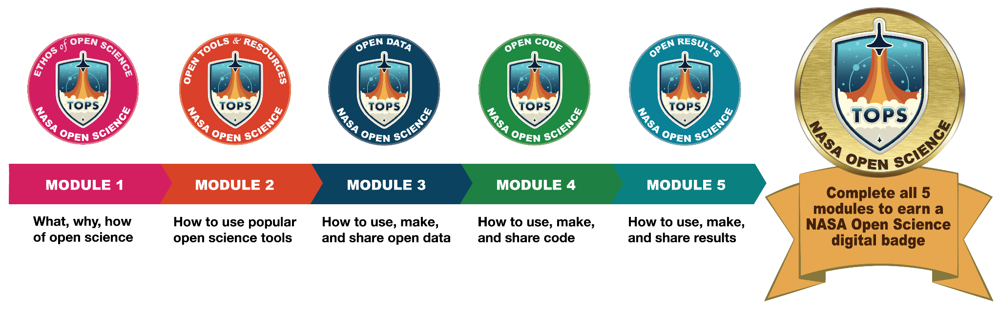

# TOPS Open Science Curriculum: Open Science 101

[Transform to Open Science (TOPS)](https://science.nasa.gov/open-science/transform-to-open-science) is part of NASA’s [Open-Source Science Initiative,](https://science.nasa.gov/researchers/open-science/) which is making a long-term commitment to create a scientific culture that is ready for 21st century challenges.

To support everyone's path to a more open and equitable scientific future, TOPS has created an Open Science 101 (OS101) curriculum. The curriculum aims to introduce learners to a nuanced understanding of open science, enabling participants to actively participate in open science. The five modules introduce participants to the definitions, tools, and resources available to share their research process and products more openly.

The curriculum is available on the [NASA TOPS Github site](https://nasa.github.io/Transform-to-Open-Science/) and can be taken as a massive open online course (MOOC). NASA TOPS Open Science 101 was developed by the [global open science community](./curriculum_leads.md) to help everyone learn the key practical skills and useful tools that help us all work openly together.

## Overview of 5 Modules

1.  [Ethos of Open Science](./modules/open_science_ethos_module.md)
2.  [Open Tools and Resources](./modules/open_tools_module.md)
3.  [Open Data](./modules/open_data_module.md)
4.  [Open Code](./modules/open_code_module.md)
5.  [Open Results](./modules/open_results_module.md)

Content for the Open Science 101 is being derived from several amazing resources, including: [OpenSciency](https://github.com/opensciency/), [OpenbyDesign](https://github.com/DSI-CORES/OpenByDesign/tree/master/src), [Utrecht](https://openscience-utrecht.com/what-is-open-science/), [Mozilla](https://mozillascience.github.io/study-group-orientation/4-open-research101.html), and more....

## Learning Objectives

Open Science 101 aims to introduce learners to a nuanced understanding of open science, enabling participants to better understand an open science workflow from end to end. The focus of the curriculum will be on providing learners with a basic understanding of open science, its ethos and benefits, and how to actively participate in open science communities. The TOPS curriculum will also be used to support researchers looking to engage with NASA as NASA moves to adopt more open science requirements (e.g., Scientific Information Policy and ROSES opportunities). Scientists will need to acquire the new skills highlighted in the curriculum to participate in open science effectively and to demonstrate those skills when applying for NASA funding opportunities.

### Researcher core open science skills
- Have an [ORCID](https://orcid.org/)
- Familiar with NASA's [Open Science and Data Management Plan (OSDMP)](https://science.nasa.gov/researchers/sara/faqs/osdmp), including data management and software management plan best practices and resources
- How to find and identify community accepted data and software repositories
- How to openly license and share FAIR data and assign a DOI
- Apply a permissive license and share open-source software
- Organizing open meetings

## Curriculum

The curriculum is designed to be completed either independently, through a MOOC or in a group, at in-person or online workshops. The NASA TOPS site has more information about other modes for taking the curriculum. The time commitment to complete all five modules is about 3 - 12 hours, depending on your knowledge of open science.

Additional information about the module [structure](./curriculum_structure.md) is provided.

### Course Creation

Open Science 101 is hosted on the [Open EdX](https://openscience101.org/) platform. The platform was developed by [Raccoon Gang](https://raccoongang.com/) through [Mt. Tam Innovations, LLC](https://www.thinkmti.com/) on the Fully Integrated Lifecycle Mission Support Services (FILMSS) contract at NASA Ames Research Center, led by [KBR, Inc.](https://www.kbr.com/en)

### Instructor-Led Workshop Materials
For instructor-led workshops (in-person and virtual), the materials will be organized as follows:
- Each module is organized into five, 30-minute lessons for a total of 2.5 hours of content. We recommend scheduling a module workshop for three hours and include two 15-minute breaks.
- Each lesson has content suitable for in-person or virtual workshops (slides with talking points).
- Each lesson ends with an activity or knowledge check that can be completed by both in-person or virtual participants.
- Each module ends with an assessment that must be completed online at [https://openscience101.org/](https://openscience101.org/). Participants may move between instructor-led workshops and the MOOC by completing each assessment in sequential order, with a passing grade of 70%. If you are a subject matter expert in any of the module content areas, please feel free to advance straight to the assessments and fast track your completion.
- All content has been assigned a CC-BY license.

## Badging

Upon completion of all five [Open Science 101](./readme.md) modules, you will earn a NASA Open Science digital badge! The NASA Open Science badge is issued through Credly and is linked to your [ORCID](https://orcid.org/) account. These digital badges can be added to resumes, personal websites, professional networking websites, or social media websites.
In order for the TOPS Open Science badge to be offered as part of in-person or virtual workshops, the following minimum requirements must be met.
- The event must be registered with the TOPS team at hq-openscience@nasa.gov.
- Teach at least one module in full (Note: Although modules can stand alone, we recommend teaching The Ethos of Open Science alongside your chosen module, as it provides the foundational understanding for open science practices and benefits to users).
- Have at least one [certified](https://carpentries.org/instructors/) instructor or apply for a waiver (application link TBD).
- Must use TOPS Open Science 101 curriculum materials.
- Survey course participants before and after completion, using a survey that TOPS will provide for your use.
- Abide by the TOPS [Code of Conduct](../../../CODE_OF_CONDUCT.md).

## Contribute to Open Science 101

TOPS has created a development version of the curriculum written in Markdown to enable the community to help make it even better.  It can be found [here](https://github.com/nasa/Transform-to-Open-Science/tree/open-science-101).

**Note:** This version of the curriculum will not allow  you to get badged.  To get badged for Open Science 101 [ enroll here](https://nasa.github.io/Transform-to-Open-Science/take-os101/).

### Methods of Contributing

To contribute, you can [create a pull request](https://github.com/nasa/Transform-to-Open-Science/pulls), [open an issue](https://github.com/nasa/Transform-to-Open-Science/issues), or [start a discussion](https://github.com/nasa/Transform-to-Open-Science/discussions). 

For technical details on contributing to OS 101 and our GitHub in general please visit our [contributing page](../../../CONTRIBUTING.md#contributing-to-open-science-101-on-github).

## Teaching Open Science 101

### New Instructors

To become an instructor for Open Science 101, [contact TOPS](mailto:hq-openscience@nasa.gov) to find out more about this process.  More details will be posted soon.

### Existing Instructors

Are you already teaching OS101?  Learn how you can get your instructor-led training listed on our website by reading our [workshop listing requirements](./workshop_listings.md).